# Métodos de simulación

## Máster Universitario en Inteligencia Artificial (MUIA)

**Autores**

- Sergio Cavero
- Daniele Pellegrino
- Antonio Sejas

**Diciembre 2019**

# Enunciado: Una noche en el casino

En un casino un jugador dispone de 30 fichas y decide jugar una noche a la ruleta.

La ruleta estándar contiene 37 ranuras, numeradas del 0 al 36. Entre los números del 1 al 10 y del 19 al 28, los números pares van en rojo y los impares en negro. Entre los números del 11 al 18 y del 29 al 36, los números pares van en negro y los impares en rojo. El 0 es verde.

Las probabilidades de pago vienen determinadas por la posibilidad de que la bola en aterrice en la ranura seleccionada. Sin embargo, las probabilidades solamente tienen en cuenta las 36 ranuras negras y rojas numeradas y no la ranura verde del
0.Por ejemplo, si apuestas a un solo número tienes una posibilidad entre 37 (1/37) de acertar, y 36 posibilidades de 37 (36/37) de no acertar. Sin embargo, la cuota paga a 35:1, no a 36:1. La ranura del 0 es lo que se denomina “margen de la casa” (house edge), es decir el dinero que el casino espera recibir.

El jugador puede realizar las siguientes apuestas, con los premios correspondientes:

- Pagos 1:1. Los pagos 1:1 son apuestas que te ofrecen una devolución de dinero igualada. Por ejemplo, si apuestas una ficha y aciertas ganas 1 ficha más la ficha apostada. Los tres pagos más comunes 1:1 son los de a favor del rojo, del negro, de par/impar o a favor de un número alto o bajo (1-18 o 19-36).
- Pagos 2:1. Apostar a una serie de doce números (docena). Véanse en el tablero los tres espacios de apuesta para las seis docenas por las que se puede apostar (por filas y por columnas).
- Pagos 5:1. Apostar en series de seis números, colocando las fichas en el lateral de la mesa entre dos filas, significa que estas apostando a los tres números de ambas filas.
- Pagos 8:1. Apostar en una serie de cuatro números, colocando las fichas en el medio de cuatro números.
- Pagos 11:1. Apostar en una fila de tres números, colocando las fichas en el lateral de la tabla junto a una fila.
- Pagos 17:1. Apostar a un par de números, vertical u horizontal, colocando la ficha entre los dos números elegidos.
- Pagos 35:1. Para ganar un pago 35:1, tendrás que apostar a un solo número.

El jugador siempre va a apostar una ficha y se retira cuando se queda sin fichas o cuando alcanza las 150.

Se estima que el número máximo de partidas que se pueden jugar en una noche es de 50.

Partiendo del planteamiento del problema anterior se deberán resolver las siguientes cuestiones:

1. Si decide apostar al azar (de forma equiprobable en entre los distintos tipos de apuestas):

   a) ¿Qué proporción de noches a lo largo de un mes se ha retirado por quedarse sin dinero?

   b) ¿Cuál es el número de fichas con las que ha finalizado las noches de ese mes y cómo se distribuye (representar el histograma)?

   c) ¿Cuál es el número medio de partidas jugadas antes de retirarse por quedarse sin dinero?

2. Si analizamos el problema a largo plazo, jugando partidas indefinidamente, y empezando con 30 fichas ¿cuál es la probabilidad de que me quede sin dinero? ¿y la de que termine con 150 fichas?

3)  ¿Con qué probabilidad debería jugar a cada una de las partidas para que el beneficio medio de cada noche sea máximo? Utilícese la metaheurística recocido simulado.

## 0. Pasos previos

### Cargar librerías y funciones necesarias

```python
import transition_matrix as tm
import pandas as pd
import numpy as np
import matplotlib.pyplot as plt
import matplotlib.cm as cm
import seaborn as sns
from random import randrange
import numpy.random as rnd
from numpy.linalg import matrix_power
print("Se han cargado todas las librerias necesarias")
```

    Se han cargado todas las librerias necesarias

```python
gambling_random = np.random
gambling_random.seed(42)
```

```python
%matplotlib inline
plt.style.use('seaborn-whitegrid')
pd.set_option('display.max_columns', 200)
pd.set_option('display.max_rows', 200)
```

### Modelización del enunciado

En esta sección vamos a modelar los diferentes elementos que componen nuestro problema.

- Juego de la ruleta: probabilidades de ganar cierta apuesta de la ruleta y beneficio obtenido

```python
bets = [(1, float(18 / 37)), # Pagos 1:1.
        (2, float(12 / 37)), # Pagos 2:1.
        (5, float(6 / 37)),  # Pagos 5:1.
        (8, float(4 / 37)),  # Pagos 8:1
        (11, float(3 / 37)), # Pagos 11:1.
        (17, float(2 / 37)), # Pagos 17:1.
        (35, float(1 / 37))] # Pagos 35:1.
```

- Probabilidades de realizar las apuestar anteriormente realizadas, son probabilidades equiprobables. A continuación el algoritmio SA se encargará de buscar el vector de probabilidades óptimo.

```python
p_bets_eq = [float(1/len(bets))]*len(bets)
p_bets_eq
```

    [0.14285714285714285,
     0.14285714285714285,
     0.14285714285714285,
     0.14285714285714285,
     0.14285714285714285,
     0.14285714285714285,
     0.14285714285714285]

- Límite de partidas y fichas:

```python
LEAVE_WITH_MIN = 0 # Mínimo número de fichas con las que el jugador se retira
LEAVE_WITH_MAX = 150 # Máximo número de fichas con las que el jugador se retira
NUM_GAMES = 50 # Número máximo de partidas que puede jugar un jugador
INITIAL_CHIPS = 30 # Número de fichas iniciales con las que comienza a jugar
DAYS = 30 # Número de días que el jugador va a ir a jugara a la ruleta
```

### Construir la matriz de transición

Una cadena es un proceso en tiempo discreto en el que una variable aleatoria $X_n$ va cambiando con el paso del tiempo. Las
cadenas de Markov tienen la propiedad de que la probabilidad de que $X_n = j$ sólo depende
del estado inmediatamente anterior del sistema: $X_n−1$. Cuando en una cadena dichas
probabilidades no dependen del tiempo en que se considere, $n$, $P(X_n = j | X-{n−1} = i)$

A continuación vamos a construir la cadena de Markov haciendo uso de la función `create_transition_matrix` que nosotros mismos hemos implementado. Esta mátriz se construye básandonos en el enunicado anteriormente comentado y en las propiedades de la cadena de Markov:

$$
T = [p_{ij}] = \begin{bmatrix}
p_{1,1} & p_{1,2}  & \cdots  & p_{1,m} \\
p_{2,1} & p_{2,2} & \cdots & p_{2,m}\\
\vdots & \vdots & \ddots &  \cdots \\
p_{m,1} & p_{m,2}  & \cdots  &  p_{m,m}
\end{bmatrix}
$$

donde $p_{ij}$ es la probabilidad de ir del estado $i$ al $j$. En nuestro caso, un estado representa la cantidad de fichas que nuestro jugador tiene en ese momento. La probabilidad $p_{ij}$ es la probabilidad con la que el jugador pasa de tener $i$ a $j$ fichas. Cada una de las probabilidades se calcula de la siguiente manera:

$P(probabilidad \  de\  realizar\  esta \ apuesta | probabilidad \ de\  ganar\  la\  apuesta)$

La matriz de transición se construye sabiendo los estados (en este caso el valor máximo y mínimo de fichas que puede alcanzar el jugador), las probabilidades de realizar las apuestas y las probabilidades de ganar la apuesta realizada.

```python
matrix = tm.create_transition_matrix(LEAVE_WITH_MIN,LEAVE_WITH_MAX, bets, p_bets_eq)
```

Vamos a visualizar la matriz creada por medio de la libreria pandas y añadiendo un vector de filas y columnas que representan los estados del problema, es decir, las fichas que tiene el jugador en cada momento.

```python
df = pd.DataFrame(matrix)
df.head()
```

<div>
<style scoped>
    .dataframe tbody tr th:only-of-type {
        vertical-align: middle;
    }

    .dataframe tbody tr th {
        vertical-align: top;
    }

    .dataframe thead th {
        text-align: right;
    }

</style>
<table border="1" class="dataframe">
  <thead>
    <tr style="text-align: right;">
      <th></th>
      <th>0</th>
      <th>1</th>
      <th>2</th>
      <th>3</th>
      <th>4</th>
      <th>5</th>
      <th>6</th>
      <th>7</th>
      <th>8</th>
      <th>9</th>
      <th>10</th>
      <th>11</th>
      <th>12</th>
      <th>13</th>
      <th>14</th>
      <th>15</th>
      <th>16</th>
      <th>17</th>
      <th>18</th>
      <th>19</th>
      <th>20</th>
      <th>21</th>
      <th>22</th>
      <th>23</th>
      <th>24</th>
      <th>25</th>
      <th>26</th>
      <th>27</th>
      <th>28</th>
      <th>29</th>
      <th>30</th>
      <th>31</th>
      <th>32</th>
      <th>33</th>
      <th>34</th>
      <th>35</th>
      <th>36</th>
      <th>37</th>
      <th>38</th>
      <th>39</th>
      <th>40</th>
      <th>41</th>
      <th>42</th>
      <th>43</th>
      <th>44</th>
      <th>45</th>
      <th>46</th>
      <th>47</th>
      <th>48</th>
      <th>49</th>
      <th>50</th>
      <th>51</th>
      <th>52</th>
      <th>53</th>
      <th>54</th>
      <th>55</th>
      <th>56</th>
      <th>57</th>
      <th>58</th>
      <th>59</th>
      <th>60</th>
      <th>61</th>
      <th>62</th>
      <th>63</th>
      <th>64</th>
      <th>65</th>
      <th>66</th>
      <th>67</th>
      <th>68</th>
      <th>69</th>
      <th>70</th>
      <th>71</th>
      <th>72</th>
      <th>73</th>
      <th>74</th>
      <th>75</th>
      <th>76</th>
      <th>77</th>
      <th>78</th>
      <th>79</th>
      <th>80</th>
      <th>81</th>
      <th>82</th>
      <th>83</th>
      <th>84</th>
      <th>85</th>
      <th>86</th>
      <th>87</th>
      <th>88</th>
      <th>89</th>
      <th>90</th>
      <th>91</th>
      <th>92</th>
      <th>93</th>
      <th>94</th>
      <th>95</th>
      <th>96</th>
      <th>97</th>
      <th>98</th>
      <th>99</th>
      <th>100</th>
      <th>101</th>
      <th>102</th>
      <th>103</th>
      <th>104</th>
      <th>105</th>
      <th>106</th>
      <th>107</th>
      <th>108</th>
      <th>109</th>
      <th>110</th>
      <th>111</th>
      <th>112</th>
      <th>113</th>
      <th>114</th>
      <th>115</th>
      <th>116</th>
      <th>117</th>
      <th>118</th>
      <th>119</th>
      <th>120</th>
      <th>121</th>
      <th>122</th>
      <th>123</th>
      <th>124</th>
      <th>125</th>
      <th>126</th>
      <th>127</th>
      <th>128</th>
      <th>129</th>
      <th>130</th>
      <th>131</th>
      <th>132</th>
      <th>133</th>
      <th>134</th>
      <th>135</th>
      <th>136</th>
      <th>137</th>
      <th>138</th>
      <th>139</th>
      <th>140</th>
      <th>141</th>
      <th>142</th>
      <th>143</th>
      <th>144</th>
      <th>145</th>
      <th>146</th>
      <th>147</th>
      <th>148</th>
      <th>149</th>
      <th>150</th>
      <th>151</th>
      <th>152</th>
      <th>153</th>
      <th>154</th>
      <th>155</th>
      <th>156</th>
      <th>157</th>
      <th>158</th>
      <th>159</th>
      <th>160</th>
      <th>161</th>
      <th>162</th>
      <th>163</th>
      <th>164</th>
      <th>165</th>
      <th>166</th>
      <th>167</th>
      <th>168</th>
      <th>169</th>
      <th>170</th>
      <th>171</th>
      <th>172</th>
      <th>173</th>
      <th>174</th>
      <th>175</th>
      <th>176</th>
      <th>177</th>
      <th>178</th>
      <th>179</th>
      <th>180</th>
      <th>181</th>
      <th>182</th>
      <th>183</th>
      <th>184</th>
    </tr>
  </thead>
  <tbody>
    <tr>
      <th>0</th>
      <td>1.000000</td>
      <td>0.000000</td>
      <td>0.000000</td>
      <td>0.000000</td>
      <td>0.000000</td>
      <td>0.000000</td>
      <td>0.000000</td>
      <td>0.000000</td>
      <td>0.000000</td>
      <td>0.000000</td>
      <td>0.000000</td>
      <td>0.000000</td>
      <td>0.000000</td>
      <td>0.000000</td>
      <td>0.000000</td>
      <td>0.000000</td>
      <td>0.0</td>
      <td>0.0</td>
      <td>0.000000</td>
      <td>0.000000</td>
      <td>0.000000</td>
      <td>0.000000</td>
      <td>0.0</td>
      <td>0.0</td>
      <td>0.0</td>
      <td>0.0</td>
      <td>0.0</td>
      <td>0.0</td>
      <td>0.0</td>
      <td>0.0</td>
      <td>0.0</td>
      <td>0.0</td>
      <td>0.0</td>
      <td>0.0</td>
      <td>0.0</td>
      <td>0.0</td>
      <td>0.000000</td>
      <td>0.000000</td>
      <td>0.000000</td>
      <td>0.000000</td>
      <td>0.0</td>
      <td>0.0</td>
      <td>0.0</td>
      <td>0.0</td>
      <td>0.0</td>
      <td>0.0</td>
      <td>0.0</td>
      <td>0.0</td>
      <td>0.0</td>
      <td>0.0</td>
      <td>0.0</td>
      <td>0.0</td>
      <td>0.0</td>
      <td>0.0</td>
      <td>0.0</td>
      <td>0.0</td>
      <td>0.0</td>
      <td>0.0</td>
      <td>0.0</td>
      <td>0.0</td>
      <td>0.0</td>
      <td>0.0</td>
      <td>0.0</td>
      <td>0.0</td>
      <td>0.0</td>
      <td>0.0</td>
      <td>0.0</td>
      <td>0.0</td>
      <td>0.0</td>
      <td>0.0</td>
      <td>0.0</td>
      <td>0.0</td>
      <td>0.0</td>
      <td>0.0</td>
      <td>0.0</td>
      <td>0.0</td>
      <td>0.0</td>
      <td>0.0</td>
      <td>0.0</td>
      <td>0.0</td>
      <td>0.0</td>
      <td>0.0</td>
      <td>0.0</td>
      <td>0.0</td>
      <td>0.0</td>
      <td>0.0</td>
      <td>0.0</td>
      <td>0.0</td>
      <td>0.0</td>
      <td>0.0</td>
      <td>0.0</td>
      <td>0.0</td>
      <td>0.0</td>
      <td>0.0</td>
      <td>0.0</td>
      <td>0.0</td>
      <td>0.0</td>
      <td>0.0</td>
      <td>0.0</td>
      <td>0.0</td>
      <td>0.0</td>
      <td>0.0</td>
      <td>0.0</td>
      <td>0.0</td>
      <td>0.0</td>
      <td>0.0</td>
      <td>0.0</td>
      <td>0.0</td>
      <td>0.0</td>
      <td>0.0</td>
      <td>0.0</td>
      <td>0.0</td>
      <td>0.0</td>
      <td>0.0</td>
      <td>0.0</td>
      <td>0.0</td>
      <td>0.0</td>
      <td>0.0</td>
      <td>0.0</td>
      <td>0.0</td>
      <td>0.0</td>
      <td>0.0</td>
      <td>0.0</td>
      <td>0.0</td>
      <td>0.0</td>
      <td>0.0</td>
      <td>0.0</td>
      <td>0.0</td>
      <td>0.0</td>
      <td>0.0</td>
      <td>0.0</td>
      <td>0.0</td>
      <td>0.0</td>
      <td>0.0</td>
      <td>0.0</td>
      <td>0.0</td>
      <td>0.0</td>
      <td>0.0</td>
      <td>0.0</td>
      <td>0.0</td>
      <td>0.0</td>
      <td>0.0</td>
      <td>0.0</td>
      <td>0.0</td>
      <td>0.0</td>
      <td>0.0</td>
      <td>0.0</td>
      <td>0.0</td>
      <td>0.0</td>
      <td>0.0</td>
      <td>0.0</td>
      <td>0.0</td>
      <td>0.0</td>
      <td>0.0</td>
      <td>0.0</td>
      <td>0.0</td>
      <td>0.0</td>
      <td>0.0</td>
      <td>0.0</td>
      <td>0.0</td>
      <td>0.0</td>
      <td>0.0</td>
      <td>0.0</td>
      <td>0.0</td>
      <td>0.0</td>
      <td>0.0</td>
      <td>0.0</td>
      <td>0.0</td>
      <td>0.0</td>
      <td>0.0</td>
      <td>0.0</td>
      <td>0.0</td>
      <td>0.0</td>
      <td>0.0</td>
      <td>0.0</td>
      <td>0.0</td>
      <td>0.0</td>
      <td>0.0</td>
      <td>0.0</td>
      <td>0.0</td>
      <td>0.0</td>
      <td>0.0</td>
      <td>0.0</td>
      <td>0.0</td>
      <td>0.0</td>
    </tr>
    <tr>
      <th>1</th>
      <td>0.822394</td>
      <td>0.000000</td>
      <td>0.069498</td>
      <td>0.046332</td>
      <td>0.000000</td>
      <td>0.000000</td>
      <td>0.023166</td>
      <td>0.000000</td>
      <td>0.000000</td>
      <td>0.015444</td>
      <td>0.000000</td>
      <td>0.000000</td>
      <td>0.011583</td>
      <td>0.000000</td>
      <td>0.000000</td>
      <td>0.000000</td>
      <td>0.0</td>
      <td>0.0</td>
      <td>0.007722</td>
      <td>0.000000</td>
      <td>0.000000</td>
      <td>0.000000</td>
      <td>0.0</td>
      <td>0.0</td>
      <td>0.0</td>
      <td>0.0</td>
      <td>0.0</td>
      <td>0.0</td>
      <td>0.0</td>
      <td>0.0</td>
      <td>0.0</td>
      <td>0.0</td>
      <td>0.0</td>
      <td>0.0</td>
      <td>0.0</td>
      <td>0.0</td>
      <td>0.003861</td>
      <td>0.000000</td>
      <td>0.000000</td>
      <td>0.000000</td>
      <td>0.0</td>
      <td>0.0</td>
      <td>0.0</td>
      <td>0.0</td>
      <td>0.0</td>
      <td>0.0</td>
      <td>0.0</td>
      <td>0.0</td>
      <td>0.0</td>
      <td>0.0</td>
      <td>0.0</td>
      <td>0.0</td>
      <td>0.0</td>
      <td>0.0</td>
      <td>0.0</td>
      <td>0.0</td>
      <td>0.0</td>
      <td>0.0</td>
      <td>0.0</td>
      <td>0.0</td>
      <td>0.0</td>
      <td>0.0</td>
      <td>0.0</td>
      <td>0.0</td>
      <td>0.0</td>
      <td>0.0</td>
      <td>0.0</td>
      <td>0.0</td>
      <td>0.0</td>
      <td>0.0</td>
      <td>0.0</td>
      <td>0.0</td>
      <td>0.0</td>
      <td>0.0</td>
      <td>0.0</td>
      <td>0.0</td>
      <td>0.0</td>
      <td>0.0</td>
      <td>0.0</td>
      <td>0.0</td>
      <td>0.0</td>
      <td>0.0</td>
      <td>0.0</td>
      <td>0.0</td>
      <td>0.0</td>
      <td>0.0</td>
      <td>0.0</td>
      <td>0.0</td>
      <td>0.0</td>
      <td>0.0</td>
      <td>0.0</td>
      <td>0.0</td>
      <td>0.0</td>
      <td>0.0</td>
      <td>0.0</td>
      <td>0.0</td>
      <td>0.0</td>
      <td>0.0</td>
      <td>0.0</td>
      <td>0.0</td>
      <td>0.0</td>
      <td>0.0</td>
      <td>0.0</td>
      <td>0.0</td>
      <td>0.0</td>
      <td>0.0</td>
      <td>0.0</td>
      <td>0.0</td>
      <td>0.0</td>
      <td>0.0</td>
      <td>0.0</td>
      <td>0.0</td>
      <td>0.0</td>
      <td>0.0</td>
      <td>0.0</td>
      <td>0.0</td>
      <td>0.0</td>
      <td>0.0</td>
      <td>0.0</td>
      <td>0.0</td>
      <td>0.0</td>
      <td>0.0</td>
      <td>0.0</td>
      <td>0.0</td>
      <td>0.0</td>
      <td>0.0</td>
      <td>0.0</td>
      <td>0.0</td>
      <td>0.0</td>
      <td>0.0</td>
      <td>0.0</td>
      <td>0.0</td>
      <td>0.0</td>
      <td>0.0</td>
      <td>0.0</td>
      <td>0.0</td>
      <td>0.0</td>
      <td>0.0</td>
      <td>0.0</td>
      <td>0.0</td>
      <td>0.0</td>
      <td>0.0</td>
      <td>0.0</td>
      <td>0.0</td>
      <td>0.0</td>
      <td>0.0</td>
      <td>0.0</td>
      <td>0.0</td>
      <td>0.0</td>
      <td>0.0</td>
      <td>0.0</td>
      <td>0.0</td>
      <td>0.0</td>
      <td>0.0</td>
      <td>0.0</td>
      <td>0.0</td>
      <td>0.0</td>
      <td>0.0</td>
      <td>0.0</td>
      <td>0.0</td>
      <td>0.0</td>
      <td>0.0</td>
      <td>0.0</td>
      <td>0.0</td>
      <td>0.0</td>
      <td>0.0</td>
      <td>0.0</td>
      <td>0.0</td>
      <td>0.0</td>
      <td>0.0</td>
      <td>0.0</td>
      <td>0.0</td>
      <td>0.0</td>
      <td>0.0</td>
      <td>0.0</td>
      <td>0.0</td>
      <td>0.0</td>
      <td>0.0</td>
      <td>0.0</td>
      <td>0.0</td>
      <td>0.0</td>
      <td>0.0</td>
      <td>0.0</td>
      <td>0.0</td>
      <td>0.0</td>
    </tr>
    <tr>
      <th>2</th>
      <td>0.000000</td>
      <td>0.822394</td>
      <td>0.000000</td>
      <td>0.069498</td>
      <td>0.046332</td>
      <td>0.000000</td>
      <td>0.000000</td>
      <td>0.023166</td>
      <td>0.000000</td>
      <td>0.000000</td>
      <td>0.015444</td>
      <td>0.000000</td>
      <td>0.000000</td>
      <td>0.011583</td>
      <td>0.000000</td>
      <td>0.000000</td>
      <td>0.0</td>
      <td>0.0</td>
      <td>0.000000</td>
      <td>0.007722</td>
      <td>0.000000</td>
      <td>0.000000</td>
      <td>0.0</td>
      <td>0.0</td>
      <td>0.0</td>
      <td>0.0</td>
      <td>0.0</td>
      <td>0.0</td>
      <td>0.0</td>
      <td>0.0</td>
      <td>0.0</td>
      <td>0.0</td>
      <td>0.0</td>
      <td>0.0</td>
      <td>0.0</td>
      <td>0.0</td>
      <td>0.000000</td>
      <td>0.003861</td>
      <td>0.000000</td>
      <td>0.000000</td>
      <td>0.0</td>
      <td>0.0</td>
      <td>0.0</td>
      <td>0.0</td>
      <td>0.0</td>
      <td>0.0</td>
      <td>0.0</td>
      <td>0.0</td>
      <td>0.0</td>
      <td>0.0</td>
      <td>0.0</td>
      <td>0.0</td>
      <td>0.0</td>
      <td>0.0</td>
      <td>0.0</td>
      <td>0.0</td>
      <td>0.0</td>
      <td>0.0</td>
      <td>0.0</td>
      <td>0.0</td>
      <td>0.0</td>
      <td>0.0</td>
      <td>0.0</td>
      <td>0.0</td>
      <td>0.0</td>
      <td>0.0</td>
      <td>0.0</td>
      <td>0.0</td>
      <td>0.0</td>
      <td>0.0</td>
      <td>0.0</td>
      <td>0.0</td>
      <td>0.0</td>
      <td>0.0</td>
      <td>0.0</td>
      <td>0.0</td>
      <td>0.0</td>
      <td>0.0</td>
      <td>0.0</td>
      <td>0.0</td>
      <td>0.0</td>
      <td>0.0</td>
      <td>0.0</td>
      <td>0.0</td>
      <td>0.0</td>
      <td>0.0</td>
      <td>0.0</td>
      <td>0.0</td>
      <td>0.0</td>
      <td>0.0</td>
      <td>0.0</td>
      <td>0.0</td>
      <td>0.0</td>
      <td>0.0</td>
      <td>0.0</td>
      <td>0.0</td>
      <td>0.0</td>
      <td>0.0</td>
      <td>0.0</td>
      <td>0.0</td>
      <td>0.0</td>
      <td>0.0</td>
      <td>0.0</td>
      <td>0.0</td>
      <td>0.0</td>
      <td>0.0</td>
      <td>0.0</td>
      <td>0.0</td>
      <td>0.0</td>
      <td>0.0</td>
      <td>0.0</td>
      <td>0.0</td>
      <td>0.0</td>
      <td>0.0</td>
      <td>0.0</td>
      <td>0.0</td>
      <td>0.0</td>
      <td>0.0</td>
      <td>0.0</td>
      <td>0.0</td>
      <td>0.0</td>
      <td>0.0</td>
      <td>0.0</td>
      <td>0.0</td>
      <td>0.0</td>
      <td>0.0</td>
      <td>0.0</td>
      <td>0.0</td>
      <td>0.0</td>
      <td>0.0</td>
      <td>0.0</td>
      <td>0.0</td>
      <td>0.0</td>
      <td>0.0</td>
      <td>0.0</td>
      <td>0.0</td>
      <td>0.0</td>
      <td>0.0</td>
      <td>0.0</td>
      <td>0.0</td>
      <td>0.0</td>
      <td>0.0</td>
      <td>0.0</td>
      <td>0.0</td>
      <td>0.0</td>
      <td>0.0</td>
      <td>0.0</td>
      <td>0.0</td>
      <td>0.0</td>
      <td>0.0</td>
      <td>0.0</td>
      <td>0.0</td>
      <td>0.0</td>
      <td>0.0</td>
      <td>0.0</td>
      <td>0.0</td>
      <td>0.0</td>
      <td>0.0</td>
      <td>0.0</td>
      <td>0.0</td>
      <td>0.0</td>
      <td>0.0</td>
      <td>0.0</td>
      <td>0.0</td>
      <td>0.0</td>
      <td>0.0</td>
      <td>0.0</td>
      <td>0.0</td>
      <td>0.0</td>
      <td>0.0</td>
      <td>0.0</td>
      <td>0.0</td>
      <td>0.0</td>
      <td>0.0</td>
      <td>0.0</td>
      <td>0.0</td>
      <td>0.0</td>
      <td>0.0</td>
      <td>0.0</td>
      <td>0.0</td>
      <td>0.0</td>
      <td>0.0</td>
      <td>0.0</td>
      <td>0.0</td>
      <td>0.0</td>
    </tr>
    <tr>
      <th>3</th>
      <td>0.000000</td>
      <td>0.000000</td>
      <td>0.822394</td>
      <td>0.000000</td>
      <td>0.069498</td>
      <td>0.046332</td>
      <td>0.000000</td>
      <td>0.000000</td>
      <td>0.023166</td>
      <td>0.000000</td>
      <td>0.000000</td>
      <td>0.015444</td>
      <td>0.000000</td>
      <td>0.000000</td>
      <td>0.011583</td>
      <td>0.000000</td>
      <td>0.0</td>
      <td>0.0</td>
      <td>0.000000</td>
      <td>0.000000</td>
      <td>0.007722</td>
      <td>0.000000</td>
      <td>0.0</td>
      <td>0.0</td>
      <td>0.0</td>
      <td>0.0</td>
      <td>0.0</td>
      <td>0.0</td>
      <td>0.0</td>
      <td>0.0</td>
      <td>0.0</td>
      <td>0.0</td>
      <td>0.0</td>
      <td>0.0</td>
      <td>0.0</td>
      <td>0.0</td>
      <td>0.000000</td>
      <td>0.000000</td>
      <td>0.003861</td>
      <td>0.000000</td>
      <td>0.0</td>
      <td>0.0</td>
      <td>0.0</td>
      <td>0.0</td>
      <td>0.0</td>
      <td>0.0</td>
      <td>0.0</td>
      <td>0.0</td>
      <td>0.0</td>
      <td>0.0</td>
      <td>0.0</td>
      <td>0.0</td>
      <td>0.0</td>
      <td>0.0</td>
      <td>0.0</td>
      <td>0.0</td>
      <td>0.0</td>
      <td>0.0</td>
      <td>0.0</td>
      <td>0.0</td>
      <td>0.0</td>
      <td>0.0</td>
      <td>0.0</td>
      <td>0.0</td>
      <td>0.0</td>
      <td>0.0</td>
      <td>0.0</td>
      <td>0.0</td>
      <td>0.0</td>
      <td>0.0</td>
      <td>0.0</td>
      <td>0.0</td>
      <td>0.0</td>
      <td>0.0</td>
      <td>0.0</td>
      <td>0.0</td>
      <td>0.0</td>
      <td>0.0</td>
      <td>0.0</td>
      <td>0.0</td>
      <td>0.0</td>
      <td>0.0</td>
      <td>0.0</td>
      <td>0.0</td>
      <td>0.0</td>
      <td>0.0</td>
      <td>0.0</td>
      <td>0.0</td>
      <td>0.0</td>
      <td>0.0</td>
      <td>0.0</td>
      <td>0.0</td>
      <td>0.0</td>
      <td>0.0</td>
      <td>0.0</td>
      <td>0.0</td>
      <td>0.0</td>
      <td>0.0</td>
      <td>0.0</td>
      <td>0.0</td>
      <td>0.0</td>
      <td>0.0</td>
      <td>0.0</td>
      <td>0.0</td>
      <td>0.0</td>
      <td>0.0</td>
      <td>0.0</td>
      <td>0.0</td>
      <td>0.0</td>
      <td>0.0</td>
      <td>0.0</td>
      <td>0.0</td>
      <td>0.0</td>
      <td>0.0</td>
      <td>0.0</td>
      <td>0.0</td>
      <td>0.0</td>
      <td>0.0</td>
      <td>0.0</td>
      <td>0.0</td>
      <td>0.0</td>
      <td>0.0</td>
      <td>0.0</td>
      <td>0.0</td>
      <td>0.0</td>
      <td>0.0</td>
      <td>0.0</td>
      <td>0.0</td>
      <td>0.0</td>
      <td>0.0</td>
      <td>0.0</td>
      <td>0.0</td>
      <td>0.0</td>
      <td>0.0</td>
      <td>0.0</td>
      <td>0.0</td>
      <td>0.0</td>
      <td>0.0</td>
      <td>0.0</td>
      <td>0.0</td>
      <td>0.0</td>
      <td>0.0</td>
      <td>0.0</td>
      <td>0.0</td>
      <td>0.0</td>
      <td>0.0</td>
      <td>0.0</td>
      <td>0.0</td>
      <td>0.0</td>
      <td>0.0</td>
      <td>0.0</td>
      <td>0.0</td>
      <td>0.0</td>
      <td>0.0</td>
      <td>0.0</td>
      <td>0.0</td>
      <td>0.0</td>
      <td>0.0</td>
      <td>0.0</td>
      <td>0.0</td>
      <td>0.0</td>
      <td>0.0</td>
      <td>0.0</td>
      <td>0.0</td>
      <td>0.0</td>
      <td>0.0</td>
      <td>0.0</td>
      <td>0.0</td>
      <td>0.0</td>
      <td>0.0</td>
      <td>0.0</td>
      <td>0.0</td>
      <td>0.0</td>
      <td>0.0</td>
      <td>0.0</td>
      <td>0.0</td>
      <td>0.0</td>
      <td>0.0</td>
      <td>0.0</td>
      <td>0.0</td>
      <td>0.0</td>
      <td>0.0</td>
      <td>0.0</td>
      <td>0.0</td>
      <td>0.0</td>
    </tr>
    <tr>
      <th>4</th>
      <td>0.000000</td>
      <td>0.000000</td>
      <td>0.000000</td>
      <td>0.822394</td>
      <td>0.000000</td>
      <td>0.069498</td>
      <td>0.046332</td>
      <td>0.000000</td>
      <td>0.000000</td>
      <td>0.023166</td>
      <td>0.000000</td>
      <td>0.000000</td>
      <td>0.015444</td>
      <td>0.000000</td>
      <td>0.000000</td>
      <td>0.011583</td>
      <td>0.0</td>
      <td>0.0</td>
      <td>0.000000</td>
      <td>0.000000</td>
      <td>0.000000</td>
      <td>0.007722</td>
      <td>0.0</td>
      <td>0.0</td>
      <td>0.0</td>
      <td>0.0</td>
      <td>0.0</td>
      <td>0.0</td>
      <td>0.0</td>
      <td>0.0</td>
      <td>0.0</td>
      <td>0.0</td>
      <td>0.0</td>
      <td>0.0</td>
      <td>0.0</td>
      <td>0.0</td>
      <td>0.000000</td>
      <td>0.000000</td>
      <td>0.000000</td>
      <td>0.003861</td>
      <td>0.0</td>
      <td>0.0</td>
      <td>0.0</td>
      <td>0.0</td>
      <td>0.0</td>
      <td>0.0</td>
      <td>0.0</td>
      <td>0.0</td>
      <td>0.0</td>
      <td>0.0</td>
      <td>0.0</td>
      <td>0.0</td>
      <td>0.0</td>
      <td>0.0</td>
      <td>0.0</td>
      <td>0.0</td>
      <td>0.0</td>
      <td>0.0</td>
      <td>0.0</td>
      <td>0.0</td>
      <td>0.0</td>
      <td>0.0</td>
      <td>0.0</td>
      <td>0.0</td>
      <td>0.0</td>
      <td>0.0</td>
      <td>0.0</td>
      <td>0.0</td>
      <td>0.0</td>
      <td>0.0</td>
      <td>0.0</td>
      <td>0.0</td>
      <td>0.0</td>
      <td>0.0</td>
      <td>0.0</td>
      <td>0.0</td>
      <td>0.0</td>
      <td>0.0</td>
      <td>0.0</td>
      <td>0.0</td>
      <td>0.0</td>
      <td>0.0</td>
      <td>0.0</td>
      <td>0.0</td>
      <td>0.0</td>
      <td>0.0</td>
      <td>0.0</td>
      <td>0.0</td>
      <td>0.0</td>
      <td>0.0</td>
      <td>0.0</td>
      <td>0.0</td>
      <td>0.0</td>
      <td>0.0</td>
      <td>0.0</td>
      <td>0.0</td>
      <td>0.0</td>
      <td>0.0</td>
      <td>0.0</td>
      <td>0.0</td>
      <td>0.0</td>
      <td>0.0</td>
      <td>0.0</td>
      <td>0.0</td>
      <td>0.0</td>
      <td>0.0</td>
      <td>0.0</td>
      <td>0.0</td>
      <td>0.0</td>
      <td>0.0</td>
      <td>0.0</td>
      <td>0.0</td>
      <td>0.0</td>
      <td>0.0</td>
      <td>0.0</td>
      <td>0.0</td>
      <td>0.0</td>
      <td>0.0</td>
      <td>0.0</td>
      <td>0.0</td>
      <td>0.0</td>
      <td>0.0</td>
      <td>0.0</td>
      <td>0.0</td>
      <td>0.0</td>
      <td>0.0</td>
      <td>0.0</td>
      <td>0.0</td>
      <td>0.0</td>
      <td>0.0</td>
      <td>0.0</td>
      <td>0.0</td>
      <td>0.0</td>
      <td>0.0</td>
      <td>0.0</td>
      <td>0.0</td>
      <td>0.0</td>
      <td>0.0</td>
      <td>0.0</td>
      <td>0.0</td>
      <td>0.0</td>
      <td>0.0</td>
      <td>0.0</td>
      <td>0.0</td>
      <td>0.0</td>
      <td>0.0</td>
      <td>0.0</td>
      <td>0.0</td>
      <td>0.0</td>
      <td>0.0</td>
      <td>0.0</td>
      <td>0.0</td>
      <td>0.0</td>
      <td>0.0</td>
      <td>0.0</td>
      <td>0.0</td>
      <td>0.0</td>
      <td>0.0</td>
      <td>0.0</td>
      <td>0.0</td>
      <td>0.0</td>
      <td>0.0</td>
      <td>0.0</td>
      <td>0.0</td>
      <td>0.0</td>
      <td>0.0</td>
      <td>0.0</td>
      <td>0.0</td>
      <td>0.0</td>
      <td>0.0</td>
      <td>0.0</td>
      <td>0.0</td>
      <td>0.0</td>
      <td>0.0</td>
      <td>0.0</td>
      <td>0.0</td>
      <td>0.0</td>
      <td>0.0</td>
      <td>0.0</td>
      <td>0.0</td>
      <td>0.0</td>
      <td>0.0</td>
      <td>0.0</td>
      <td>0.0</td>
      <td>0.0</td>
    </tr>
  </tbody>
</table>
</div>

### Funciones para la simulación

En esta sección se definen las funciones necesarias para llevar a cabo la simulación.
Para llevar a cabo esta simulación se han implementado tres funciones:

- `simulate_game`: esta función recibe como parámetro el estado en el que se encuentra el jugador, es decir, el número de fichas actuales. El jugador entonces realiza una apuesta y se produce la tirada de la ruleta. En función del resultado el jugador recibe un número de fichas o pierda la que ha apostado. Esta transición de pasar de un número de fichas a otro número de fichas se realiza mediante la matriz de transición anteriormente implementada.
- `simulate_night`: esta función simula todas las posibles partidas que se puedan realizar en una noche en el casino. Básicamente ejecuta el metodo `simulate_game` tantas veces como número máximo de veces pueda jugar el jugador. Además en este método se recopila información a cerca de la evolución del número de fichas a lo largo de la noche.
- `simulate_num_days`: esta función simula todas los días en los que el jugador va al casino.

```python
def simulate_game(state, matrix, gambling_random):
    return gambling_random.choice(range(len(matrix[state])), p=matrix[state])
```

```python
def simulate_night(matrix, gambling_random, NUM_GAMES, state):
    chips = []
    games = 0
    chips.append(state)
    for i in range(NUM_GAMES):
        chips.append(simulate_game(chips[-1], matrix, gambling_random))
        if chips[-2] != LEAVE_WITH_MIN: games +=1
    return chips, games

```

```python
def simulate_num_days(matrix, gambling_random,NUM_GAMES, INITIAL_CHIPS, DAYS):
    return [simulate_night(matrix, gambling_random,NUM_GAMES, INITIAL_CHIPS) for i in range(DAYS)]
```

```python
def simulate(matrix, gambling_random,NUM_GAMES, INITIAL_CHIPS, DAYS):
    simulation = simulate_num_days(matrix, gambling_random,NUM_GAMES, INITIAL_CHIPS, DAYS)
    chips = [simulation[i][0] for i in range(DAYS)]
    games = [simulation[i][1] for i in range(DAYS)]
    return simulation, chips, games
```

### Funciones auxiliares

En esta sección se encuentran las funciones auxiliares para desarrollar diferentes tareas: representación, manejo de datos, manejo de estructuras, visualización...

```python
def plot_chips_evolution(chips):
    x = range(len(chips[0]))
    plt.figure(figsize=(15, 15))
    for i,y in enumerate(chips):
        plt.plot(x, y,linewidth=4.0,  marker='o')
    plt.axhline(y=INITIAL_CHIPS, color='black', linestyle='-')
```

```python
def create_df(chips, games):
    final_chips = [x[-1] for x in chips]
    improvement = [((x/INITIAL_CHIPS)-1) for x in final_chips]
    benefit = [(x-INITIAL_CHIPS) for x in final_chips]
    days = list(range(1, DAYS+1))
    d = {'Day':days, 'Chips': final_chips, 'Games': games, 'Benefit': benefit, 'Improvement': improvement}
    df = pd.DataFrame(d)
    return df
```

```python
def plot_bar_graph(df, INITIAL_CHIPS):
    x = df['Day']
    y = df['Chips']
    mask1 = df['Chips'] < INITIAL_CHIPS
    mask2 = df['Chips'] >= INITIAL_CHIPS
    plt.figure(figsize=(20,10))
    plt.bar(x[mask1], y[mask1], color = 'red')
    plt.bar(x[mask2], y[mask2], color = 'blue')
    plt.axhline(y=INITIAL_CHIPS, color='black', linestyle='-')
    plt.xlabel("Días")
    plt.ylabel("Número de fichas")
    plt.show()
```

```python
def plot_results(valores_y, valores_t, x):
    fig, (ax1, ax2) = plt.subplots(1, 2, figsize=(20, 8))
    fig.suptitle('Resultados de la optimización')
    ax1.set_title('Evolución de la temperatura')
    ax2.set_title('Calidad (Valores de y)')
    ax1.plot(valores_t, 'tab:orange')
    ax2.plot(valores_y, 'tab:red')
    print("Vector de probabilidades: " + str(x))
    print("Fichas obtenidas: " + str(valores_y[-1]))
```

```python
def show_results(df, INITIAL_CHIPS, LEAVE_WITH_MAX):
    print("Número de noches que el jugador perdió todas las fichas: " + str(np.count_nonzero(df['Chips']==0)))
    print("Porcentaje de noches que el jugador perdió todas las fichas: " + str(round((np.count_nonzero(df['Chips']==0)/DAYS)*100,2)) + "%")
    print("Número de noches que el jugador perdió fichas: " + str(np.count_nonzero(df['Chips']<INITIAL_CHIPS)))
    print("Porcentaje de noches que el jugador perdió fichas: " + str(round((np.count_nonzero(df['Chips']<INITIAL_CHIPS)/DAYS)*100,2)) + "%")
    print("Número de noches que el jugador salió igual del casino: " + str(np.count_nonzero(df['Chips']==INITIAL_CHIPS)))
    print("Porcentaje de noches que el jugador salió igual del casino: " + str(round((np.count_nonzero(df['Chips']==INITIAL_CHIPS)/DAYS)*100,2)) + "%")
    print("Número de noches que el jugador ganó fichas: " + str(np.count_nonzero(df['Chips']>INITIAL_CHIPS)))
    print("Porcentaje de noches que el jugador ganó fichas: " + str(round((np.count_nonzero(df['Chips']>INITIAL_CHIPS)/DAYS)*100,2)) + "%")
    print("Número de noches que el jugador se retiró alcanzando el máximo de fichas: " + str(np.count_nonzero(df['Chips']>=LEAVE_WITH_MAX)))
    print("Porcentaje de noches que el jugador se retiró alcanzando el máximo de fichas: " + str(round((np.count_nonzero(df['Chips']>=LEAVE_WITH_MAX)/DAYS)*100,2)) + "%")
```

## Ejercicio 1: Si decide apostar al azar:

### a) ¿Qué proporción de noches a lo largo de un mes se ha retirado por quedarse sin dinero?

Lo primero que vamos a hacer es ejecutar la simulación. Recordamos los parámetros, la probabilidad de realizar cada una de las posibles apuestas es equiprobable, el número máximo de partidas que se puede jugar una noche es 50, el jugador va a ir todos los días de un mes, es decir, 30 días, si el jugador alcanza 0 fichas o 150 o más se planta. Además, el jugador empieza cada noche con 30 fichas.

```python
LEAVE_WITH_MIN = 0
LEAVE_WITH_MAX = 150
NUM_GAMES = 50
INITIAL_CHIPS = 30
DAYS = 30
```

```python
simulation, chips, games = simulate(matrix, gambling_random,NUM_GAMES, INITIAL_CHIPS, DAYS)
df = create_df(chips, games)
```

La simulación se ha realizado, veaos cual es el resultado obtenido a lo largo del mes:

```python
plot_bar_graph(df, INITIAL_CHIPS)
```

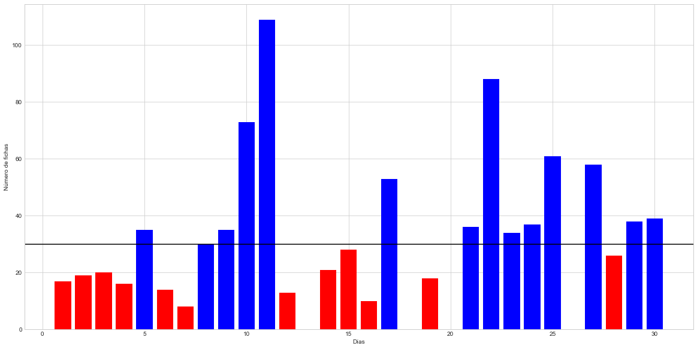

En el gráfico anterior se muestran en el eje x los diferentes días del mes. En el eje y se muestra el número de fichas con las que el jugador salio del casino cada uno de los días. La línea negra muestra el número de fichas con el que el jugador entró al casino. Las barras coloreadas de color rojo son los días malos de nuestro jugador en los cuales perdió fichas. Por otro lado, los días con barras azules son días en los que el jugador obtuvo beneficio. Si un día no muestra barra es por que el jugador se fue ese día sin ninguna ficha.

Respondiendo a la pregunta, el número de noches en las que el jugador se ha tenido que retirar por que se ha quedado sin dinero es el siguiente:

```python
show_results(df, INITIAL_CHIPS, LEAVE_WITH_MAX)
```

    Número de noches que el jugador perdió todas las fichas: 4
    Porcentaje de noches que el jugador perdió todas las fichas: 13.33%
    Número de noches que el jugador perdió fichas: 16
    Porcentaje de noches que el jugador perdió fichas: 53.33%
    Número de noches que el jugador salió igual del casino: 1
    Porcentaje de noches que el jugador salió igual del casino: 3.33%
    Número de noches que el jugador ganó fichas: 13
    Porcentaje de noches que el jugador ganó fichas: 43.33%
    Número de noches que el jugador se retiró alcanzando el máximo de fichas: 0
    Porcentaje de noches que el jugador se retiró alcanzando el máximo de fichas: 0.0%

### b) ¿Cuál es el número de fichas con las que ha finalizado las noches de ese mes y cómo se distribuye (representar el histograma)?

En el gráfico anterior se mostró cuales eran las fichas que nuestro jugador había sido capaz de llevarse a casa para cada uno de los días del mes.
Vamos a aprovechar esta pregunta para visualizar la evolución de la cantidad de fichas que tuvo nuestro jugador a lo largo de cada uno de los días en el casino.

```python
plot_chips_evolution(chips)
```

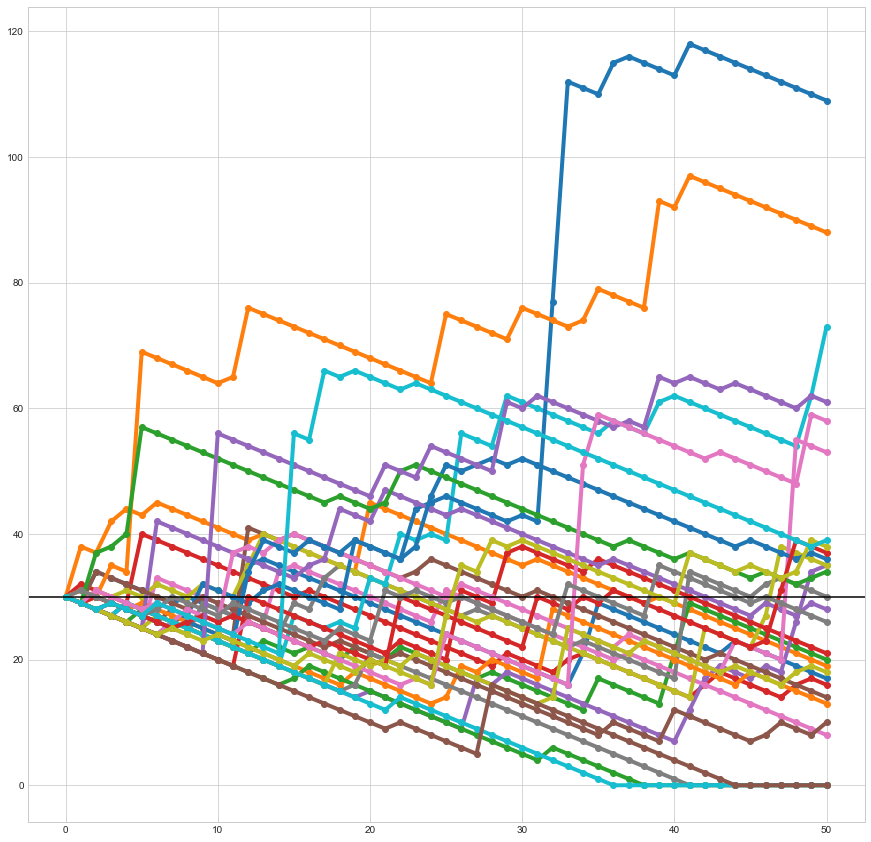

Por último, vamos a mostra rle histograma de frecuencia de la cantidad de fichas con las que le jugador es capaz de salir del casino a lo largo de un mes.

```python
sns.distplot(df['Chips']);plt.xlim(0,None)
```

    (0, 157.4341804981768)

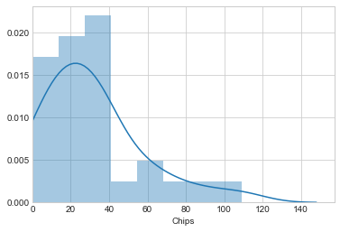

### c) ¿Cuál es el número medio de partidas jugadas antes de retirarse por quedarse sin dinero?

```python
ruined = df[df['Chips'] == 0]
ruined
```

<div>
<style scoped>
    .dataframe tbody tr th:only-of-type {
        vertical-align: middle;
    }

    .dataframe tbody tr th {
        vertical-align: top;
    }

    .dataframe thead th {
        text-align: right;
    }

</style>
<table border="1" class="dataframe">
  <thead>
    <tr style="text-align: right;">
      <th></th>
      <th>Day</th>
      <th>Chips</th>
      <th>Games</th>
      <th>Benefit</th>
      <th>Improvement</th>
    </tr>
  </thead>
  <tbody>
    <tr>
      <th>12</th>
      <td>13</td>
      <td>0</td>
      <td>38</td>
      <td>-30</td>
      <td>-1.0</td>
    </tr>
    <tr>
      <th>17</th>
      <td>18</td>
      <td>0</td>
      <td>41</td>
      <td>-30</td>
      <td>-1.0</td>
    </tr>
    <tr>
      <th>19</th>
      <td>20</td>
      <td>0</td>
      <td>36</td>
      <td>-30</td>
      <td>-1.0</td>
    </tr>
    <tr>
      <th>25</th>
      <td>26</td>
      <td>0</td>
      <td>44</td>
      <td>-30</td>
      <td>-1.0</td>
    </tr>
  </tbody>
</table>
</div>

```python
"El jugador se ha arruinado "+ str(ruined.shape[0]) +" veces, jugando de media " + str(round(ruined["Games"].mean(),2)) + " días antes de arruinarse."
```

    'El jugador se ha arruinado 4 veces, jugando de media 39.75 días antes de arruinarse.'

#### Estadísticos de esta primera simulación

Aunque esta sección no estaba requerida en el enunicado de la memoria a continuación se muestran diferentes estadísticos sencillos que pueden ayudarnos a comprender mejor el resultado de la simulación.

```python
df.describe()
```

<div>
<style scoped>
    .dataframe tbody tr th:only-of-type {
        vertical-align: middle;
    }

    .dataframe tbody tr th {
        vertical-align: top;
    }

    .dataframe thead th {
        text-align: right;
    }

</style>
<table border="1" class="dataframe">
  <thead>
    <tr style="text-align: right;">
      <th></th>
      <th>Day</th>
      <th>Chips</th>
      <th>Games</th>
      <th>Benefit</th>
      <th>Improvement</th>
    </tr>
  </thead>
  <tbody>
    <tr>
      <th>count</th>
      <td>30.000000</td>
      <td>30.000000</td>
      <td>30.000000</td>
      <td>30.000000</td>
      <td>30.000000</td>
    </tr>
    <tr>
      <th>mean</th>
      <td>15.500000</td>
      <td>31.200000</td>
      <td>48.633333</td>
      <td>1.200000</td>
      <td>0.040000</td>
    </tr>
    <tr>
      <th>std</th>
      <td>8.803408</td>
      <td>26.156558</td>
      <td>3.718392</td>
      <td>26.156558</td>
      <td>0.871885</td>
    </tr>
    <tr>
      <th>min</th>
      <td>1.000000</td>
      <td>0.000000</td>
      <td>36.000000</td>
      <td>-30.000000</td>
      <td>-1.000000</td>
    </tr>
    <tr>
      <th>25%</th>
      <td>8.250000</td>
      <td>14.500000</td>
      <td>50.000000</td>
      <td>-15.500000</td>
      <td>-0.516667</td>
    </tr>
    <tr>
      <th>50%</th>
      <td>15.500000</td>
      <td>27.000000</td>
      <td>50.000000</td>
      <td>-3.000000</td>
      <td>-0.100000</td>
    </tr>
    <tr>
      <th>75%</th>
      <td>22.750000</td>
      <td>37.750000</td>
      <td>50.000000</td>
      <td>7.750000</td>
      <td>0.258333</td>
    </tr>
    <tr>
      <th>max</th>
      <td>30.000000</td>
      <td>109.000000</td>
      <td>50.000000</td>
      <td>79.000000</td>
      <td>2.633333</td>
    </tr>
  </tbody>
</table>
</div>

### Análisis de los resultados en media

```python
LEAVE_WITH_MIN = 0
LEAVE_WITH_MAX = 150
NUM_GAMES = 50
INITIAL_CHIPS = 30
DAYS = 30
```

```python
months = [simulate(matrix, gambling_random,NUM_GAMES, INITIAL_CHIPS, DAYS)  for i  in range(1000)]
```

```python
simulations = []
chips = []
games = []
for s, c, g  in months:
    simulations.append(s)
    chips.append(c)
    games.append(g)

chips = np.array(chips)
chips_avg = chips.sum(0)/len(chips)
games = np.array(games)
games_avg = games.sum(0)/len(games)
df = create_df(chips_avg, games_avg)
plot_bar_graph(df, INITIAL_CHIPS)
```

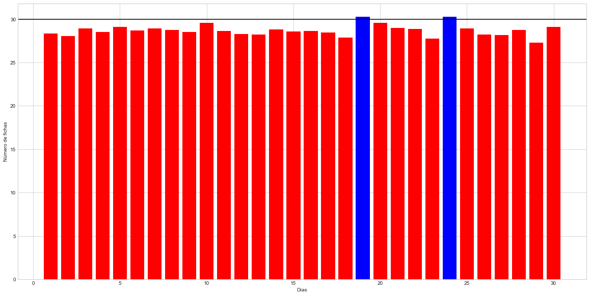

```python
plot_chips_evolution(chips_avg)
```

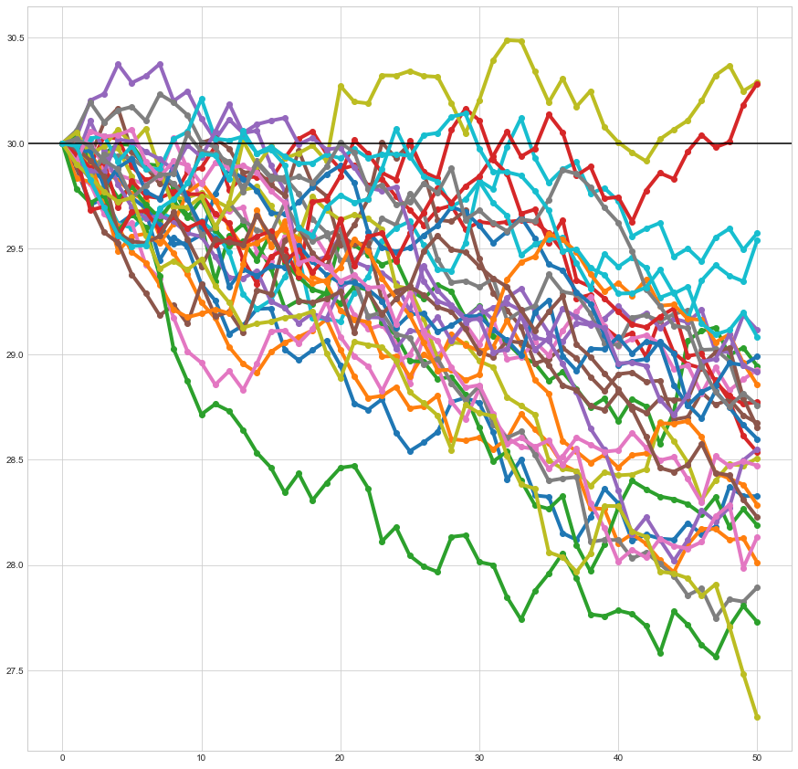

```python
sns.distplot(df['Chips']);plt.xlim(0,None)
```

    (0, 31.515323668342266)

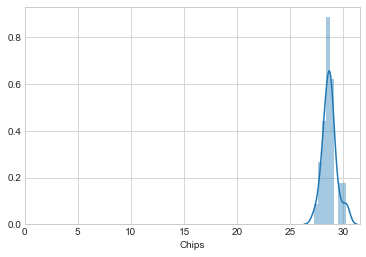

### Análisis de la distribución

En esta ocasión vamos a olvidarnos del problema en si y vamos a estudiar como se comporta la distribución de las fichas obtenidas al final devarias noches

```python
bet_eq_fc = []
for i in range (1000):
    _, chips_eq, _ = simulate(matrix, gambling_random,NUM_GAMES, INITIAL_CHIPS, 1)
    matrix = tm.create_transition_matrix(LEAVE_WITH_MIN,LEAVE_WITH_MAX, bets, p_bets_eq)
    bet_eq_fc.append(chips_eq[0][-1])

sns.distplot(bet_eq_fc);plt.xlim(0,None)
```

    (0, 157.28544623443764)

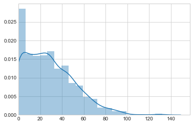

```python
pd.DataFrame(bet_eq_fc).describe()
```

<div>
<style scoped>
    .dataframe tbody tr th:only-of-type {
        vertical-align: middle;
    }

    .dataframe tbody tr th {
        vertical-align: top;
    }

    .dataframe thead th {
        text-align: right;
    }

</style>
<table border="1" class="dataframe">
  <thead>
    <tr style="text-align: right;">
      <th></th>
      <th>0</th>
    </tr>
  </thead>
  <tbody>
    <tr>
      <th>count</th>
      <td>1000.000000</td>
    </tr>
    <tr>
      <th>mean</th>
      <td>28.743000</td>
    </tr>
    <tr>
      <th>std</th>
      <td>22.553128</td>
    </tr>
    <tr>
      <th>min</th>
      <td>0.000000</td>
    </tr>
    <tr>
      <th>25%</th>
      <td>10.000000</td>
    </tr>
    <tr>
      <th>50%</th>
      <td>26.000000</td>
    </tr>
    <tr>
      <th>75%</th>
      <td>44.000000</td>
    </tr>
    <tr>
      <th>max</th>
      <td>132.000000</td>
    </tr>
  </tbody>
</table>
</div>

## Ejercicio 2: Si analizamos el problema a largo plazo, jugando partidas indefinidamente, y empezando con 30 fichas ¿cuál es la probabilidad de que me quede sin dinero? ¿y la de que termine con 150 fichas?

```python
LEAVE_WITH_MIN = 0
LEAVE_WITH_MAX = 150
NUM_GAMES = 4000
INITIAL_CHIPS = 30
DAYS = 1000
```

```python
simulation, chips, games = simulate(matrix, gambling_random,NUM_GAMES, INITIAL_CHIPS, DAYS)
df = create_df(chips, games)
```

La simulación se ha realizado, veaos cual es el resultado obtenido a lo largo del mes:

```python
plot_bar_graph(df, INITIAL_CHIPS)
```

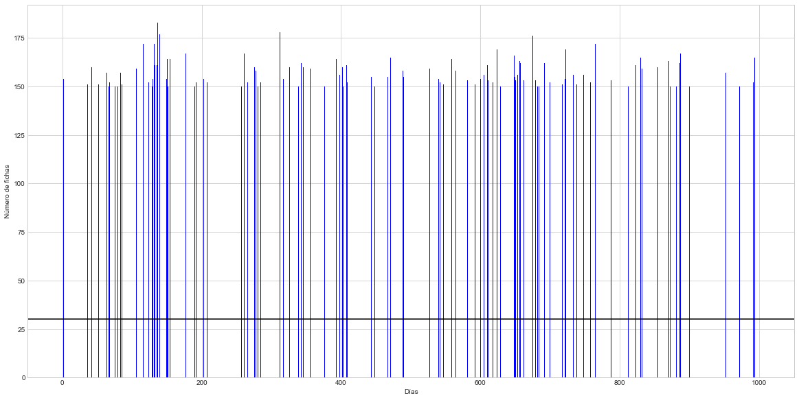

```python
show_results(df, INITIAL_CHIPS, LEAVE_WITH_MAX)
```

    Número de noches que el jugador perdió todas las fichas: 864
    Porcentaje de noches que el jugador perdió todas las fichas: 86.4%
    Número de noches que el jugador perdió fichas: 864
    Porcentaje de noches que el jugador perdió fichas: 86.4%
    Número de noches que el jugador salió igual del casino: 0
    Porcentaje de noches que el jugador salió igual del casino: 0.0%
    Número de noches que el jugador ganó fichas: 136
    Porcentaje de noches que el jugador ganó fichas: 13.6%
    Número de noches que el jugador se retiró alcanzando el máximo de fichas: 136
    Porcentaje de noches que el jugador se retiró alcanzando el máximo de fichas: 13.6%

```python
plot_chips_evolution(chips)
```

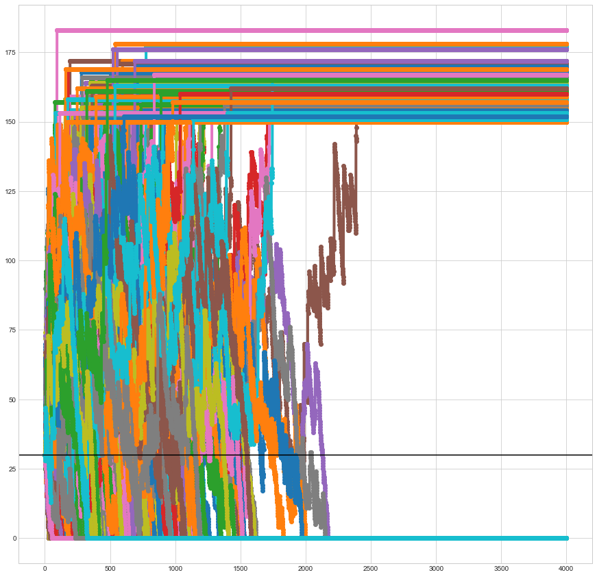

```python
df.describe()
```

<div>
<style scoped>
    .dataframe tbody tr th:only-of-type {
        vertical-align: middle;
    }

    .dataframe tbody tr th {
        vertical-align: top;
    }

    .dataframe thead th {
        text-align: right;
    }

</style>
<table border="1" class="dataframe">
  <thead>
    <tr style="text-align: right;">
      <th></th>
      <th>Day</th>
      <th>Chips</th>
      <th>Games</th>
      <th>Benefit</th>
      <th>Improvement</th>
    </tr>
  </thead>
  <tbody>
    <tr>
      <th>count</th>
      <td>1000.000000</td>
      <td>1000.00000</td>
      <td>1000.000000</td>
      <td>1000.00000</td>
      <td>1000.000000</td>
    </tr>
    <tr>
      <th>mean</th>
      <td>500.500000</td>
      <td>21.39400</td>
      <td>776.137000</td>
      <td>-8.60600</td>
      <td>-0.286867</td>
    </tr>
    <tr>
      <th>std</th>
      <td>288.819436</td>
      <td>54.01565</td>
      <td>1317.017346</td>
      <td>54.01565</td>
      <td>1.800522</td>
    </tr>
    <tr>
      <th>min</th>
      <td>1.000000</td>
      <td>0.00000</td>
      <td>30.000000</td>
      <td>-30.00000</td>
      <td>-1.000000</td>
    </tr>
    <tr>
      <th>25%</th>
      <td>250.750000</td>
      <td>0.00000</td>
      <td>76.000000</td>
      <td>-30.00000</td>
      <td>-1.000000</td>
    </tr>
    <tr>
      <th>50%</th>
      <td>500.500000</td>
      <td>0.00000</td>
      <td>173.000000</td>
      <td>-30.00000</td>
      <td>-1.000000</td>
    </tr>
    <tr>
      <th>75%</th>
      <td>750.250000</td>
      <td>0.00000</td>
      <td>593.000000</td>
      <td>-30.00000</td>
      <td>-1.000000</td>
    </tr>
    <tr>
      <th>max</th>
      <td>1000.000000</td>
      <td>183.00000</td>
      <td>4000.000000</td>
      <td>153.00000</td>
      <td>5.100000</td>
    </tr>
  </tbody>
</table>
</div>

### Cálculo de la matriz estacionaria

```python
matrix = tm.create_transition_matrix(LEAVE_WITH_MIN,LEAVE_WITH_MAX, bets, p_bets_eq)
elevate_matrix_n = 10**9
chips_start = 30
matrix_future = matrix_power(np.array(matrix), elevate_matrix_n)
print("El porcentaje exacto de perder todas las fichas, empezando con %s es: %s" %(chips_start, matrix_future[chips_start][0]))
print("Matriz elevada a %s"%elevate_matrix_n)
pd.DataFrame(matrix_future).head()
```

    El porcentaje exacto de perder todas las fichas, empezando con 30 es: 0.8618635964960594
    Matriz elevada a 1000000000

<div>
<style scoped>
    .dataframe tbody tr th:only-of-type {
        vertical-align: middle;
    }

    .dataframe tbody tr th {
        vertical-align: top;
    }

    .dataframe thead th {
        text-align: right;
    }

</style>
<table border="1" class="dataframe">
  <thead>
    <tr style="text-align: right;">
      <th></th>
      <th>0</th>
      <th>1</th>
      <th>2</th>
      <th>3</th>
      <th>4</th>
      <th>5</th>
      <th>6</th>
      <th>7</th>
      <th>8</th>
      <th>9</th>
      <th>10</th>
      <th>11</th>
      <th>12</th>
      <th>13</th>
      <th>14</th>
      <th>15</th>
      <th>16</th>
      <th>17</th>
      <th>18</th>
      <th>19</th>
      <th>20</th>
      <th>21</th>
      <th>22</th>
      <th>23</th>
      <th>24</th>
      <th>25</th>
      <th>26</th>
      <th>27</th>
      <th>28</th>
      <th>29</th>
      <th>30</th>
      <th>31</th>
      <th>32</th>
      <th>33</th>
      <th>34</th>
      <th>35</th>
      <th>36</th>
      <th>37</th>
      <th>38</th>
      <th>39</th>
      <th>40</th>
      <th>41</th>
      <th>42</th>
      <th>43</th>
      <th>44</th>
      <th>45</th>
      <th>46</th>
      <th>47</th>
      <th>48</th>
      <th>49</th>
      <th>50</th>
      <th>51</th>
      <th>52</th>
      <th>53</th>
      <th>54</th>
      <th>55</th>
      <th>56</th>
      <th>57</th>
      <th>58</th>
      <th>59</th>
      <th>60</th>
      <th>61</th>
      <th>62</th>
      <th>63</th>
      <th>64</th>
      <th>65</th>
      <th>66</th>
      <th>67</th>
      <th>68</th>
      <th>69</th>
      <th>70</th>
      <th>71</th>
      <th>72</th>
      <th>73</th>
      <th>74</th>
      <th>75</th>
      <th>76</th>
      <th>77</th>
      <th>78</th>
      <th>79</th>
      <th>80</th>
      <th>81</th>
      <th>82</th>
      <th>83</th>
      <th>84</th>
      <th>85</th>
      <th>86</th>
      <th>87</th>
      <th>88</th>
      <th>89</th>
      <th>90</th>
      <th>91</th>
      <th>92</th>
      <th>93</th>
      <th>94</th>
      <th>95</th>
      <th>96</th>
      <th>97</th>
      <th>98</th>
      <th>99</th>
      <th>100</th>
      <th>101</th>
      <th>102</th>
      <th>103</th>
      <th>104</th>
      <th>105</th>
      <th>106</th>
      <th>107</th>
      <th>108</th>
      <th>109</th>
      <th>110</th>
      <th>111</th>
      <th>112</th>
      <th>113</th>
      <th>114</th>
      <th>115</th>
      <th>116</th>
      <th>117</th>
      <th>118</th>
      <th>119</th>
      <th>120</th>
      <th>121</th>
      <th>122</th>
      <th>123</th>
      <th>124</th>
      <th>125</th>
      <th>126</th>
      <th>127</th>
      <th>128</th>
      <th>129</th>
      <th>130</th>
      <th>131</th>
      <th>132</th>
      <th>133</th>
      <th>134</th>
      <th>135</th>
      <th>136</th>
      <th>137</th>
      <th>138</th>
      <th>139</th>
      <th>140</th>
      <th>141</th>
      <th>142</th>
      <th>143</th>
      <th>144</th>
      <th>145</th>
      <th>146</th>
      <th>147</th>
      <th>148</th>
      <th>149</th>
      <th>150</th>
      <th>151</th>
      <th>152</th>
      <th>153</th>
      <th>154</th>
      <th>155</th>
      <th>156</th>
      <th>157</th>
      <th>158</th>
      <th>159</th>
      <th>160</th>
      <th>161</th>
      <th>162</th>
      <th>163</th>
      <th>164</th>
      <th>165</th>
      <th>166</th>
      <th>167</th>
      <th>168</th>
      <th>169</th>
      <th>170</th>
      <th>171</th>
      <th>172</th>
      <th>173</th>
      <th>174</th>
      <th>175</th>
      <th>176</th>
      <th>177</th>
      <th>178</th>
      <th>179</th>
      <th>180</th>
      <th>181</th>
      <th>182</th>
      <th>183</th>
      <th>184</th>
    </tr>
  </thead>
  <tbody>
    <tr>
      <th>0</th>
      <td>1.000000</td>
      <td>0.0</td>
      <td>0.0</td>
      <td>0.0</td>
      <td>0.0</td>
      <td>0.0</td>
      <td>0.0</td>
      <td>0.0</td>
      <td>0.0</td>
      <td>0.0</td>
      <td>0.0</td>
      <td>0.0</td>
      <td>0.0</td>
      <td>0.0</td>
      <td>0.0</td>
      <td>0.0</td>
      <td>0.0</td>
      <td>0.0</td>
      <td>0.0</td>
      <td>0.0</td>
      <td>0.0</td>
      <td>0.0</td>
      <td>0.0</td>
      <td>0.0</td>
      <td>0.0</td>
      <td>0.0</td>
      <td>0.0</td>
      <td>0.0</td>
      <td>0.0</td>
      <td>0.0</td>
      <td>0.0</td>
      <td>0.0</td>
      <td>0.0</td>
      <td>0.0</td>
      <td>0.0</td>
      <td>0.0</td>
      <td>0.0</td>
      <td>0.0</td>
      <td>0.0</td>
      <td>0.0</td>
      <td>0.0</td>
      <td>0.0</td>
      <td>0.0</td>
      <td>0.0</td>
      <td>0.0</td>
      <td>0.0</td>
      <td>0.0</td>
      <td>0.0</td>
      <td>0.0</td>
      <td>0.0</td>
      <td>0.0</td>
      <td>0.0</td>
      <td>0.0</td>
      <td>0.0</td>
      <td>0.0</td>
      <td>0.0</td>
      <td>0.0</td>
      <td>0.0</td>
      <td>0.0</td>
      <td>0.0</td>
      <td>0.0</td>
      <td>0.0</td>
      <td>0.0</td>
      <td>0.0</td>
      <td>0.0</td>
      <td>0.0</td>
      <td>0.0</td>
      <td>0.0</td>
      <td>0.0</td>
      <td>0.0</td>
      <td>0.0</td>
      <td>0.0</td>
      <td>0.0</td>
      <td>0.0</td>
      <td>0.0</td>
      <td>0.0</td>
      <td>0.0</td>
      <td>0.0</td>
      <td>0.0</td>
      <td>0.0</td>
      <td>0.0</td>
      <td>0.0</td>
      <td>0.0</td>
      <td>0.0</td>
      <td>0.0</td>
      <td>0.0</td>
      <td>0.0</td>
      <td>0.0</td>
      <td>0.0</td>
      <td>0.0</td>
      <td>0.0</td>
      <td>0.0</td>
      <td>0.0</td>
      <td>0.0</td>
      <td>0.0</td>
      <td>0.0</td>
      <td>0.0</td>
      <td>0.0</td>
      <td>0.0</td>
      <td>0.0</td>
      <td>0.0</td>
      <td>0.0</td>
      <td>0.0</td>
      <td>0.0</td>
      <td>0.0</td>
      <td>0.0</td>
      <td>0.0</td>
      <td>0.0</td>
      <td>0.0</td>
      <td>0.0</td>
      <td>0.0</td>
      <td>0.0</td>
      <td>0.0</td>
      <td>0.0</td>
      <td>0.0</td>
      <td>0.0</td>
      <td>0.0</td>
      <td>0.0</td>
      <td>0.0</td>
      <td>0.0</td>
      <td>0.0</td>
      <td>0.0</td>
      <td>0.0</td>
      <td>0.0</td>
      <td>0.0</td>
      <td>0.0</td>
      <td>0.0</td>
      <td>0.0</td>
      <td>0.0</td>
      <td>0.0</td>
      <td>0.0</td>
      <td>0.0</td>
      <td>0.0</td>
      <td>0.0</td>
      <td>0.0</td>
      <td>0.0</td>
      <td>0.0</td>
      <td>0.0</td>
      <td>0.0</td>
      <td>0.0</td>
      <td>0.0</td>
      <td>0.0</td>
      <td>0.0</td>
      <td>0.0</td>
      <td>0.0</td>
      <td>0.0</td>
      <td>0.0</td>
      <td>0.0</td>
      <td>0.0</td>
      <td>0.0</td>
      <td>0.000000</td>
      <td>0.000000</td>
      <td>0.000000</td>
      <td>0.000000</td>
      <td>0.000000</td>
      <td>0.000000</td>
      <td>0.000000</td>
      <td>0.000000</td>
      <td>0.000000</td>
      <td>0.000000</td>
      <td>0.000000</td>
      <td>0.000000</td>
      <td>0.000000</td>
      <td>0.000000</td>
      <td>0.000000</td>
      <td>0.000000</td>
      <td>0.000000</td>
      <td>0.000000</td>
      <td>0.000000</td>
      <td>0.000000</td>
      <td>0.000000</td>
      <td>0.000000</td>
      <td>0.000000</td>
      <td>0.000000</td>
      <td>0.000000</td>
      <td>0.00000</td>
      <td>0.000000</td>
      <td>0.000000</td>
      <td>0.000000</td>
      <td>0.000000</td>
      <td>0.000000</td>
      <td>0.000000</td>
      <td>0.000000</td>
      <td>0.000000</td>
      <td>0.000000</td>
    </tr>
    <tr>
      <th>1</th>
      <td>0.995705</td>
      <td>0.0</td>
      <td>0.0</td>
      <td>0.0</td>
      <td>0.0</td>
      <td>0.0</td>
      <td>0.0</td>
      <td>0.0</td>
      <td>0.0</td>
      <td>0.0</td>
      <td>0.0</td>
      <td>0.0</td>
      <td>0.0</td>
      <td>0.0</td>
      <td>0.0</td>
      <td>0.0</td>
      <td>0.0</td>
      <td>0.0</td>
      <td>0.0</td>
      <td>0.0</td>
      <td>0.0</td>
      <td>0.0</td>
      <td>0.0</td>
      <td>0.0</td>
      <td>0.0</td>
      <td>0.0</td>
      <td>0.0</td>
      <td>0.0</td>
      <td>0.0</td>
      <td>0.0</td>
      <td>0.0</td>
      <td>0.0</td>
      <td>0.0</td>
      <td>0.0</td>
      <td>0.0</td>
      <td>0.0</td>
      <td>0.0</td>
      <td>0.0</td>
      <td>0.0</td>
      <td>0.0</td>
      <td>0.0</td>
      <td>0.0</td>
      <td>0.0</td>
      <td>0.0</td>
      <td>0.0</td>
      <td>0.0</td>
      <td>0.0</td>
      <td>0.0</td>
      <td>0.0</td>
      <td>0.0</td>
      <td>0.0</td>
      <td>0.0</td>
      <td>0.0</td>
      <td>0.0</td>
      <td>0.0</td>
      <td>0.0</td>
      <td>0.0</td>
      <td>0.0</td>
      <td>0.0</td>
      <td>0.0</td>
      <td>0.0</td>
      <td>0.0</td>
      <td>0.0</td>
      <td>0.0</td>
      <td>0.0</td>
      <td>0.0</td>
      <td>0.0</td>
      <td>0.0</td>
      <td>0.0</td>
      <td>0.0</td>
      <td>0.0</td>
      <td>0.0</td>
      <td>0.0</td>
      <td>0.0</td>
      <td>0.0</td>
      <td>0.0</td>
      <td>0.0</td>
      <td>0.0</td>
      <td>0.0</td>
      <td>0.0</td>
      <td>0.0</td>
      <td>0.0</td>
      <td>0.0</td>
      <td>0.0</td>
      <td>0.0</td>
      <td>0.0</td>
      <td>0.0</td>
      <td>0.0</td>
      <td>0.0</td>
      <td>0.0</td>
      <td>0.0</td>
      <td>0.0</td>
      <td>0.0</td>
      <td>0.0</td>
      <td>0.0</td>
      <td>0.0</td>
      <td>0.0</td>
      <td>0.0</td>
      <td>0.0</td>
      <td>0.0</td>
      <td>0.0</td>
      <td>0.0</td>
      <td>0.0</td>
      <td>0.0</td>
      <td>0.0</td>
      <td>0.0</td>
      <td>0.0</td>
      <td>0.0</td>
      <td>0.0</td>
      <td>0.0</td>
      <td>0.0</td>
      <td>0.0</td>
      <td>0.0</td>
      <td>0.0</td>
      <td>0.0</td>
      <td>0.0</td>
      <td>0.0</td>
      <td>0.0</td>
      <td>0.0</td>
      <td>0.0</td>
      <td>0.0</td>
      <td>0.0</td>
      <td>0.0</td>
      <td>0.0</td>
      <td>0.0</td>
      <td>0.0</td>
      <td>0.0</td>
      <td>0.0</td>
      <td>0.0</td>
      <td>0.0</td>
      <td>0.0</td>
      <td>0.0</td>
      <td>0.0</td>
      <td>0.0</td>
      <td>0.0</td>
      <td>0.0</td>
      <td>0.0</td>
      <td>0.0</td>
      <td>0.0</td>
      <td>0.0</td>
      <td>0.0</td>
      <td>0.0</td>
      <td>0.0</td>
      <td>0.0</td>
      <td>0.0</td>
      <td>0.0</td>
      <td>0.0</td>
      <td>0.0</td>
      <td>0.0</td>
      <td>0.0</td>
      <td>0.000619</td>
      <td>0.000482</td>
      <td>0.000399</td>
      <td>0.000350</td>
      <td>0.000302</td>
      <td>0.000254</td>
      <td>0.000224</td>
      <td>0.000194</td>
      <td>0.000164</td>
      <td>0.000146</td>
      <td>0.000128</td>
      <td>0.000110</td>
      <td>0.000100</td>
      <td>0.000091</td>
      <td>0.000082</td>
      <td>0.000073</td>
      <td>0.000064</td>
      <td>0.000055</td>
      <td>0.000052</td>
      <td>0.000048</td>
      <td>0.000045</td>
      <td>0.000042</td>
      <td>0.000039</td>
      <td>0.000036</td>
      <td>0.000033</td>
      <td>0.00003</td>
      <td>0.000027</td>
      <td>0.000024</td>
      <td>0.000021</td>
      <td>0.000018</td>
      <td>0.000015</td>
      <td>0.000012</td>
      <td>0.000009</td>
      <td>0.000006</td>
      <td>0.000003</td>
    </tr>
    <tr>
      <th>2</th>
      <td>0.991390</td>
      <td>0.0</td>
      <td>0.0</td>
      <td>0.0</td>
      <td>0.0</td>
      <td>0.0</td>
      <td>0.0</td>
      <td>0.0</td>
      <td>0.0</td>
      <td>0.0</td>
      <td>0.0</td>
      <td>0.0</td>
      <td>0.0</td>
      <td>0.0</td>
      <td>0.0</td>
      <td>0.0</td>
      <td>0.0</td>
      <td>0.0</td>
      <td>0.0</td>
      <td>0.0</td>
      <td>0.0</td>
      <td>0.0</td>
      <td>0.0</td>
      <td>0.0</td>
      <td>0.0</td>
      <td>0.0</td>
      <td>0.0</td>
      <td>0.0</td>
      <td>0.0</td>
      <td>0.0</td>
      <td>0.0</td>
      <td>0.0</td>
      <td>0.0</td>
      <td>0.0</td>
      <td>0.0</td>
      <td>0.0</td>
      <td>0.0</td>
      <td>0.0</td>
      <td>0.0</td>
      <td>0.0</td>
      <td>0.0</td>
      <td>0.0</td>
      <td>0.0</td>
      <td>0.0</td>
      <td>0.0</td>
      <td>0.0</td>
      <td>0.0</td>
      <td>0.0</td>
      <td>0.0</td>
      <td>0.0</td>
      <td>0.0</td>
      <td>0.0</td>
      <td>0.0</td>
      <td>0.0</td>
      <td>0.0</td>
      <td>0.0</td>
      <td>0.0</td>
      <td>0.0</td>
      <td>0.0</td>
      <td>0.0</td>
      <td>0.0</td>
      <td>0.0</td>
      <td>0.0</td>
      <td>0.0</td>
      <td>0.0</td>
      <td>0.0</td>
      <td>0.0</td>
      <td>0.0</td>
      <td>0.0</td>
      <td>0.0</td>
      <td>0.0</td>
      <td>0.0</td>
      <td>0.0</td>
      <td>0.0</td>
      <td>0.0</td>
      <td>0.0</td>
      <td>0.0</td>
      <td>0.0</td>
      <td>0.0</td>
      <td>0.0</td>
      <td>0.0</td>
      <td>0.0</td>
      <td>0.0</td>
      <td>0.0</td>
      <td>0.0</td>
      <td>0.0</td>
      <td>0.0</td>
      <td>0.0</td>
      <td>0.0</td>
      <td>0.0</td>
      <td>0.0</td>
      <td>0.0</td>
      <td>0.0</td>
      <td>0.0</td>
      <td>0.0</td>
      <td>0.0</td>
      <td>0.0</td>
      <td>0.0</td>
      <td>0.0</td>
      <td>0.0</td>
      <td>0.0</td>
      <td>0.0</td>
      <td>0.0</td>
      <td>0.0</td>
      <td>0.0</td>
      <td>0.0</td>
      <td>0.0</td>
      <td>0.0</td>
      <td>0.0</td>
      <td>0.0</td>
      <td>0.0</td>
      <td>0.0</td>
      <td>0.0</td>
      <td>0.0</td>
      <td>0.0</td>
      <td>0.0</td>
      <td>0.0</td>
      <td>0.0</td>
      <td>0.0</td>
      <td>0.0</td>
      <td>0.0</td>
      <td>0.0</td>
      <td>0.0</td>
      <td>0.0</td>
      <td>0.0</td>
      <td>0.0</td>
      <td>0.0</td>
      <td>0.0</td>
      <td>0.0</td>
      <td>0.0</td>
      <td>0.0</td>
      <td>0.0</td>
      <td>0.0</td>
      <td>0.0</td>
      <td>0.0</td>
      <td>0.0</td>
      <td>0.0</td>
      <td>0.0</td>
      <td>0.0</td>
      <td>0.0</td>
      <td>0.0</td>
      <td>0.0</td>
      <td>0.0</td>
      <td>0.0</td>
      <td>0.0</td>
      <td>0.0</td>
      <td>0.0</td>
      <td>0.0</td>
      <td>0.0</td>
      <td>0.0</td>
      <td>0.001241</td>
      <td>0.000967</td>
      <td>0.000799</td>
      <td>0.000702</td>
      <td>0.000606</td>
      <td>0.000510</td>
      <td>0.000449</td>
      <td>0.000389</td>
      <td>0.000329</td>
      <td>0.000292</td>
      <td>0.000256</td>
      <td>0.000220</td>
      <td>0.000201</td>
      <td>0.000183</td>
      <td>0.000164</td>
      <td>0.000146</td>
      <td>0.000128</td>
      <td>0.000110</td>
      <td>0.000103</td>
      <td>0.000097</td>
      <td>0.000091</td>
      <td>0.000085</td>
      <td>0.000078</td>
      <td>0.000072</td>
      <td>0.000066</td>
      <td>0.00006</td>
      <td>0.000054</td>
      <td>0.000048</td>
      <td>0.000042</td>
      <td>0.000036</td>
      <td>0.000030</td>
      <td>0.000024</td>
      <td>0.000018</td>
      <td>0.000012</td>
      <td>0.000006</td>
    </tr>
    <tr>
      <th>3</th>
      <td>0.987055</td>
      <td>0.0</td>
      <td>0.0</td>
      <td>0.0</td>
      <td>0.0</td>
      <td>0.0</td>
      <td>0.0</td>
      <td>0.0</td>
      <td>0.0</td>
      <td>0.0</td>
      <td>0.0</td>
      <td>0.0</td>
      <td>0.0</td>
      <td>0.0</td>
      <td>0.0</td>
      <td>0.0</td>
      <td>0.0</td>
      <td>0.0</td>
      <td>0.0</td>
      <td>0.0</td>
      <td>0.0</td>
      <td>0.0</td>
      <td>0.0</td>
      <td>0.0</td>
      <td>0.0</td>
      <td>0.0</td>
      <td>0.0</td>
      <td>0.0</td>
      <td>0.0</td>
      <td>0.0</td>
      <td>0.0</td>
      <td>0.0</td>
      <td>0.0</td>
      <td>0.0</td>
      <td>0.0</td>
      <td>0.0</td>
      <td>0.0</td>
      <td>0.0</td>
      <td>0.0</td>
      <td>0.0</td>
      <td>0.0</td>
      <td>0.0</td>
      <td>0.0</td>
      <td>0.0</td>
      <td>0.0</td>
      <td>0.0</td>
      <td>0.0</td>
      <td>0.0</td>
      <td>0.0</td>
      <td>0.0</td>
      <td>0.0</td>
      <td>0.0</td>
      <td>0.0</td>
      <td>0.0</td>
      <td>0.0</td>
      <td>0.0</td>
      <td>0.0</td>
      <td>0.0</td>
      <td>0.0</td>
      <td>0.0</td>
      <td>0.0</td>
      <td>0.0</td>
      <td>0.0</td>
      <td>0.0</td>
      <td>0.0</td>
      <td>0.0</td>
      <td>0.0</td>
      <td>0.0</td>
      <td>0.0</td>
      <td>0.0</td>
      <td>0.0</td>
      <td>0.0</td>
      <td>0.0</td>
      <td>0.0</td>
      <td>0.0</td>
      <td>0.0</td>
      <td>0.0</td>
      <td>0.0</td>
      <td>0.0</td>
      <td>0.0</td>
      <td>0.0</td>
      <td>0.0</td>
      <td>0.0</td>
      <td>0.0</td>
      <td>0.0</td>
      <td>0.0</td>
      <td>0.0</td>
      <td>0.0</td>
      <td>0.0</td>
      <td>0.0</td>
      <td>0.0</td>
      <td>0.0</td>
      <td>0.0</td>
      <td>0.0</td>
      <td>0.0</td>
      <td>0.0</td>
      <td>0.0</td>
      <td>0.0</td>
      <td>0.0</td>
      <td>0.0</td>
      <td>0.0</td>
      <td>0.0</td>
      <td>0.0</td>
      <td>0.0</td>
      <td>0.0</td>
      <td>0.0</td>
      <td>0.0</td>
      <td>0.0</td>
      <td>0.0</td>
      <td>0.0</td>
      <td>0.0</td>
      <td>0.0</td>
      <td>0.0</td>
      <td>0.0</td>
      <td>0.0</td>
      <td>0.0</td>
      <td>0.0</td>
      <td>0.0</td>
      <td>0.0</td>
      <td>0.0</td>
      <td>0.0</td>
      <td>0.0</td>
      <td>0.0</td>
      <td>0.0</td>
      <td>0.0</td>
      <td>0.0</td>
      <td>0.0</td>
      <td>0.0</td>
      <td>0.0</td>
      <td>0.0</td>
      <td>0.0</td>
      <td>0.0</td>
      <td>0.0</td>
      <td>0.0</td>
      <td>0.0</td>
      <td>0.0</td>
      <td>0.0</td>
      <td>0.0</td>
      <td>0.0</td>
      <td>0.0</td>
      <td>0.0</td>
      <td>0.0</td>
      <td>0.0</td>
      <td>0.0</td>
      <td>0.0</td>
      <td>0.0</td>
      <td>0.0</td>
      <td>0.0</td>
      <td>0.0</td>
      <td>0.0</td>
      <td>0.001866</td>
      <td>0.001454</td>
      <td>0.001202</td>
      <td>0.001056</td>
      <td>0.000911</td>
      <td>0.000766</td>
      <td>0.000675</td>
      <td>0.000584</td>
      <td>0.000494</td>
      <td>0.000439</td>
      <td>0.000384</td>
      <td>0.000330</td>
      <td>0.000302</td>
      <td>0.000275</td>
      <td>0.000247</td>
      <td>0.000220</td>
      <td>0.000192</td>
      <td>0.000165</td>
      <td>0.000155</td>
      <td>0.000146</td>
      <td>0.000137</td>
      <td>0.000127</td>
      <td>0.000118</td>
      <td>0.000108</td>
      <td>0.000099</td>
      <td>0.00009</td>
      <td>0.000081</td>
      <td>0.000072</td>
      <td>0.000063</td>
      <td>0.000053</td>
      <td>0.000044</td>
      <td>0.000035</td>
      <td>0.000027</td>
      <td>0.000018</td>
      <td>0.000009</td>
    </tr>
    <tr>
      <th>4</th>
      <td>0.982699</td>
      <td>0.0</td>
      <td>0.0</td>
      <td>0.0</td>
      <td>0.0</td>
      <td>0.0</td>
      <td>0.0</td>
      <td>0.0</td>
      <td>0.0</td>
      <td>0.0</td>
      <td>0.0</td>
      <td>0.0</td>
      <td>0.0</td>
      <td>0.0</td>
      <td>0.0</td>
      <td>0.0</td>
      <td>0.0</td>
      <td>0.0</td>
      <td>0.0</td>
      <td>0.0</td>
      <td>0.0</td>
      <td>0.0</td>
      <td>0.0</td>
      <td>0.0</td>
      <td>0.0</td>
      <td>0.0</td>
      <td>0.0</td>
      <td>0.0</td>
      <td>0.0</td>
      <td>0.0</td>
      <td>0.0</td>
      <td>0.0</td>
      <td>0.0</td>
      <td>0.0</td>
      <td>0.0</td>
      <td>0.0</td>
      <td>0.0</td>
      <td>0.0</td>
      <td>0.0</td>
      <td>0.0</td>
      <td>0.0</td>
      <td>0.0</td>
      <td>0.0</td>
      <td>0.0</td>
      <td>0.0</td>
      <td>0.0</td>
      <td>0.0</td>
      <td>0.0</td>
      <td>0.0</td>
      <td>0.0</td>
      <td>0.0</td>
      <td>0.0</td>
      <td>0.0</td>
      <td>0.0</td>
      <td>0.0</td>
      <td>0.0</td>
      <td>0.0</td>
      <td>0.0</td>
      <td>0.0</td>
      <td>0.0</td>
      <td>0.0</td>
      <td>0.0</td>
      <td>0.0</td>
      <td>0.0</td>
      <td>0.0</td>
      <td>0.0</td>
      <td>0.0</td>
      <td>0.0</td>
      <td>0.0</td>
      <td>0.0</td>
      <td>0.0</td>
      <td>0.0</td>
      <td>0.0</td>
      <td>0.0</td>
      <td>0.0</td>
      <td>0.0</td>
      <td>0.0</td>
      <td>0.0</td>
      <td>0.0</td>
      <td>0.0</td>
      <td>0.0</td>
      <td>0.0</td>
      <td>0.0</td>
      <td>0.0</td>
      <td>0.0</td>
      <td>0.0</td>
      <td>0.0</td>
      <td>0.0</td>
      <td>0.0</td>
      <td>0.0</td>
      <td>0.0</td>
      <td>0.0</td>
      <td>0.0</td>
      <td>0.0</td>
      <td>0.0</td>
      <td>0.0</td>
      <td>0.0</td>
      <td>0.0</td>
      <td>0.0</td>
      <td>0.0</td>
      <td>0.0</td>
      <td>0.0</td>
      <td>0.0</td>
      <td>0.0</td>
      <td>0.0</td>
      <td>0.0</td>
      <td>0.0</td>
      <td>0.0</td>
      <td>0.0</td>
      <td>0.0</td>
      <td>0.0</td>
      <td>0.0</td>
      <td>0.0</td>
      <td>0.0</td>
      <td>0.0</td>
      <td>0.0</td>
      <td>0.0</td>
      <td>0.0</td>
      <td>0.0</td>
      <td>0.0</td>
      <td>0.0</td>
      <td>0.0</td>
      <td>0.0</td>
      <td>0.0</td>
      <td>0.0</td>
      <td>0.0</td>
      <td>0.0</td>
      <td>0.0</td>
      <td>0.0</td>
      <td>0.0</td>
      <td>0.0</td>
      <td>0.0</td>
      <td>0.0</td>
      <td>0.0</td>
      <td>0.0</td>
      <td>0.0</td>
      <td>0.0</td>
      <td>0.0</td>
      <td>0.0</td>
      <td>0.0</td>
      <td>0.0</td>
      <td>0.0</td>
      <td>0.0</td>
      <td>0.0</td>
      <td>0.0</td>
      <td>0.0</td>
      <td>0.0</td>
      <td>0.0</td>
      <td>0.0</td>
      <td>0.0</td>
      <td>0.002494</td>
      <td>0.001943</td>
      <td>0.001606</td>
      <td>0.001411</td>
      <td>0.001217</td>
      <td>0.001024</td>
      <td>0.000902</td>
      <td>0.000781</td>
      <td>0.000660</td>
      <td>0.000587</td>
      <td>0.000514</td>
      <td>0.000441</td>
      <td>0.000404</td>
      <td>0.000367</td>
      <td>0.000330</td>
      <td>0.000293</td>
      <td>0.000257</td>
      <td>0.000221</td>
      <td>0.000208</td>
      <td>0.000195</td>
      <td>0.000182</td>
      <td>0.000170</td>
      <td>0.000157</td>
      <td>0.000145</td>
      <td>0.000133</td>
      <td>0.00012</td>
      <td>0.000108</td>
      <td>0.000096</td>
      <td>0.000084</td>
      <td>0.000071</td>
      <td>0.000059</td>
      <td>0.000047</td>
      <td>0.000035</td>
      <td>0.000024</td>
      <td>0.000012</td>
    </tr>
  </tbody>
</table>
</div>

### Comparación: Cálculo de precisión

Comparación simulación con diferentes inicios contra el método exacto

```python
LEAVE_WITH_MIN = 0
LEAVE_WITH_MAX = 150
NUM_GAMES = 4000
INITIAL_CHIPS_A = [1,50,100,120,149]
DAYS = 500
result_simulations = []
for init_chips_night in INITIAL_CHIPS_A:
  simulation, chips, games = simulate(matrix, gambling_random,NUM_GAMES, init_chips_night, DAYS)
  result_simulations.append({
      'init_chips': init_chips_night,
      'df': create_df(chips, games)
  })
# Calculate matrix
n_infinite = 10**9
matrix_future = matrix_power(np.array(matrix), n_infinite)
print(n_infinite, matrix_future[30][0])
```

    1000000000 0.8618635964960594

```python
# Comparacion
for simulation_i in result_simulations:
  init_chips = simulation_i['init_chips']
  df = simulation_i['df']
  p_lose_simulation = np.count_nonzero(df['Chips']==0)/DAYS
  p_lose_matrix = matrix_future[init_chips][0]

  print("==========================",)
  print("Init chips: %s" % init_chips)
  print("p_lose_simulation:",p_lose_simulation)
  print("p_lose_matrix:",p_lose_matrix)
  print("Error en precisión simulación:",abs(p_lose_matrix-p_lose_simulation))
```

    ==========================
    Init chips: 1
    p_lose_simulation: 1.0
    p_lose_matrix: 0.9957054429110437
    Error en precisión simulación: 0.004294557088956319
    ==========================
    Init chips: 50
    p_lose_simulation: 0.74
    p_lose_matrix: 0.7582135952446913
    Error en precisión simulación: 0.01821359524469135
    ==========================
    Init chips: 100
    p_lose_simulation: 0.45
    p_lose_matrix: 0.4517026316408317
    Error en precisión simulación: 0.0017026316408316755
    ==========================
    Init chips: 120
    p_lose_simulation: 0.308
    p_lose_matrix: 0.30641200484965236
    Error en precisión simulación: 0.001587995150347632
    ==========================
    Init chips: 149
    p_lose_simulation: 0.072
    p_lose_matrix: 0.06251615052746358
    Error en precisión simulación: 0.009483849472536415

## Ejercicio 3: ¿Con qué probabilidad debería jugar a cada una de las partidas para que el beneficio medio de cada noche sea máximo? Utilícese la metaheurística recocido simulado.

### Elementos del algoritmo

#### Constructivo

```python
def inicializador_aleatorio(bets):
    x = []
    for i in range(len(bets)):
        x.append(randrange(100))
    suma = np.sum(x)
    x = x/suma
    return x

def inicializador_equiprobable(bets):
    return [float(1/len(bets))]*len(bets)
```

#### Estructura de Vecindad

```python
def vecindad(x, delta=0.2, c=2):
    for i in range(c):
        j = randrange(len(x))
        x[j] = x[j] + delta
    suma = np.sum(x)
    x = x/suma
    return x
```

#### Probailidad de Aceptación

```python
def probabilidad_aceptacion(y, y_nuevo, temperatura):
    # si mejora la solución actual se acepta siempre
    if y_nuevo > y:
        return 1
    # en caso contrario, la aceptación dependerá de la temperatura,
    # a medida que avanza el problema menor temperatura, menor probabilidad de aceptación
    else:
        probabilidad = np.exp(- (y - y_nuevo) / temperatura)
        return probabilidad
```

#### Función Objetivo

```python
def fo(chips, games):
    final_chips = [x[-1] for x in chips]
    return sum(final_chips) / len(final_chips)

def fo_v2(chips, games, k2=0.1):
    final_chips = [x[-1] for x in chips]
    return  (sum(final_chips)/ len(final_chips)) + k2 * (sum(games) / len(games))
```

### Ejecución del algoritmo

```python
def recocido_simulado(funcion, vecindad, x_inicial, probabilidad_aceptacion, max_iteraciones, informacion,initial_temp, descanso, alpha, gambling_random,NUM_GAMES, INITIAL_CHIPS, DAYS, bets, LEAVE_WITH_MIN, LEAVE_WITH_MAX):
    T = T_i = float(initial_temp)
    x = x_inicial
    num = 1
    matrix = tm.create_transition_matrix(LEAVE_WITH_MIN,LEAVE_WITH_MAX, bets, x)
    _, chips, games = simulate(matrix, gambling_random,NUM_GAMES, INITIAL_CHIPS, DAYS)
    y = funcion(chips, games)
    valores_x, valores_y = [x], [y]
    valores_t = []
    for iteracion in range(max_iteraciones+1):
        valores_t.append(T)
        x_vecina = vecindad(x.copy())
        matrix = tm.create_transition_matrix(LEAVE_WITH_MIN,LEAVE_WITH_MAX, bets, x_vecina)
        _, chips, games = simulate(matrix, gambling_random,NUM_GAMES, INITIAL_CHIPS, DAYS)
        y_vecina = funcion(chips, games)
        if informacion == 1:
            print(
                "Iteracion {:>2}/{:>2} : T = {:>4.3g}, y = {:>4.3g}, y_vecina = {:>4.3g}".format(
                    iteracion, max_iteraciones, T, y, y_vecina))
        if probabilidad_aceptacion(y, y_vecina, T) > rnd.random():
            x, y = x_vecina, y_vecina
        valores_x.append(x)
        valores_y.append(y)
        if iteracion % descanso == 0:
            T = T_i*(alpha**num)
            num += 1
    return x, valores_y[-1], valores_x, valores_y, valores_t
```

```python
LEAVE_WITH_MIN = 0
LEAVE_WITH_MAX = 150
NUM_GAMES = 50
INITIAL_CHIPS = 30
DAYS = 30
gambling_random = np.random
gambling_random.seed(42)
```

### Ajuste de parámetros

#### Constructivo

Se van a comparar los métodos de construcción de soluciones equiprobables y aleatorias. Para ello, se van a construir un número de soluciones determinada y a comprar los resultados de la simulación.

```python
bet_eq_fc = []
bet_al_fc = []
print("[", end = '')
for i in range (100):
    bet_eq = inicializador_equiprobable(bets)
    bet_al = inicializador_aleatorio(bets)
    matrix = tm.create_transition_matrix(LEAVE_WITH_MIN,LEAVE_WITH_MAX, bets, bet_eq)
    _, chips_eq, _ = simulate(matrix, gambling_random,NUM_GAMES, INITIAL_CHIPS, 1)
    matrix = tm.create_transition_matrix(LEAVE_WITH_MIN,LEAVE_WITH_MAX, bets, bet_al)
    _, chips_al, _ = simulate(matrix, gambling_random,NUM_GAMES, INITIAL_CHIPS, 1)
    bet_eq_fc.append(chips_eq[0][-1])
    bet_al_fc.append(chips_al[0][-1])
    if i % 1000 == 0: print("/", end = '')
print("]")

plt.hist(bet_eq_fc, alpha=0.5, label='Equiprobable')
plt.hist(bet_al_fc, alpha=0.5, label='Aleatorio')
plt.legend(loc='upper right')
plt.show()
```

    [/]

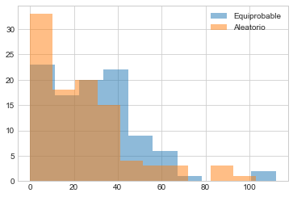

```python
dic = {"Equiprobable": bet_eq_fc, "Aleatorio": bet_al_fc}
pd.DataFrame(dic,).describe()
```

<div>
<style scoped>
    .dataframe tbody tr th:only-of-type {
        vertical-align: middle;
    }

    .dataframe tbody tr th {
        vertical-align: top;
    }

    .dataframe thead th {
        text-align: right;
    }

</style>
<table border="1" class="dataframe">
  <thead>
    <tr style="text-align: right;">
      <th></th>
      <th>Equiprobable</th>
      <th>Aleatorio</th>
    </tr>
  </thead>
  <tbody>
    <tr>
      <th>count</th>
      <td>100.000000</td>
      <td>100.000000</td>
    </tr>
    <tr>
      <th>mean</th>
      <td>28.850000</td>
      <td>23.730000</td>
    </tr>
    <tr>
      <th>std</th>
      <td>21.281839</td>
      <td>21.787706</td>
    </tr>
    <tr>
      <th>min</th>
      <td>0.000000</td>
      <td>0.000000</td>
    </tr>
    <tr>
      <th>25%</th>
      <td>14.000000</td>
      <td>7.000000</td>
    </tr>
    <tr>
      <th>50%</th>
      <td>27.500000</td>
      <td>20.000000</td>
    </tr>
    <tr>
      <th>75%</th>
      <td>40.000000</td>
      <td>33.500000</td>
    </tr>
    <tr>
      <th>max</th>
      <td>112.000000</td>
      <td>103.000000</td>
    </tr>
  </tbody>
</table>
</div>

### Visualización de los resultados del algoritmo

```python
gambling_random = np.random
gambling_random.seed(42)
x, y, valores_x, valores_y, valores_t = recocido_simulado(fo, vecindad, inicializador_aleatorio(bets), probabilidad_aceptacion,2000,1,5,150,0.85,gambling_random, NUM_GAMES, INITIAL_CHIPS, DAYS, bets, LEAVE_WITH_MIN, LEAVE_WITH_MAX)
```

    Iteracion  0/2000 : T =    5, y = 28.8, y_vecina = 31.1
    Iteracion  1/2000 : T = 4.25, y = 31.1, y_vecina = 22.7
    Iteracion  2/2000 : T = 4.25, y = 31.1, y_vecina = 30.5
    Iteracion  3/2000 : T = 4.25, y = 30.5, y_vecina = 25.6
    Iteracion  4/2000 : T = 4.25, y = 25.6, y_vecina = 17.5
    Iteracion  5/2000 : T = 4.25, y = 25.6, y_vecina = 25.8
    Iteracion  6/2000 : T = 4.25, y = 25.8, y_vecina = 29.3
    Iteracion  7/2000 : T = 4.25, y = 29.3, y_vecina = 33.9
    Iteracion  8/2000 : T = 4.25, y = 33.9, y_vecina = 30.3
    Iteracion  9/2000 : T = 4.25, y = 33.9, y_vecina = 28.2
    Iteracion 10/2000 : T = 4.25, y = 28.2, y_vecina = 26.1
    Iteracion 11/2000 : T = 4.25, y = 28.2, y_vecina = 44.2
    Iteracion 12/2000 : T = 4.25, y = 44.2, y_vecina =   32
    Iteracion 13/2000 : T = 4.25, y = 44.2, y_vecina = 33.9
    Iteracion 14/2000 : T = 4.25, y = 44.2, y_vecina =   33
    Iteracion 15/2000 : T = 4.25, y = 44.2, y_vecina = 30.2
    Iteracion 16/2000 : T = 4.25, y = 44.2, y_vecina = 25.9
    Iteracion 17/2000 : T = 4.25, y = 44.2, y_vecina = 26.6
    Iteracion 18/2000 : T = 4.25, y = 44.2, y_vecina = 21.1
    Iteracion 19/2000 : T = 4.25, y = 44.2, y_vecina =   33
    Iteracion 20/2000 : T = 4.25, y = 44.2, y_vecina = 28.6
    Iteracion 21/2000 : T = 4.25, y = 44.2, y_vecina = 27.1
    Iteracion 22/2000 : T = 4.25, y = 44.2, y_vecina = 29.5
    Iteracion 23/2000 : T = 4.25, y = 44.2, y_vecina = 30.6
    Iteracion 24/2000 : T = 4.25, y = 44.2, y_vecina = 24.2
    Iteracion 25/2000 : T = 4.25, y = 44.2, y_vecina = 29.6
    Iteracion 26/2000 : T = 4.25, y = 44.2, y_vecina = 30.4
    Iteracion 27/2000 : T = 4.25, y = 44.2, y_vecina = 31.5
    Iteracion 28/2000 : T = 4.25, y = 44.2, y_vecina = 28.8
    Iteracion 29/2000 : T = 4.25, y = 44.2, y_vecina = 27.3
    Iteracion 30/2000 : T = 4.25, y = 44.2, y_vecina = 27.7
    Iteracion 31/2000 : T = 4.25, y = 44.2, y_vecina = 21.7
    Iteracion 32/2000 : T = 4.25, y = 44.2, y_vecina =   26
    Iteracion 33/2000 : T = 4.25, y = 44.2, y_vecina = 25.8
    Iteracion 34/2000 : T = 4.25, y = 44.2, y_vecina = 27.3
    Iteracion 35/2000 : T = 4.25, y = 44.2, y_vecina = 25.7
    Iteracion 36/2000 : T = 4.25, y = 44.2, y_vecina = 33.3
    Iteracion 37/2000 : T = 4.25, y = 44.2, y_vecina = 25.6
    Iteracion 38/2000 : T = 4.25, y = 44.2, y_vecina = 29.4
    Iteracion 39/2000 : T = 4.25, y = 44.2, y_vecina = 25.7
    Iteracion 40/2000 : T = 4.25, y = 44.2, y_vecina = 31.6
    Iteracion 41/2000 : T = 4.25, y = 44.2, y_vecina = 22.9
    Iteracion 42/2000 : T = 4.25, y = 44.2, y_vecina = 28.5
    Iteracion 43/2000 : T = 4.25, y = 44.2, y_vecina = 14.8
    Iteracion 44/2000 : T = 4.25, y = 44.2, y_vecina = 28.1
    Iteracion 45/2000 : T = 4.25, y = 44.2, y_vecina = 24.7
    Iteracion 46/2000 : T = 4.25, y = 44.2, y_vecina = 24.6
    Iteracion 47/2000 : T = 4.25, y = 44.2, y_vecina =   33
    Iteracion 48/2000 : T = 4.25, y = 44.2, y_vecina = 19.1
    Iteracion 49/2000 : T = 4.25, y = 44.2, y_vecina = 30.1
    Iteracion 50/2000 : T = 4.25, y = 44.2, y_vecina = 24.1
    Iteracion 51/2000 : T = 4.25, y = 44.2, y_vecina = 23.6
    Iteracion 52/2000 : T = 4.25, y = 44.2, y_vecina = 25.5
    Iteracion 53/2000 : T = 4.25, y = 44.2, y_vecina = 33.1
    Iteracion 54/2000 : T = 4.25, y = 44.2, y_vecina = 27.8
    Iteracion 55/2000 : T = 4.25, y = 44.2, y_vecina = 33.3
    Iteracion 56/2000 : T = 4.25, y = 44.2, y_vecina = 30.8
    Iteracion 57/2000 : T = 4.25, y = 44.2, y_vecina = 22.4
    Iteracion 58/2000 : T = 4.25, y = 44.2, y_vecina = 27.6
    Iteracion 59/2000 : T = 4.25, y = 44.2, y_vecina =   32
    Iteracion 60/2000 : T = 4.25, y = 44.2, y_vecina = 26.1
    Iteracion 61/2000 : T = 4.25, y = 44.2, y_vecina = 20.7
    Iteracion 62/2000 : T = 4.25, y = 44.2, y_vecina = 27.2
    Iteracion 63/2000 : T = 4.25, y = 44.2, y_vecina = 31.6
    Iteracion 64/2000 : T = 4.25, y = 44.2, y_vecina = 20.4
    Iteracion 65/2000 : T = 4.25, y = 44.2, y_vecina = 23.5
    Iteracion 66/2000 : T = 4.25, y = 44.2, y_vecina = 25.2
    Iteracion 67/2000 : T = 4.25, y = 44.2, y_vecina = 29.3
    Iteracion 68/2000 : T = 4.25, y = 44.2, y_vecina = 28.9
    Iteracion 69/2000 : T = 4.25, y = 44.2, y_vecina = 28.7
    Iteracion 70/2000 : T = 4.25, y = 44.2, y_vecina = 25.2
    Iteracion 71/2000 : T = 4.25, y = 44.2, y_vecina = 24.7
    Iteracion 72/2000 : T = 4.25, y = 44.2, y_vecina = 28.8
    Iteracion 73/2000 : T = 4.25, y = 44.2, y_vecina = 26.6
    Iteracion 74/2000 : T = 4.25, y = 44.2, y_vecina = 27.7
    Iteracion 75/2000 : T = 4.25, y = 44.2, y_vecina = 28.7
    Iteracion 76/2000 : T = 4.25, y = 44.2, y_vecina = 35.7
    Iteracion 77/2000 : T = 4.25, y = 44.2, y_vecina = 25.5
    Iteracion 78/2000 : T = 4.25, y = 44.2, y_vecina = 23.8
    Iteracion 79/2000 : T = 4.25, y = 44.2, y_vecina = 20.2
    Iteracion 80/2000 : T = 4.25, y = 44.2, y_vecina = 27.1
    Iteracion 81/2000 : T = 4.25, y = 44.2, y_vecina =   24
    Iteracion 82/2000 : T = 4.25, y = 44.2, y_vecina = 30.6
    Iteracion 83/2000 : T = 4.25, y = 44.2, y_vecina = 33.2
    Iteracion 84/2000 : T = 4.25, y = 44.2, y_vecina =   23
    Iteracion 85/2000 : T = 4.25, y = 44.2, y_vecina = 31.9
    Iteracion 86/2000 : T = 4.25, y = 44.2, y_vecina = 34.9
    Iteracion 87/2000 : T = 4.25, y = 44.2, y_vecina = 34.4
    Iteracion 88/2000 : T = 4.25, y = 44.2, y_vecina = 27.1
    Iteracion 89/2000 : T = 4.25, y = 44.2, y_vecina = 30.9
    Iteracion 90/2000 : T = 4.25, y = 44.2, y_vecina = 30.1
    Iteracion 91/2000 : T = 4.25, y = 30.1, y_vecina = 32.8
    Iteracion 92/2000 : T = 4.25, y = 32.8, y_vecina = 28.9
    Iteracion 93/2000 : T = 4.25, y = 32.8, y_vecina = 35.1
    Iteracion 94/2000 : T = 4.25, y = 35.1, y_vecina = 32.3
    Iteracion 95/2000 : T = 4.25, y = 35.1, y_vecina = 37.6
    Iteracion 96/2000 : T = 4.25, y = 37.6, y_vecina = 32.9
    Iteracion 97/2000 : T = 4.25, y = 32.9, y_vecina = 28.7
    Iteracion 98/2000 : T = 4.25, y = 32.9, y_vecina = 31.9
    Iteracion 99/2000 : T = 4.25, y = 31.9, y_vecina = 24.7
    Iteracion 100/2000 : T = 4.25, y = 31.9, y_vecina = 25.7
    Iteracion 101/2000 : T = 4.25, y = 31.9, y_vecina =   33
    Iteracion 102/2000 : T = 4.25, y =   33, y_vecina = 33.2
    Iteracion 103/2000 : T = 4.25, y = 33.2, y_vecina = 26.5
    Iteracion 104/2000 : T = 4.25, y = 33.2, y_vecina = 32.4
    Iteracion 105/2000 : T = 4.25, y = 32.4, y_vecina = 30.6
    Iteracion 106/2000 : T = 4.25, y = 32.4, y_vecina = 23.7
    Iteracion 107/2000 : T = 4.25, y = 32.4, y_vecina = 29.7
    Iteracion 108/2000 : T = 4.25, y = 32.4, y_vecina = 25.9
    Iteracion 109/2000 : T = 4.25, y = 32.4, y_vecina = 27.2
    Iteracion 110/2000 : T = 4.25, y = 32.4, y_vecina = 27.9
    Iteracion 111/2000 : T = 4.25, y = 32.4, y_vecina = 25.8
    Iteracion 112/2000 : T = 4.25, y = 32.4, y_vecina = 25.5
    Iteracion 113/2000 : T = 4.25, y = 32.4, y_vecina = 25.8
    Iteracion 114/2000 : T = 4.25, y = 32.4, y_vecina = 31.1
    Iteracion 115/2000 : T = 4.25, y = 31.1, y_vecina = 28.3
    Iteracion 116/2000 : T = 4.25, y = 31.1, y_vecina = 24.9
    Iteracion 117/2000 : T = 4.25, y = 31.1, y_vecina = 30.3
    Iteracion 118/2000 : T = 4.25, y = 31.1, y_vecina = 24.6
    Iteracion 119/2000 : T = 4.25, y = 31.1, y_vecina = 37.1
    Iteracion 120/2000 : T = 4.25, y = 37.1, y_vecina = 36.3
    Iteracion 121/2000 : T = 4.25, y = 36.3, y_vecina = 33.8
    Iteracion 122/2000 : T = 4.25, y = 36.3, y_vecina = 23.7
    Iteracion 123/2000 : T = 4.25, y = 36.3, y_vecina = 29.9
    Iteracion 124/2000 : T = 4.25, y = 36.3, y_vecina = 33.2
    Iteracion 125/2000 : T = 4.25, y = 33.2, y_vecina = 30.1
    Iteracion 126/2000 : T = 4.25, y = 33.2, y_vecina = 28.8
    Iteracion 127/2000 : T = 4.25, y = 33.2, y_vecina = 26.9
    Iteracion 128/2000 : T = 4.25, y = 33.2, y_vecina = 29.4
    Iteracion 129/2000 : T = 4.25, y = 33.2, y_vecina = 31.2
    Iteracion 130/2000 : T = 4.25, y = 31.2, y_vecina = 32.2
    Iteracion 131/2000 : T = 4.25, y = 32.2, y_vecina = 28.9
    Iteracion 132/2000 : T = 4.25, y = 32.2, y_vecina = 21.1
    Iteracion 133/2000 : T = 4.25, y = 32.2, y_vecina = 29.8
    Iteracion 134/2000 : T = 4.25, y = 29.8, y_vecina = 20.4
    Iteracion 135/2000 : T = 4.25, y = 29.8, y_vecina = 27.9
    Iteracion 136/2000 : T = 4.25, y = 29.8, y_vecina = 26.8
    Iteracion 137/2000 : T = 4.25, y = 26.8, y_vecina = 26.7
    Iteracion 138/2000 : T = 4.25, y = 26.7, y_vecina = 24.7
    Iteracion 139/2000 : T = 4.25, y = 26.7, y_vecina = 21.5
    Iteracion 140/2000 : T = 4.25, y = 26.7, y_vecina = 31.6
    Iteracion 141/2000 : T = 4.25, y = 31.6, y_vecina = 30.9
    Iteracion 142/2000 : T = 4.25, y = 30.9, y_vecina = 26.1
    Iteracion 143/2000 : T = 4.25, y = 30.9, y_vecina = 28.2
    Iteracion 144/2000 : T = 4.25, y = 30.9, y_vecina =   36
    Iteracion 145/2000 : T = 4.25, y =   36, y_vecina =   34
    Iteracion 146/2000 : T = 4.25, y =   34, y_vecina = 28.5
    Iteracion 147/2000 : T = 4.25, y =   34, y_vecina = 27.1
    Iteracion 148/2000 : T = 4.25, y = 27.1, y_vecina = 30.8
    Iteracion 149/2000 : T = 4.25, y = 30.8, y_vecina = 33.4
    Iteracion 150/2000 : T = 4.25, y = 33.4, y_vecina = 29.3
    Iteracion 151/2000 : T = 3.61, y = 33.4, y_vecina = 31.8
    Iteracion 152/2000 : T = 3.61, y = 33.4, y_vecina = 33.9
    Iteracion 153/2000 : T = 3.61, y = 33.9, y_vecina = 33.2
    Iteracion 154/2000 : T = 3.61, y = 33.2, y_vecina = 29.6
    Iteracion 155/2000 : T = 3.61, y = 29.6, y_vecina = 31.1
    Iteracion 156/2000 : T = 3.61, y = 31.1, y_vecina = 33.7
    Iteracion 157/2000 : T = 3.61, y = 33.7, y_vecina = 27.2
    Iteracion 158/2000 : T = 3.61, y = 33.7, y_vecina = 31.4
    Iteracion 159/2000 : T = 3.61, y = 31.4, y_vecina =   35
    Iteracion 160/2000 : T = 3.61, y =   35, y_vecina = 28.6
    Iteracion 161/2000 : T = 3.61, y = 28.6, y_vecina = 31.5
    Iteracion 162/2000 : T = 3.61, y = 31.5, y_vecina = 33.5
    Iteracion 163/2000 : T = 3.61, y = 33.5, y_vecina = 32.4
    Iteracion 164/2000 : T = 3.61, y = 32.4, y_vecina = 28.4
    Iteracion 165/2000 : T = 3.61, y = 28.4, y_vecina = 32.2
    Iteracion 166/2000 : T = 3.61, y = 32.2, y_vecina =   20
    Iteracion 167/2000 : T = 3.61, y = 32.2, y_vecina = 36.9
    Iteracion 168/2000 : T = 3.61, y = 36.9, y_vecina = 27.3
    Iteracion 169/2000 : T = 3.61, y = 36.9, y_vecina = 22.1
    Iteracion 170/2000 : T = 3.61, y = 36.9, y_vecina = 33.7
    Iteracion 171/2000 : T = 3.61, y = 36.9, y_vecina = 32.9
    Iteracion 172/2000 : T = 3.61, y = 32.9, y_vecina = 30.3
    Iteracion 173/2000 : T = 3.61, y = 32.9, y_vecina = 24.1
    Iteracion 174/2000 : T = 3.61, y = 32.9, y_vecina = 32.4
    Iteracion 175/2000 : T = 3.61, y = 32.4, y_vecina = 32.4
    Iteracion 176/2000 : T = 3.61, y = 32.4, y_vecina = 26.2
    Iteracion 177/2000 : T = 3.61, y = 32.4, y_vecina = 37.2
    Iteracion 178/2000 : T = 3.61, y = 37.2, y_vecina =   29
    Iteracion 179/2000 : T = 3.61, y =   29, y_vecina = 27.8
    Iteracion 180/2000 : T = 3.61, y = 27.8, y_vecina = 29.9
    Iteracion 181/2000 : T = 3.61, y = 29.9, y_vecina = 33.2
    Iteracion 182/2000 : T = 3.61, y = 33.2, y_vecina =   29
    Iteracion 183/2000 : T = 3.61, y = 33.2, y_vecina = 38.8
    Iteracion 184/2000 : T = 3.61, y = 38.8, y_vecina = 26.1
    Iteracion 185/2000 : T = 3.61, y = 38.8, y_vecina = 28.9
    Iteracion 186/2000 : T = 3.61, y = 38.8, y_vecina = 23.7
    Iteracion 187/2000 : T = 3.61, y = 38.8, y_vecina = 32.7
    Iteracion 188/2000 : T = 3.61, y = 38.8, y_vecina = 20.9
    Iteracion 189/2000 : T = 3.61, y = 38.8, y_vecina = 33.8
    Iteracion 190/2000 : T = 3.61, y = 38.8, y_vecina = 38.4
    Iteracion 191/2000 : T = 3.61, y = 38.4, y_vecina = 25.6
    Iteracion 192/2000 : T = 3.61, y = 38.4, y_vecina =   30
    Iteracion 193/2000 : T = 3.61, y =   30, y_vecina = 25.5
    Iteracion 194/2000 : T = 3.61, y =   30, y_vecina = 30.8
    Iteracion 195/2000 : T = 3.61, y = 30.8, y_vecina = 26.8
    Iteracion 196/2000 : T = 3.61, y = 30.8, y_vecina = 28.2
    Iteracion 197/2000 : T = 3.61, y = 28.2, y_vecina = 25.1
    Iteracion 198/2000 : T = 3.61, y = 28.2, y_vecina = 25.4
    Iteracion 199/2000 : T = 3.61, y = 28.2, y_vecina = 30.2
    Iteracion 200/2000 : T = 3.61, y = 30.2, y_vecina = 29.2
    Iteracion 201/2000 : T = 3.61, y = 29.2, y_vecina =   30
    Iteracion 202/2000 : T = 3.61, y =   30, y_vecina = 33.3
    Iteracion 203/2000 : T = 3.61, y = 33.3, y_vecina = 26.7
    Iteracion 204/2000 : T = 3.61, y = 33.3, y_vecina = 29.5
    Iteracion 205/2000 : T = 3.61, y = 33.3, y_vecina = 25.9
    Iteracion 206/2000 : T = 3.61, y = 33.3, y_vecina = 18.8
    Iteracion 207/2000 : T = 3.61, y = 33.3, y_vecina = 30.8
    Iteracion 208/2000 : T = 3.61, y = 30.8, y_vecina = 25.8
    Iteracion 209/2000 : T = 3.61, y = 30.8, y_vecina = 23.3
    Iteracion 210/2000 : T = 3.61, y = 30.8, y_vecina = 25.8
    Iteracion 211/2000 : T = 3.61, y = 30.8, y_vecina = 34.9
    Iteracion 212/2000 : T = 3.61, y = 34.9, y_vecina = 29.2
    Iteracion 213/2000 : T = 3.61, y = 34.9, y_vecina = 24.4
    Iteracion 214/2000 : T = 3.61, y = 34.9, y_vecina = 33.5
    Iteracion 215/2000 : T = 3.61, y = 33.5, y_vecina = 27.1
    Iteracion 216/2000 : T = 3.61, y = 33.5, y_vecina = 24.4
    Iteracion 217/2000 : T = 3.61, y = 33.5, y_vecina =   30
    Iteracion 218/2000 : T = 3.61, y = 33.5, y_vecina = 33.1
    Iteracion 219/2000 : T = 3.61, y = 33.1, y_vecina = 31.4
    Iteracion 220/2000 : T = 3.61, y = 31.4, y_vecina = 30.8
    Iteracion 221/2000 : T = 3.61, y = 30.8, y_vecina = 25.7
    Iteracion 222/2000 : T = 3.61, y = 30.8, y_vecina = 25.8
    Iteracion 223/2000 : T = 3.61, y = 25.8, y_vecina = 30.1
    Iteracion 224/2000 : T = 3.61, y = 30.1, y_vecina = 30.4
    Iteracion 225/2000 : T = 3.61, y = 30.4, y_vecina = 27.7
    Iteracion 226/2000 : T = 3.61, y = 27.7, y_vecina = 22.3
    Iteracion 227/2000 : T = 3.61, y = 27.7, y_vecina = 24.6
    Iteracion 228/2000 : T = 3.61, y = 27.7, y_vecina = 24.5
    Iteracion 229/2000 : T = 3.61, y = 24.5, y_vecina = 24.8
    Iteracion 230/2000 : T = 3.61, y = 24.8, y_vecina = 27.1
    Iteracion 231/2000 : T = 3.61, y = 27.1, y_vecina = 28.3
    Iteracion 232/2000 : T = 3.61, y = 28.3, y_vecina = 30.4
    Iteracion 233/2000 : T = 3.61, y = 30.4, y_vecina = 26.2
    Iteracion 234/2000 : T = 3.61, y = 30.4, y_vecina = 29.5
    Iteracion 235/2000 : T = 3.61, y = 29.5, y_vecina = 28.7
    Iteracion 236/2000 : T = 3.61, y = 28.7, y_vecina = 31.8
    Iteracion 237/2000 : T = 3.61, y = 31.8, y_vecina = 29.5
    Iteracion 238/2000 : T = 3.61, y = 31.8, y_vecina = 31.1
    Iteracion 239/2000 : T = 3.61, y = 31.1, y_vecina = 27.1
    Iteracion 240/2000 : T = 3.61, y = 31.1, y_vecina = 34.9
    Iteracion 241/2000 : T = 3.61, y = 34.9, y_vecina = 30.3
    Iteracion 242/2000 : T = 3.61, y = 34.9, y_vecina = 25.8
    Iteracion 243/2000 : T = 3.61, y = 34.9, y_vecina = 23.6
    Iteracion 244/2000 : T = 3.61, y = 34.9, y_vecina = 25.5
    Iteracion 245/2000 : T = 3.61, y = 34.9, y_vecina = 28.7
    Iteracion 246/2000 : T = 3.61, y = 34.9, y_vecina = 19.4
    Iteracion 247/2000 : T = 3.61, y = 34.9, y_vecina = 31.4
    Iteracion 248/2000 : T = 3.61, y = 34.9, y_vecina = 29.4
    Iteracion 249/2000 : T = 3.61, y = 34.9, y_vecina = 36.1
    Iteracion 250/2000 : T = 3.61, y = 36.1, y_vecina = 25.1
    Iteracion 251/2000 : T = 3.61, y = 36.1, y_vecina = 32.2
    Iteracion 252/2000 : T = 3.61, y = 36.1, y_vecina =   23
    Iteracion 253/2000 : T = 3.61, y = 36.1, y_vecina = 28.5
    Iteracion 254/2000 : T = 3.61, y = 28.5, y_vecina = 30.1
    Iteracion 255/2000 : T = 3.61, y = 30.1, y_vecina = 28.2
    Iteracion 256/2000 : T = 3.61, y = 30.1, y_vecina = 28.1
    Iteracion 257/2000 : T = 3.61, y = 30.1, y_vecina = 25.8
    Iteracion 258/2000 : T = 3.61, y = 30.1, y_vecina = 24.4
    Iteracion 259/2000 : T = 3.61, y = 30.1, y_vecina =   31
    Iteracion 260/2000 : T = 3.61, y =   31, y_vecina = 28.3
    Iteracion 261/2000 : T = 3.61, y =   31, y_vecina = 30.4
    Iteracion 262/2000 : T = 3.61, y = 30.4, y_vecina = 18.4
    Iteracion 263/2000 : T = 3.61, y = 30.4, y_vecina = 29.3
    Iteracion 264/2000 : T = 3.61, y = 29.3, y_vecina = 27.9
    Iteracion 265/2000 : T = 3.61, y = 27.9, y_vecina = 34.3
    Iteracion 266/2000 : T = 3.61, y = 34.3, y_vecina = 26.5
    Iteracion 267/2000 : T = 3.61, y = 34.3, y_vecina = 33.5
    Iteracion 268/2000 : T = 3.61, y = 33.5, y_vecina = 34.8
    Iteracion 269/2000 : T = 3.61, y = 34.8, y_vecina = 32.5
    Iteracion 270/2000 : T = 3.61, y = 34.8, y_vecina = 28.8
    Iteracion 271/2000 : T = 3.61, y = 28.8, y_vecina = 33.7
    Iteracion 272/2000 : T = 3.61, y = 33.7, y_vecina = 27.3
    Iteracion 273/2000 : T = 3.61, y = 33.7, y_vecina = 31.1
    Iteracion 274/2000 : T = 3.61, y = 31.1, y_vecina = 21.6
    Iteracion 275/2000 : T = 3.61, y = 31.1, y_vecina = 30.1
    Iteracion 276/2000 : T = 3.61, y = 30.1, y_vecina = 30.5
    Iteracion 277/2000 : T = 3.61, y = 30.5, y_vecina = 21.5
    Iteracion 278/2000 : T = 3.61, y = 30.5, y_vecina = 34.5
    Iteracion 279/2000 : T = 3.61, y = 34.5, y_vecina = 21.5
    Iteracion 280/2000 : T = 3.61, y = 34.5, y_vecina =   20
    Iteracion 281/2000 : T = 3.61, y = 34.5, y_vecina = 22.9
    Iteracion 282/2000 : T = 3.61, y = 34.5, y_vecina = 27.2
    Iteracion 283/2000 : T = 3.61, y = 34.5, y_vecina = 30.2
    Iteracion 284/2000 : T = 3.61, y = 34.5, y_vecina = 25.7
    Iteracion 285/2000 : T = 3.61, y = 34.5, y_vecina = 27.5
    Iteracion 286/2000 : T = 3.61, y = 34.5, y_vecina = 29.9
    Iteracion 287/2000 : T = 3.61, y = 34.5, y_vecina = 27.3
    Iteracion 288/2000 : T = 3.61, y = 34.5, y_vecina = 21.8
    Iteracion 289/2000 : T = 3.61, y = 34.5, y_vecina = 21.5
    Iteracion 290/2000 : T = 3.61, y = 34.5, y_vecina = 21.3
    Iteracion 291/2000 : T = 3.61, y = 21.3, y_vecina = 25.1
    Iteracion 292/2000 : T = 3.61, y = 25.1, y_vecina = 24.8
    Iteracion 293/2000 : T = 3.61, y = 24.8, y_vecina = 41.7
    Iteracion 294/2000 : T = 3.61, y = 41.7, y_vecina = 32.9
    Iteracion 295/2000 : T = 3.61, y = 41.7, y_vecina = 35.4
    Iteracion 296/2000 : T = 3.61, y = 41.7, y_vecina = 27.9
    Iteracion 297/2000 : T = 3.61, y = 27.9, y_vecina = 24.7
    Iteracion 298/2000 : T = 3.61, y = 27.9, y_vecina = 28.5
    Iteracion 299/2000 : T = 3.61, y = 28.5, y_vecina = 25.2
    Iteracion 300/2000 : T = 3.61, y = 28.5, y_vecina = 35.3
    Iteracion 301/2000 : T = 3.07, y = 35.3, y_vecina = 21.3
    Iteracion 302/2000 : T = 3.07, y = 21.3, y_vecina = 28.9
    Iteracion 303/2000 : T = 3.07, y = 28.9, y_vecina = 29.3
    Iteracion 304/2000 : T = 3.07, y = 29.3, y_vecina = 29.1
    Iteracion 305/2000 : T = 3.07, y = 29.1, y_vecina = 30.2
    Iteracion 306/2000 : T = 3.07, y = 30.2, y_vecina = 22.4
    Iteracion 307/2000 : T = 3.07, y = 30.2, y_vecina = 27.1
    Iteracion 308/2000 : T = 3.07, y = 27.1, y_vecina = 29.9
    Iteracion 309/2000 : T = 3.07, y = 29.9, y_vecina = 31.7
    Iteracion 310/2000 : T = 3.07, y = 31.7, y_vecina = 32.1
    Iteracion 311/2000 : T = 3.07, y = 32.1, y_vecina =   25
    Iteracion 312/2000 : T = 3.07, y = 32.1, y_vecina = 34.8
    Iteracion 313/2000 : T = 3.07, y = 34.8, y_vecina = 25.7
    Iteracion 314/2000 : T = 3.07, y = 34.8, y_vecina = 23.7
    Iteracion 315/2000 : T = 3.07, y = 34.8, y_vecina = 36.3
    Iteracion 316/2000 : T = 3.07, y = 36.3, y_vecina = 38.3
    Iteracion 317/2000 : T = 3.07, y = 38.3, y_vecina = 30.5
    Iteracion 318/2000 : T = 3.07, y = 38.3, y_vecina = 32.4
    Iteracion 319/2000 : T = 3.07, y = 32.4, y_vecina = 19.2
    Iteracion 320/2000 : T = 3.07, y = 32.4, y_vecina = 26.4
    Iteracion 321/2000 : T = 3.07, y = 32.4, y_vecina = 25.2
    Iteracion 322/2000 : T = 3.07, y = 25.2, y_vecina = 25.4
    Iteracion 323/2000 : T = 3.07, y = 25.4, y_vecina = 24.3
    Iteracion 324/2000 : T = 3.07, y = 24.3, y_vecina = 23.9
    Iteracion 325/2000 : T = 3.07, y = 23.9, y_vecina = 28.5
    Iteracion 326/2000 : T = 3.07, y = 28.5, y_vecina = 31.4
    Iteracion 327/2000 : T = 3.07, y = 31.4, y_vecina = 27.7
    Iteracion 328/2000 : T = 3.07, y = 27.7, y_vecina = 30.6
    Iteracion 329/2000 : T = 3.07, y = 30.6, y_vecina = 31.8
    Iteracion 330/2000 : T = 3.07, y = 31.8, y_vecina = 28.3
    Iteracion 331/2000 : T = 3.07, y = 31.8, y_vecina = 29.5
    Iteracion 332/2000 : T = 3.07, y = 31.8, y_vecina = 30.6
    Iteracion 333/2000 : T = 3.07, y = 30.6, y_vecina = 21.5
    Iteracion 334/2000 : T = 3.07, y = 30.6, y_vecina = 33.8
    Iteracion 335/2000 : T = 3.07, y = 33.8, y_vecina = 25.7
    Iteracion 336/2000 : T = 3.07, y = 33.8, y_vecina = 31.8
    Iteracion 337/2000 : T = 3.07, y = 31.8, y_vecina = 26.8
    Iteracion 338/2000 : T = 3.07, y = 26.8, y_vecina = 28.4
    Iteracion 339/2000 : T = 3.07, y = 28.4, y_vecina = 24.6
    Iteracion 340/2000 : T = 3.07, y = 28.4, y_vecina = 35.1
    Iteracion 341/2000 : T = 3.07, y = 35.1, y_vecina = 24.3
    Iteracion 342/2000 : T = 3.07, y = 35.1, y_vecina = 27.6
    Iteracion 343/2000 : T = 3.07, y = 35.1, y_vecina = 28.4
    Iteracion 344/2000 : T = 3.07, y = 35.1, y_vecina = 27.4
    Iteracion 345/2000 : T = 3.07, y = 35.1, y_vecina = 35.3
    Iteracion 346/2000 : T = 3.07, y = 35.3, y_vecina =   30
    Iteracion 347/2000 : T = 3.07, y = 35.3, y_vecina = 28.3
    Iteracion 348/2000 : T = 3.07, y = 35.3, y_vecina = 28.2
    Iteracion 349/2000 : T = 3.07, y = 35.3, y_vecina = 22.6
    Iteracion 350/2000 : T = 3.07, y = 35.3, y_vecina = 28.7
    Iteracion 351/2000 : T = 3.07, y = 35.3, y_vecina = 36.1
    Iteracion 352/2000 : T = 3.07, y = 36.1, y_vecina = 38.4
    Iteracion 353/2000 : T = 3.07, y = 38.4, y_vecina = 33.8
    Iteracion 354/2000 : T = 3.07, y = 38.4, y_vecina = 26.5
    Iteracion 355/2000 : T = 3.07, y = 38.4, y_vecina = 29.1
    Iteracion 356/2000 : T = 3.07, y = 38.4, y_vecina = 31.7
    Iteracion 357/2000 : T = 3.07, y = 38.4, y_vecina = 34.9
    Iteracion 358/2000 : T = 3.07, y = 34.9, y_vecina = 26.2
    Iteracion 359/2000 : T = 3.07, y = 26.2, y_vecina = 30.2
    Iteracion 360/2000 : T = 3.07, y = 30.2, y_vecina = 29.9
    Iteracion 361/2000 : T = 3.07, y = 29.9, y_vecina = 29.6
    Iteracion 362/2000 : T = 3.07, y = 29.6, y_vecina = 31.2
    Iteracion 363/2000 : T = 3.07, y = 31.2, y_vecina =   21
    Iteracion 364/2000 : T = 3.07, y = 31.2, y_vecina = 23.2
    Iteracion 365/2000 : T = 3.07, y = 31.2, y_vecina = 33.8
    Iteracion 366/2000 : T = 3.07, y = 33.8, y_vecina = 24.2
    Iteracion 367/2000 : T = 3.07, y = 33.8, y_vecina = 24.6
    Iteracion 368/2000 : T = 3.07, y = 33.8, y_vecina = 30.8
    Iteracion 369/2000 : T = 3.07, y = 33.8, y_vecina = 27.6
    Iteracion 370/2000 : T = 3.07, y = 33.8, y_vecina = 24.7
    Iteracion 371/2000 : T = 3.07, y = 33.8, y_vecina =   32
    Iteracion 372/2000 : T = 3.07, y =   32, y_vecina =   30
    Iteracion 373/2000 : T = 3.07, y =   30, y_vecina = 29.4
    Iteracion 374/2000 : T = 3.07, y = 29.4, y_vecina = 39.7
    Iteracion 375/2000 : T = 3.07, y = 39.7, y_vecina = 40.6
    Iteracion 376/2000 : T = 3.07, y = 40.6, y_vecina = 34.2
    Iteracion 377/2000 : T = 3.07, y = 40.6, y_vecina = 22.9
    Iteracion 378/2000 : T = 3.07, y = 40.6, y_vecina = 28.1
    Iteracion 379/2000 : T = 3.07, y = 40.6, y_vecina = 27.6
    Iteracion 380/2000 : T = 3.07, y = 40.6, y_vecina = 34.2
    Iteracion 381/2000 : T = 3.07, y = 40.6, y_vecina = 27.8
    Iteracion 382/2000 : T = 3.07, y = 40.6, y_vecina = 32.9
    Iteracion 383/2000 : T = 3.07, y = 40.6, y_vecina = 33.4
    Iteracion 384/2000 : T = 3.07, y = 40.6, y_vecina = 32.7
    Iteracion 385/2000 : T = 3.07, y = 40.6, y_vecina = 34.3
    Iteracion 386/2000 : T = 3.07, y = 40.6, y_vecina = 25.5
    Iteracion 387/2000 : T = 3.07, y = 40.6, y_vecina =   31
    Iteracion 388/2000 : T = 3.07, y = 40.6, y_vecina = 22.9
    Iteracion 389/2000 : T = 3.07, y = 40.6, y_vecina = 27.8
    Iteracion 390/2000 : T = 3.07, y = 40.6, y_vecina = 19.4
    Iteracion 391/2000 : T = 3.07, y = 40.6, y_vecina = 26.6
    Iteracion 392/2000 : T = 3.07, y = 40.6, y_vecina = 30.5
    Iteracion 393/2000 : T = 3.07, y = 40.6, y_vecina = 20.9
    Iteracion 394/2000 : T = 3.07, y = 40.6, y_vecina = 31.8
    Iteracion 395/2000 : T = 3.07, y = 40.6, y_vecina = 23.4
    Iteracion 396/2000 : T = 3.07, y = 40.6, y_vecina = 24.9
    Iteracion 397/2000 : T = 3.07, y = 40.6, y_vecina = 38.8
    Iteracion 398/2000 : T = 3.07, y = 40.6, y_vecina = 25.1
    Iteracion 399/2000 : T = 3.07, y = 40.6, y_vecina = 32.6
    Iteracion 400/2000 : T = 3.07, y = 40.6, y_vecina = 29.2
    Iteracion 401/2000 : T = 3.07, y = 40.6, y_vecina = 34.1
    Iteracion 402/2000 : T = 3.07, y = 40.6, y_vecina = 29.2
    Iteracion 403/2000 : T = 3.07, y = 40.6, y_vecina = 27.6
    Iteracion 404/2000 : T = 3.07, y = 40.6, y_vecina = 29.7
    Iteracion 405/2000 : T = 3.07, y = 40.6, y_vecina = 27.2
    Iteracion 406/2000 : T = 3.07, y = 40.6, y_vecina = 34.2
    Iteracion 407/2000 : T = 3.07, y = 40.6, y_vecina = 34.9
    Iteracion 408/2000 : T = 3.07, y = 40.6, y_vecina = 29.1
    Iteracion 409/2000 : T = 3.07, y = 40.6, y_vecina = 26.9
    Iteracion 410/2000 : T = 3.07, y = 40.6, y_vecina = 23.4
    Iteracion 411/2000 : T = 3.07, y = 40.6, y_vecina = 25.9
    Iteracion 412/2000 : T = 3.07, y = 40.6, y_vecina = 25.1
    Iteracion 413/2000 : T = 3.07, y = 40.6, y_vecina = 28.2
    Iteracion 414/2000 : T = 3.07, y = 40.6, y_vecina = 29.8
    Iteracion 415/2000 : T = 3.07, y = 40.6, y_vecina = 36.1
    Iteracion 416/2000 : T = 3.07, y = 40.6, y_vecina = 32.5
    Iteracion 417/2000 : T = 3.07, y = 40.6, y_vecina = 36.8
    Iteracion 418/2000 : T = 3.07, y = 40.6, y_vecina = 27.8
    Iteracion 419/2000 : T = 3.07, y = 40.6, y_vecina = 28.8
    Iteracion 420/2000 : T = 3.07, y = 40.6, y_vecina = 27.3
    Iteracion 421/2000 : T = 3.07, y = 40.6, y_vecina = 33.5
    Iteracion 422/2000 : T = 3.07, y = 33.5, y_vecina = 29.7
    Iteracion 423/2000 : T = 3.07, y = 33.5, y_vecina = 34.1
    Iteracion 424/2000 : T = 3.07, y = 34.1, y_vecina = 29.5
    Iteracion 425/2000 : T = 3.07, y = 34.1, y_vecina = 32.6
    Iteracion 426/2000 : T = 3.07, y = 32.6, y_vecina = 33.7
    Iteracion 427/2000 : T = 3.07, y = 33.7, y_vecina = 29.6
    Iteracion 428/2000 : T = 3.07, y = 33.7, y_vecina = 42.7
    Iteracion 429/2000 : T = 3.07, y = 42.7, y_vecina = 25.3
    Iteracion 430/2000 : T = 3.07, y = 42.7, y_vecina = 28.7
    Iteracion 431/2000 : T = 3.07, y = 42.7, y_vecina = 25.6
    Iteracion 432/2000 : T = 3.07, y = 42.7, y_vecina = 30.9
    Iteracion 433/2000 : T = 3.07, y = 42.7, y_vecina = 31.3
    Iteracion 434/2000 : T = 3.07, y = 42.7, y_vecina =   23
    Iteracion 435/2000 : T = 3.07, y = 42.7, y_vecina = 39.6
    Iteracion 436/2000 : T = 3.07, y = 42.7, y_vecina = 23.9
    Iteracion 437/2000 : T = 3.07, y = 42.7, y_vecina = 23.3
    Iteracion 438/2000 : T = 3.07, y = 42.7, y_vecina = 28.8
    Iteracion 439/2000 : T = 3.07, y = 42.7, y_vecina = 27.3
    Iteracion 440/2000 : T = 3.07, y = 42.7, y_vecina = 20.6
    Iteracion 441/2000 : T = 3.07, y = 42.7, y_vecina = 22.4
    Iteracion 442/2000 : T = 3.07, y = 42.7, y_vecina = 33.9
    Iteracion 443/2000 : T = 3.07, y = 42.7, y_vecina = 30.5
    Iteracion 444/2000 : T = 3.07, y = 42.7, y_vecina = 23.9
    Iteracion 445/2000 : T = 3.07, y = 42.7, y_vecina =   32
    Iteracion 446/2000 : T = 3.07, y = 42.7, y_vecina = 23.9
    Iteracion 447/2000 : T = 3.07, y = 42.7, y_vecina = 24.7
    Iteracion 448/2000 : T = 3.07, y = 42.7, y_vecina = 25.3
    Iteracion 449/2000 : T = 3.07, y = 42.7, y_vecina = 33.9
    Iteracion 450/2000 : T = 3.07, y = 42.7, y_vecina = 35.7
    Iteracion 451/2000 : T = 2.61, y = 42.7, y_vecina = 36.6
    Iteracion 452/2000 : T = 2.61, y = 42.7, y_vecina =   30
    Iteracion 453/2000 : T = 2.61, y = 42.7, y_vecina = 25.4
    Iteracion 454/2000 : T = 2.61, y = 42.7, y_vecina = 33.3
    Iteracion 455/2000 : T = 2.61, y = 42.7, y_vecina =   26
    Iteracion 456/2000 : T = 2.61, y = 42.7, y_vecina = 44.5
    Iteracion 457/2000 : T = 2.61, y = 44.5, y_vecina =   34
    Iteracion 458/2000 : T = 2.61, y = 44.5, y_vecina = 35.3
    Iteracion 459/2000 : T = 2.61, y = 44.5, y_vecina = 29.2
    Iteracion 460/2000 : T = 2.61, y = 44.5, y_vecina = 31.4
    Iteracion 461/2000 : T = 2.61, y = 44.5, y_vecina = 18.5
    Iteracion 462/2000 : T = 2.61, y = 44.5, y_vecina = 26.2
    Iteracion 463/2000 : T = 2.61, y = 44.5, y_vecina = 24.3
    Iteracion 464/2000 : T = 2.61, y = 44.5, y_vecina = 27.3
    Iteracion 465/2000 : T = 2.61, y = 44.5, y_vecina = 36.8
    Iteracion 466/2000 : T = 2.61, y = 44.5, y_vecina = 29.5
    Iteracion 467/2000 : T = 2.61, y = 44.5, y_vecina = 23.3
    Iteracion 468/2000 : T = 2.61, y = 44.5, y_vecina = 27.7
    Iteracion 469/2000 : T = 2.61, y = 44.5, y_vecina = 29.2
    Iteracion 470/2000 : T = 2.61, y = 44.5, y_vecina = 28.3
    Iteracion 471/2000 : T = 2.61, y = 44.5, y_vecina = 23.8
    Iteracion 472/2000 : T = 2.61, y = 44.5, y_vecina = 26.5
    Iteracion 473/2000 : T = 2.61, y = 44.5, y_vecina = 22.5
    Iteracion 474/2000 : T = 2.61, y = 44.5, y_vecina = 26.9
    Iteracion 475/2000 : T = 2.61, y = 44.5, y_vecina = 28.2
    Iteracion 476/2000 : T = 2.61, y = 44.5, y_vecina = 27.2
    Iteracion 477/2000 : T = 2.61, y = 44.5, y_vecina = 36.6
    Iteracion 478/2000 : T = 2.61, y = 44.5, y_vecina = 21.7
    Iteracion 479/2000 : T = 2.61, y = 44.5, y_vecina =   23
    Iteracion 480/2000 : T = 2.61, y = 44.5, y_vecina =   31
    Iteracion 481/2000 : T = 2.61, y = 44.5, y_vecina = 19.5
    Iteracion 482/2000 : T = 2.61, y = 44.5, y_vecina = 32.4
    Iteracion 483/2000 : T = 2.61, y = 44.5, y_vecina = 38.1
    Iteracion 484/2000 : T = 2.61, y = 38.1, y_vecina = 29.8
    Iteracion 485/2000 : T = 2.61, y = 38.1, y_vecina = 28.6
    Iteracion 486/2000 : T = 2.61, y = 38.1, y_vecina =   29
    Iteracion 487/2000 : T = 2.61, y = 38.1, y_vecina = 28.4
    Iteracion 488/2000 : T = 2.61, y = 38.1, y_vecina = 24.8
    Iteracion 489/2000 : T = 2.61, y = 38.1, y_vecina = 27.5
    Iteracion 490/2000 : T = 2.61, y = 38.1, y_vecina =   32
    Iteracion 491/2000 : T = 2.61, y = 38.1, y_vecina = 26.3
    Iteracion 492/2000 : T = 2.61, y = 38.1, y_vecina = 26.5
    Iteracion 493/2000 : T = 2.61, y = 38.1, y_vecina = 42.3
    Iteracion 494/2000 : T = 2.61, y = 42.3, y_vecina = 31.9
    Iteracion 495/2000 : T = 2.61, y = 42.3, y_vecina = 30.8
    Iteracion 496/2000 : T = 2.61, y = 42.3, y_vecina = 23.7
    Iteracion 497/2000 : T = 2.61, y = 42.3, y_vecina = 30.2
    Iteracion 498/2000 : T = 2.61, y = 42.3, y_vecina = 20.2
    Iteracion 499/2000 : T = 2.61, y = 42.3, y_vecina = 18.3
    Iteracion 500/2000 : T = 2.61, y = 42.3, y_vecina = 26.1
    Iteracion 501/2000 : T = 2.61, y = 42.3, y_vecina = 25.9
    Iteracion 502/2000 : T = 2.61, y = 42.3, y_vecina = 30.3
    Iteracion 503/2000 : T = 2.61, y = 42.3, y_vecina =   35
    Iteracion 504/2000 : T = 2.61, y = 42.3, y_vecina = 31.6
    Iteracion 505/2000 : T = 2.61, y = 42.3, y_vecina = 31.6
    Iteracion 506/2000 : T = 2.61, y = 42.3, y_vecina = 26.4
    Iteracion 507/2000 : T = 2.61, y = 42.3, y_vecina =   31
    Iteracion 508/2000 : T = 2.61, y = 42.3, y_vecina = 23.5
    Iteracion 509/2000 : T = 2.61, y = 42.3, y_vecina = 32.7
    Iteracion 510/2000 : T = 2.61, y = 42.3, y_vecina = 31.5
    Iteracion 511/2000 : T = 2.61, y = 42.3, y_vecina = 26.6
    Iteracion 512/2000 : T = 2.61, y = 42.3, y_vecina = 37.8
    Iteracion 513/2000 : T = 2.61, y = 42.3, y_vecina = 26.5
    Iteracion 514/2000 : T = 2.61, y = 42.3, y_vecina =   26
    Iteracion 515/2000 : T = 2.61, y = 42.3, y_vecina = 28.1
    Iteracion 516/2000 : T = 2.61, y = 42.3, y_vecina = 21.1
    Iteracion 517/2000 : T = 2.61, y = 42.3, y_vecina = 31.6
    Iteracion 518/2000 : T = 2.61, y = 42.3, y_vecina = 28.3
    Iteracion 519/2000 : T = 2.61, y = 42.3, y_vecina = 39.6
    Iteracion 520/2000 : T = 2.61, y = 42.3, y_vecina = 23.7
    Iteracion 521/2000 : T = 2.61, y = 42.3, y_vecina = 28.3
    Iteracion 522/2000 : T = 2.61, y = 42.3, y_vecina = 21.4
    Iteracion 523/2000 : T = 2.61, y = 42.3, y_vecina = 33.3
    Iteracion 524/2000 : T = 2.61, y = 42.3, y_vecina =   26
    Iteracion 525/2000 : T = 2.61, y = 42.3, y_vecina = 31.3
    Iteracion 526/2000 : T = 2.61, y = 42.3, y_vecina = 25.2
    Iteracion 527/2000 : T = 2.61, y = 42.3, y_vecina = 22.7
    Iteracion 528/2000 : T = 2.61, y = 42.3, y_vecina =   29
    Iteracion 529/2000 : T = 2.61, y = 42.3, y_vecina = 29.7
    Iteracion 530/2000 : T = 2.61, y = 42.3, y_vecina = 27.5
    Iteracion 531/2000 : T = 2.61, y = 42.3, y_vecina = 30.9
    Iteracion 532/2000 : T = 2.61, y = 42.3, y_vecina = 24.6
    Iteracion 533/2000 : T = 2.61, y = 42.3, y_vecina =   30
    Iteracion 534/2000 : T = 2.61, y = 42.3, y_vecina =   29
    Iteracion 535/2000 : T = 2.61, y = 42.3, y_vecina = 29.5
    Iteracion 536/2000 : T = 2.61, y = 42.3, y_vecina = 30.2
    Iteracion 537/2000 : T = 2.61, y = 42.3, y_vecina = 36.2
    Iteracion 538/2000 : T = 2.61, y = 42.3, y_vecina = 29.5
    Iteracion 539/2000 : T = 2.61, y = 42.3, y_vecina = 26.6
    Iteracion 540/2000 : T = 2.61, y = 42.3, y_vecina = 27.7
    Iteracion 541/2000 : T = 2.61, y = 42.3, y_vecina =   28
    Iteracion 542/2000 : T = 2.61, y = 42.3, y_vecina = 32.9
    Iteracion 543/2000 : T = 2.61, y = 42.3, y_vecina =   34
    Iteracion 544/2000 : T = 2.61, y = 42.3, y_vecina = 27.9
    Iteracion 545/2000 : T = 2.61, y = 42.3, y_vecina = 35.5
    Iteracion 546/2000 : T = 2.61, y = 42.3, y_vecina = 24.4
    Iteracion 547/2000 : T = 2.61, y = 42.3, y_vecina = 22.1
    Iteracion 548/2000 : T = 2.61, y = 42.3, y_vecina = 26.1
    Iteracion 549/2000 : T = 2.61, y = 42.3, y_vecina = 30.8
    Iteracion 550/2000 : T = 2.61, y = 42.3, y_vecina = 21.7
    Iteracion 551/2000 : T = 2.61, y = 42.3, y_vecina = 30.8
    Iteracion 552/2000 : T = 2.61, y = 42.3, y_vecina = 38.5
    Iteracion 553/2000 : T = 2.61, y = 38.5, y_vecina = 30.2
    Iteracion 554/2000 : T = 2.61, y = 38.5, y_vecina = 29.8
    Iteracion 555/2000 : T = 2.61, y = 38.5, y_vecina = 28.1
    Iteracion 556/2000 : T = 2.61, y = 38.5, y_vecina = 32.1
    Iteracion 557/2000 : T = 2.61, y = 38.5, y_vecina = 22.9
    Iteracion 558/2000 : T = 2.61, y = 38.5, y_vecina = 28.2
    Iteracion 559/2000 : T = 2.61, y = 38.5, y_vecina =   33
    Iteracion 560/2000 : T = 2.61, y = 38.5, y_vecina = 23.2
    Iteracion 561/2000 : T = 2.61, y = 38.5, y_vecina = 23.7
    Iteracion 562/2000 : T = 2.61, y = 38.5, y_vecina = 31.9
    Iteracion 563/2000 : T = 2.61, y = 38.5, y_vecina = 26.6
    Iteracion 564/2000 : T = 2.61, y = 38.5, y_vecina = 39.5
    Iteracion 565/2000 : T = 2.61, y = 39.5, y_vecina = 26.3
    Iteracion 566/2000 : T = 2.61, y = 39.5, y_vecina = 32.2
    Iteracion 567/2000 : T = 2.61, y = 39.5, y_vecina = 42.3
    Iteracion 568/2000 : T = 2.61, y = 42.3, y_vecina = 26.2
    Iteracion 569/2000 : T = 2.61, y = 42.3, y_vecina = 30.5
    Iteracion 570/2000 : T = 2.61, y = 42.3, y_vecina = 32.5
    Iteracion 571/2000 : T = 2.61, y = 42.3, y_vecina = 26.7
    Iteracion 572/2000 : T = 2.61, y = 42.3, y_vecina = 31.5
    Iteracion 573/2000 : T = 2.61, y = 42.3, y_vecina = 26.2
    Iteracion 574/2000 : T = 2.61, y = 42.3, y_vecina = 31.1
    Iteracion 575/2000 : T = 2.61, y = 42.3, y_vecina = 29.7
    Iteracion 576/2000 : T = 2.61, y = 42.3, y_vecina = 30.8
    Iteracion 577/2000 : T = 2.61, y = 42.3, y_vecina = 33.3
    Iteracion 578/2000 : T = 2.61, y = 42.3, y_vecina = 30.1
    Iteracion 579/2000 : T = 2.61, y = 42.3, y_vecina = 28.1
    Iteracion 580/2000 : T = 2.61, y = 42.3, y_vecina = 25.3
    Iteracion 581/2000 : T = 2.61, y = 42.3, y_vecina = 34.4
    Iteracion 582/2000 : T = 2.61, y = 42.3, y_vecina = 28.5
    Iteracion 583/2000 : T = 2.61, y = 42.3, y_vecina =   27
    Iteracion 584/2000 : T = 2.61, y = 42.3, y_vecina = 26.8
    Iteracion 585/2000 : T = 2.61, y = 42.3, y_vecina = 37.8
    Iteracion 586/2000 : T = 2.61, y = 42.3, y_vecina = 28.8
    Iteracion 587/2000 : T = 2.61, y = 42.3, y_vecina = 30.9
    Iteracion 588/2000 : T = 2.61, y = 42.3, y_vecina = 26.1
    Iteracion 589/2000 : T = 2.61, y = 42.3, y_vecina = 25.9
    Iteracion 590/2000 : T = 2.61, y = 42.3, y_vecina = 30.3
    Iteracion 591/2000 : T = 2.61, y = 42.3, y_vecina = 33.1
    Iteracion 592/2000 : T = 2.61, y = 42.3, y_vecina = 29.8
    Iteracion 593/2000 : T = 2.61, y = 42.3, y_vecina = 29.6
    Iteracion 594/2000 : T = 2.61, y = 42.3, y_vecina = 28.8
    Iteracion 595/2000 : T = 2.61, y = 42.3, y_vecina = 28.9
    Iteracion 596/2000 : T = 2.61, y = 42.3, y_vecina = 39.5
    Iteracion 597/2000 : T = 2.61, y = 42.3, y_vecina = 29.3
    Iteracion 598/2000 : T = 2.61, y = 42.3, y_vecina = 25.8
    Iteracion 599/2000 : T = 2.61, y = 42.3, y_vecina = 26.4
    Iteracion 600/2000 : T = 2.61, y = 42.3, y_vecina = 30.8
    Iteracion 601/2000 : T = 2.22, y = 42.3, y_vecina = 24.6
    Iteracion 602/2000 : T = 2.22, y = 42.3, y_vecina = 28.7
    Iteracion 603/2000 : T = 2.22, y = 42.3, y_vecina = 28.6
    Iteracion 604/2000 : T = 2.22, y = 42.3, y_vecina = 25.5
    Iteracion 605/2000 : T = 2.22, y = 42.3, y_vecina = 28.4
    Iteracion 606/2000 : T = 2.22, y = 42.3, y_vecina =   16
    Iteracion 607/2000 : T = 2.22, y = 42.3, y_vecina = 16.9
    Iteracion 608/2000 : T = 2.22, y = 42.3, y_vecina = 39.4
    Iteracion 609/2000 : T = 2.22, y = 42.3, y_vecina = 34.1
    Iteracion 610/2000 : T = 2.22, y = 42.3, y_vecina = 30.6
    Iteracion 611/2000 : T = 2.22, y = 42.3, y_vecina = 27.4
    Iteracion 612/2000 : T = 2.22, y = 42.3, y_vecina = 31.6
    Iteracion 613/2000 : T = 2.22, y = 42.3, y_vecina = 31.6
    Iteracion 614/2000 : T = 2.22, y = 42.3, y_vecina = 35.1
    Iteracion 615/2000 : T = 2.22, y = 42.3, y_vecina = 28.8
    Iteracion 616/2000 : T = 2.22, y = 42.3, y_vecina = 26.1
    Iteracion 617/2000 : T = 2.22, y = 42.3, y_vecina = 28.4
    Iteracion 618/2000 : T = 2.22, y = 42.3, y_vecina = 31.3
    Iteracion 619/2000 : T = 2.22, y = 42.3, y_vecina = 31.3
    Iteracion 620/2000 : T = 2.22, y = 42.3, y_vecina = 33.7
    Iteracion 621/2000 : T = 2.22, y = 42.3, y_vecina = 26.3
    Iteracion 622/2000 : T = 2.22, y = 42.3, y_vecina = 29.3
    Iteracion 623/2000 : T = 2.22, y = 42.3, y_vecina = 18.3
    Iteracion 624/2000 : T = 2.22, y = 42.3, y_vecina = 29.2
    Iteracion 625/2000 : T = 2.22, y = 42.3, y_vecina = 24.5
    Iteracion 626/2000 : T = 2.22, y = 42.3, y_vecina = 31.9
    Iteracion 627/2000 : T = 2.22, y = 42.3, y_vecina = 30.7
    Iteracion 628/2000 : T = 2.22, y = 42.3, y_vecina = 25.6
    Iteracion 629/2000 : T = 2.22, y = 42.3, y_vecina = 26.3
    Iteracion 630/2000 : T = 2.22, y = 42.3, y_vecina = 25.5
    Iteracion 631/2000 : T = 2.22, y = 42.3, y_vecina = 27.9
    Iteracion 632/2000 : T = 2.22, y = 42.3, y_vecina = 34.7
    Iteracion 633/2000 : T = 2.22, y = 42.3, y_vecina = 31.6
    Iteracion 634/2000 : T = 2.22, y = 42.3, y_vecina =   25
    Iteracion 635/2000 : T = 2.22, y = 42.3, y_vecina = 32.9
    Iteracion 636/2000 : T = 2.22, y = 42.3, y_vecina = 19.9
    Iteracion 637/2000 : T = 2.22, y = 42.3, y_vecina = 27.8
    Iteracion 638/2000 : T = 2.22, y = 42.3, y_vecina = 25.6
    Iteracion 639/2000 : T = 2.22, y = 42.3, y_vecina = 29.6
    Iteracion 640/2000 : T = 2.22, y = 42.3, y_vecina = 31.6
    Iteracion 641/2000 : T = 2.22, y = 42.3, y_vecina = 31.4
    Iteracion 642/2000 : T = 2.22, y = 42.3, y_vecina = 35.9
    Iteracion 643/2000 : T = 2.22, y = 42.3, y_vecina = 24.9
    Iteracion 644/2000 : T = 2.22, y = 42.3, y_vecina = 34.4
    Iteracion 645/2000 : T = 2.22, y = 42.3, y_vecina =   29
    Iteracion 646/2000 : T = 2.22, y = 42.3, y_vecina = 25.6
    Iteracion 647/2000 : T = 2.22, y = 42.3, y_vecina = 20.9
    Iteracion 648/2000 : T = 2.22, y = 42.3, y_vecina = 32.2
    Iteracion 649/2000 : T = 2.22, y = 42.3, y_vecina = 23.3
    Iteracion 650/2000 : T = 2.22, y = 42.3, y_vecina = 32.5
    Iteracion 651/2000 : T = 2.22, y = 42.3, y_vecina = 29.4
    Iteracion 652/2000 : T = 2.22, y = 42.3, y_vecina =   29
    Iteracion 653/2000 : T = 2.22, y = 42.3, y_vecina = 29.7
    Iteracion 654/2000 : T = 2.22, y = 42.3, y_vecina =   37
    Iteracion 655/2000 : T = 2.22, y = 42.3, y_vecina = 28.8
    Iteracion 656/2000 : T = 2.22, y = 42.3, y_vecina = 33.1
    Iteracion 657/2000 : T = 2.22, y = 42.3, y_vecina =   31
    Iteracion 658/2000 : T = 2.22, y = 42.3, y_vecina = 22.2
    Iteracion 659/2000 : T = 2.22, y = 42.3, y_vecina = 25.9
    Iteracion 660/2000 : T = 2.22, y = 42.3, y_vecina = 25.5
    Iteracion 661/2000 : T = 2.22, y = 42.3, y_vecina = 30.4
    Iteracion 662/2000 : T = 2.22, y = 42.3, y_vecina = 34.2
    Iteracion 663/2000 : T = 2.22, y = 42.3, y_vecina = 39.3
    Iteracion 664/2000 : T = 2.22, y = 42.3, y_vecina = 39.4
    Iteracion 665/2000 : T = 2.22, y = 42.3, y_vecina = 36.1
    Iteracion 666/2000 : T = 2.22, y = 42.3, y_vecina = 31.9
    Iteracion 667/2000 : T = 2.22, y = 42.3, y_vecina = 23.4
    Iteracion 668/2000 : T = 2.22, y = 42.3, y_vecina = 27.4
    Iteracion 669/2000 : T = 2.22, y = 42.3, y_vecina = 29.9
    Iteracion 670/2000 : T = 2.22, y = 42.3, y_vecina = 33.3
    Iteracion 671/2000 : T = 2.22, y = 42.3, y_vecina = 28.9
    Iteracion 672/2000 : T = 2.22, y = 42.3, y_vecina = 32.4
    Iteracion 673/2000 : T = 2.22, y = 42.3, y_vecina = 29.5
    Iteracion 674/2000 : T = 2.22, y = 42.3, y_vecina =   30
    Iteracion 675/2000 : T = 2.22, y = 42.3, y_vecina = 25.3
    Iteracion 676/2000 : T = 2.22, y = 42.3, y_vecina = 32.3
    Iteracion 677/2000 : T = 2.22, y = 42.3, y_vecina = 29.9
    Iteracion 678/2000 : T = 2.22, y = 42.3, y_vecina = 31.1
    Iteracion 679/2000 : T = 2.22, y = 42.3, y_vecina = 28.2
    Iteracion 680/2000 : T = 2.22, y = 42.3, y_vecina = 22.3
    Iteracion 681/2000 : T = 2.22, y = 42.3, y_vecina = 35.6
    Iteracion 682/2000 : T = 2.22, y = 42.3, y_vecina = 36.6
    Iteracion 683/2000 : T = 2.22, y = 42.3, y_vecina = 25.2
    Iteracion 684/2000 : T = 2.22, y = 42.3, y_vecina =   27
    Iteracion 685/2000 : T = 2.22, y = 42.3, y_vecina = 28.7
    Iteracion 686/2000 : T = 2.22, y = 42.3, y_vecina = 25.1
    Iteracion 687/2000 : T = 2.22, y = 42.3, y_vecina = 33.9
    Iteracion 688/2000 : T = 2.22, y = 42.3, y_vecina = 30.5
    Iteracion 689/2000 : T = 2.22, y = 42.3, y_vecina =   29
    Iteracion 690/2000 : T = 2.22, y = 42.3, y_vecina = 24.9
    Iteracion 691/2000 : T = 2.22, y = 42.3, y_vecina = 40.7
    Iteracion 692/2000 : T = 2.22, y = 40.7, y_vecina = 37.7
    Iteracion 693/2000 : T = 2.22, y = 40.7, y_vecina = 27.1
    Iteracion 694/2000 : T = 2.22, y = 40.7, y_vecina = 28.7
    Iteracion 695/2000 : T = 2.22, y = 40.7, y_vecina = 26.4
    Iteracion 696/2000 : T = 2.22, y = 40.7, y_vecina = 24.3
    Iteracion 697/2000 : T = 2.22, y = 40.7, y_vecina = 30.4
    Iteracion 698/2000 : T = 2.22, y = 40.7, y_vecina = 33.7
    Iteracion 699/2000 : T = 2.22, y = 40.7, y_vecina = 24.4
    Iteracion 700/2000 : T = 2.22, y = 40.7, y_vecina = 23.9
    Iteracion 701/2000 : T = 2.22, y = 40.7, y_vecina = 32.3
    Iteracion 702/2000 : T = 2.22, y = 40.7, y_vecina = 25.5
    Iteracion 703/2000 : T = 2.22, y = 40.7, y_vecina = 34.3
    Iteracion 704/2000 : T = 2.22, y = 40.7, y_vecina = 27.9
    Iteracion 705/2000 : T = 2.22, y = 40.7, y_vecina = 27.4
    Iteracion 706/2000 : T = 2.22, y = 40.7, y_vecina = 31.7
    Iteracion 707/2000 : T = 2.22, y = 40.7, y_vecina = 37.2
    Iteracion 708/2000 : T = 2.22, y = 37.2, y_vecina = 22.1
    Iteracion 709/2000 : T = 2.22, y = 37.2, y_vecina = 27.2
    Iteracion 710/2000 : T = 2.22, y = 37.2, y_vecina = 20.7
    Iteracion 711/2000 : T = 2.22, y = 37.2, y_vecina = 31.7
    Iteracion 712/2000 : T = 2.22, y = 37.2, y_vecina = 33.4
    Iteracion 713/2000 : T = 2.22, y = 37.2, y_vecina = 29.4
    Iteracion 714/2000 : T = 2.22, y = 29.4, y_vecina = 27.9
    Iteracion 715/2000 : T = 2.22, y = 29.4, y_vecina = 29.9
    Iteracion 716/2000 : T = 2.22, y = 29.9, y_vecina = 30.8
    Iteracion 717/2000 : T = 2.22, y = 30.8, y_vecina = 25.9
    Iteracion 718/2000 : T = 2.22, y = 30.8, y_vecina = 32.8
    Iteracion 719/2000 : T = 2.22, y = 32.8, y_vecina = 26.6
    Iteracion 720/2000 : T = 2.22, y = 32.8, y_vecina = 20.3
    Iteracion 721/2000 : T = 2.22, y = 32.8, y_vecina = 27.6
    Iteracion 722/2000 : T = 2.22, y = 32.8, y_vecina = 27.7
    Iteracion 723/2000 : T = 2.22, y = 32.8, y_vecina = 26.8
    Iteracion 724/2000 : T = 2.22, y = 32.8, y_vecina = 30.6
    Iteracion 725/2000 : T = 2.22, y = 32.8, y_vecina = 25.5
    Iteracion 726/2000 : T = 2.22, y = 32.8, y_vecina = 32.3
    Iteracion 727/2000 : T = 2.22, y = 32.3, y_vecina = 27.2
    Iteracion 728/2000 : T = 2.22, y = 32.3, y_vecina = 26.9
    Iteracion 729/2000 : T = 2.22, y = 32.3, y_vecina = 23.4
    Iteracion 730/2000 : T = 2.22, y = 32.3, y_vecina = 28.4
    Iteracion 731/2000 : T = 2.22, y = 32.3, y_vecina = 34.5
    Iteracion 732/2000 : T = 2.22, y = 34.5, y_vecina = 29.9
    Iteracion 733/2000 : T = 2.22, y = 34.5, y_vecina = 22.2
    Iteracion 734/2000 : T = 2.22, y = 34.5, y_vecina = 21.7
    Iteracion 735/2000 : T = 2.22, y = 34.5, y_vecina = 30.9
    Iteracion 736/2000 : T = 2.22, y = 34.5, y_vecina = 24.5
    Iteracion 737/2000 : T = 2.22, y = 34.5, y_vecina = 24.3
    Iteracion 738/2000 : T = 2.22, y = 34.5, y_vecina = 23.6
    Iteracion 739/2000 : T = 2.22, y = 34.5, y_vecina = 20.8
    Iteracion 740/2000 : T = 2.22, y = 34.5, y_vecina = 29.3
    Iteracion 741/2000 : T = 2.22, y = 34.5, y_vecina =   24
    Iteracion 742/2000 : T = 2.22, y = 34.5, y_vecina = 28.1
    Iteracion 743/2000 : T = 2.22, y = 34.5, y_vecina = 22.6
    Iteracion 744/2000 : T = 2.22, y = 34.5, y_vecina = 32.9
    Iteracion 745/2000 : T = 2.22, y = 32.9, y_vecina = 23.1
    Iteracion 746/2000 : T = 2.22, y = 32.9, y_vecina = 34.3
    Iteracion 747/2000 : T = 2.22, y = 34.3, y_vecina = 18.3
    Iteracion 748/2000 : T = 2.22, y = 34.3, y_vecina = 29.1
    Iteracion 749/2000 : T = 2.22, y = 34.3, y_vecina = 28.3
    Iteracion 750/2000 : T = 2.22, y = 34.3, y_vecina = 29.1
    Iteracion 751/2000 : T = 1.89, y = 34.3, y_vecina = 34.6
    Iteracion 752/2000 : T = 1.89, y = 34.6, y_vecina = 29.5
    Iteracion 753/2000 : T = 1.89, y = 34.6, y_vecina = 29.4
    Iteracion 754/2000 : T = 1.89, y = 34.6, y_vecina = 26.5
    Iteracion 755/2000 : T = 1.89, y = 34.6, y_vecina = 31.4
    Iteracion 756/2000 : T = 1.89, y = 34.6, y_vecina = 30.3
    Iteracion 757/2000 : T = 1.89, y = 34.6, y_vecina = 23.5
    Iteracion 758/2000 : T = 1.89, y = 34.6, y_vecina = 28.4
    Iteracion 759/2000 : T = 1.89, y = 34.6, y_vecina = 25.9
    Iteracion 760/2000 : T = 1.89, y = 34.6, y_vecina = 31.3
    Iteracion 761/2000 : T = 1.89, y = 34.6, y_vecina = 29.9
    Iteracion 762/2000 : T = 1.89, y = 34.6, y_vecina = 26.5
    Iteracion 763/2000 : T = 1.89, y = 34.6, y_vecina =   30
    Iteracion 764/2000 : T = 1.89, y = 34.6, y_vecina = 35.2
    Iteracion 765/2000 : T = 1.89, y = 35.2, y_vecina =   30
    Iteracion 766/2000 : T = 1.89, y = 35.2, y_vecina = 32.4
    Iteracion 767/2000 : T = 1.89, y = 35.2, y_vecina = 30.4
    Iteracion 768/2000 : T = 1.89, y = 30.4, y_vecina =   26
    Iteracion 769/2000 : T = 1.89, y =   26, y_vecina = 30.6
    Iteracion 770/2000 : T = 1.89, y = 30.6, y_vecina = 26.3
    Iteracion 771/2000 : T = 1.89, y = 26.3, y_vecina = 27.2
    Iteracion 772/2000 : T = 1.89, y = 27.2, y_vecina = 23.1
    Iteracion 773/2000 : T = 1.89, y = 27.2, y_vecina = 32.1
    Iteracion 774/2000 : T = 1.89, y = 32.1, y_vecina =   28
    Iteracion 775/2000 : T = 1.89, y = 32.1, y_vecina = 34.4
    Iteracion 776/2000 : T = 1.89, y = 34.4, y_vecina = 24.7
    Iteracion 777/2000 : T = 1.89, y = 34.4, y_vecina = 28.8
    Iteracion 778/2000 : T = 1.89, y = 34.4, y_vecina = 31.5
    Iteracion 779/2000 : T = 1.89, y = 34.4, y_vecina = 33.3
    Iteracion 780/2000 : T = 1.89, y = 34.4, y_vecina = 24.9
    Iteracion 781/2000 : T = 1.89, y = 34.4, y_vecina = 32.9
    Iteracion 782/2000 : T = 1.89, y = 32.9, y_vecina = 29.4
    Iteracion 783/2000 : T = 1.89, y = 32.9, y_vecina = 32.2
    Iteracion 784/2000 : T = 1.89, y = 32.2, y_vecina = 24.8
    Iteracion 785/2000 : T = 1.89, y = 32.2, y_vecina = 27.6
    Iteracion 786/2000 : T = 1.89, y = 32.2, y_vecina = 29.9
    Iteracion 787/2000 : T = 1.89, y = 32.2, y_vecina = 28.6
    Iteracion 788/2000 : T = 1.89, y = 32.2, y_vecina = 22.1
    Iteracion 789/2000 : T = 1.89, y = 32.2, y_vecina = 30.3
    Iteracion 790/2000 : T = 1.89, y = 32.2, y_vecina = 23.8
    Iteracion 791/2000 : T = 1.89, y = 32.2, y_vecina = 26.8
    Iteracion 792/2000 : T = 1.89, y = 32.2, y_vecina = 26.2
    Iteracion 793/2000 : T = 1.89, y = 32.2, y_vecina =   31
    Iteracion 794/2000 : T = 1.89, y = 32.2, y_vecina = 29.9
    Iteracion 795/2000 : T = 1.89, y = 32.2, y_vecina = 23.1
    Iteracion 796/2000 : T = 1.89, y = 32.2, y_vecina = 32.3
    Iteracion 797/2000 : T = 1.89, y = 32.3, y_vecina = 32.1
    Iteracion 798/2000 : T = 1.89, y = 32.1, y_vecina =   25
    Iteracion 799/2000 : T = 1.89, y = 32.1, y_vecina = 39.6
    Iteracion 800/2000 : T = 1.89, y = 39.6, y_vecina = 24.4
    Iteracion 801/2000 : T = 1.89, y = 39.6, y_vecina = 23.5
    Iteracion 802/2000 : T = 1.89, y = 39.6, y_vecina = 31.2
    Iteracion 803/2000 : T = 1.89, y = 39.6, y_vecina =   28
    Iteracion 804/2000 : T = 1.89, y = 39.6, y_vecina =   25
    Iteracion 805/2000 : T = 1.89, y = 39.6, y_vecina = 21.3
    Iteracion 806/2000 : T = 1.89, y = 39.6, y_vecina = 33.3
    Iteracion 807/2000 : T = 1.89, y = 39.6, y_vecina = 25.6
    Iteracion 808/2000 : T = 1.89, y = 39.6, y_vecina = 24.2
    Iteracion 809/2000 : T = 1.89, y = 39.6, y_vecina = 27.4
    Iteracion 810/2000 : T = 1.89, y = 39.6, y_vecina =   33
    Iteracion 811/2000 : T = 1.89, y = 39.6, y_vecina = 30.8
    Iteracion 812/2000 : T = 1.89, y = 39.6, y_vecina = 29.7
    Iteracion 813/2000 : T = 1.89, y = 39.6, y_vecina = 34.5
    Iteracion 814/2000 : T = 1.89, y = 39.6, y_vecina =   33
    Iteracion 815/2000 : T = 1.89, y = 39.6, y_vecina = 27.6
    Iteracion 816/2000 : T = 1.89, y = 39.6, y_vecina =   34
    Iteracion 817/2000 : T = 1.89, y = 39.6, y_vecina = 24.1
    Iteracion 818/2000 : T = 1.89, y = 39.6, y_vecina = 28.6
    Iteracion 819/2000 : T = 1.89, y = 39.6, y_vecina = 24.6
    Iteracion 820/2000 : T = 1.89, y = 39.6, y_vecina = 27.6
    Iteracion 821/2000 : T = 1.89, y = 39.6, y_vecina = 23.1
    Iteracion 822/2000 : T = 1.89, y = 39.6, y_vecina = 37.4
    Iteracion 823/2000 : T = 1.89, y = 39.6, y_vecina = 28.1
    Iteracion 824/2000 : T = 1.89, y = 39.6, y_vecina = 31.9
    Iteracion 825/2000 : T = 1.89, y = 39.6, y_vecina =   30
    Iteracion 826/2000 : T = 1.89, y = 39.6, y_vecina = 30.5
    Iteracion 827/2000 : T = 1.89, y = 39.6, y_vecina = 36.1
    Iteracion 828/2000 : T = 1.89, y = 39.6, y_vecina = 33.5
    Iteracion 829/2000 : T = 1.89, y = 39.6, y_vecina = 37.9
    Iteracion 830/2000 : T = 1.89, y = 37.9, y_vecina = 25.6
    Iteracion 831/2000 : T = 1.89, y = 37.9, y_vecina = 29.9
    Iteracion 832/2000 : T = 1.89, y = 37.9, y_vecina = 24.3
    Iteracion 833/2000 : T = 1.89, y = 37.9, y_vecina = 29.2
    Iteracion 834/2000 : T = 1.89, y = 37.9, y_vecina =   31
    Iteracion 835/2000 : T = 1.89, y = 37.9, y_vecina = 27.4
    Iteracion 836/2000 : T = 1.89, y = 37.9, y_vecina = 26.4
    Iteracion 837/2000 : T = 1.89, y = 37.9, y_vecina = 24.5
    Iteracion 838/2000 : T = 1.89, y = 37.9, y_vecina = 27.2
    Iteracion 839/2000 : T = 1.89, y = 37.9, y_vecina = 34.8
    Iteracion 840/2000 : T = 1.89, y = 37.9, y_vecina = 25.9
    Iteracion 841/2000 : T = 1.89, y = 37.9, y_vecina = 33.8
    Iteracion 842/2000 : T = 1.89, y = 37.9, y_vecina = 28.1
    Iteracion 843/2000 : T = 1.89, y = 37.9, y_vecina = 24.9
    Iteracion 844/2000 : T = 1.89, y = 37.9, y_vecina = 29.4
    Iteracion 845/2000 : T = 1.89, y = 37.9, y_vecina = 25.7
    Iteracion 846/2000 : T = 1.89, y = 37.9, y_vecina = 27.6
    Iteracion 847/2000 : T = 1.89, y = 37.9, y_vecina =   30
    Iteracion 848/2000 : T = 1.89, y = 37.9, y_vecina = 32.6
    Iteracion 849/2000 : T = 1.89, y = 37.9, y_vecina = 28.7
    Iteracion 850/2000 : T = 1.89, y = 37.9, y_vecina = 33.3
    Iteracion 851/2000 : T = 1.89, y = 37.9, y_vecina =   34
    Iteracion 852/2000 : T = 1.89, y = 37.9, y_vecina = 30.1
    Iteracion 853/2000 : T = 1.89, y = 37.9, y_vecina = 24.9
    Iteracion 854/2000 : T = 1.89, y = 37.9, y_vecina = 31.2
    Iteracion 855/2000 : T = 1.89, y = 37.9, y_vecina = 27.8
    Iteracion 856/2000 : T = 1.89, y = 37.9, y_vecina =   30
    Iteracion 857/2000 : T = 1.89, y = 37.9, y_vecina = 27.7
    Iteracion 858/2000 : T = 1.89, y = 37.9, y_vecina =   27
    Iteracion 859/2000 : T = 1.89, y = 37.9, y_vecina = 23.3
    Iteracion 860/2000 : T = 1.89, y = 37.9, y_vecina = 29.7
    Iteracion 861/2000 : T = 1.89, y = 37.9, y_vecina = 26.8
    Iteracion 862/2000 : T = 1.89, y = 37.9, y_vecina = 38.1
    Iteracion 863/2000 : T = 1.89, y = 38.1, y_vecina = 15.3
    Iteracion 864/2000 : T = 1.89, y = 38.1, y_vecina = 26.9
    Iteracion 865/2000 : T = 1.89, y = 38.1, y_vecina = 25.4
    Iteracion 866/2000 : T = 1.89, y = 38.1, y_vecina = 27.3
    Iteracion 867/2000 : T = 1.89, y = 38.1, y_vecina = 32.3
    Iteracion 868/2000 : T = 1.89, y = 38.1, y_vecina = 26.3
    Iteracion 869/2000 : T = 1.89, y = 38.1, y_vecina = 23.5
    Iteracion 870/2000 : T = 1.89, y = 38.1, y_vecina = 30.5
    Iteracion 871/2000 : T = 1.89, y = 38.1, y_vecina = 28.3
    Iteracion 872/2000 : T = 1.89, y = 38.1, y_vecina = 24.5
    Iteracion 873/2000 : T = 1.89, y = 38.1, y_vecina =   24
    Iteracion 874/2000 : T = 1.89, y = 38.1, y_vecina = 31.4
    Iteracion 875/2000 : T = 1.89, y = 38.1, y_vecina = 38.8
    Iteracion 876/2000 : T = 1.89, y = 38.8, y_vecina = 33.4
    Iteracion 877/2000 : T = 1.89, y = 38.8, y_vecina = 29.1
    Iteracion 878/2000 : T = 1.89, y = 38.8, y_vecina = 25.4
    Iteracion 879/2000 : T = 1.89, y = 38.8, y_vecina = 24.5
    Iteracion 880/2000 : T = 1.89, y = 38.8, y_vecina = 27.2
    Iteracion 881/2000 : T = 1.89, y = 38.8, y_vecina = 27.4
    Iteracion 882/2000 : T = 1.89, y = 38.8, y_vecina = 27.4
    Iteracion 883/2000 : T = 1.89, y = 38.8, y_vecina = 29.2
    Iteracion 884/2000 : T = 1.89, y = 38.8, y_vecina = 29.3
    Iteracion 885/2000 : T = 1.89, y = 38.8, y_vecina =   23
    Iteracion 886/2000 : T = 1.89, y = 38.8, y_vecina = 28.9
    Iteracion 887/2000 : T = 1.89, y = 38.8, y_vecina = 27.1
    Iteracion 888/2000 : T = 1.89, y = 38.8, y_vecina = 28.2
    Iteracion 889/2000 : T = 1.89, y = 38.8, y_vecina = 27.4
    Iteracion 890/2000 : T = 1.89, y = 38.8, y_vecina = 28.8
    Iteracion 891/2000 : T = 1.89, y = 38.8, y_vecina = 33.9
    Iteracion 892/2000 : T = 1.89, y = 38.8, y_vecina = 30.3
    Iteracion 893/2000 : T = 1.89, y = 38.8, y_vecina = 25.3
    Iteracion 894/2000 : T = 1.89, y = 38.8, y_vecina = 25.8
    Iteracion 895/2000 : T = 1.89, y = 38.8, y_vecina = 31.2
    Iteracion 896/2000 : T = 1.89, y = 38.8, y_vecina = 34.6
    Iteracion 897/2000 : T = 1.89, y = 38.8, y_vecina = 26.2
    Iteracion 898/2000 : T = 1.89, y = 38.8, y_vecina = 31.8
    Iteracion 899/2000 : T = 1.89, y = 38.8, y_vecina = 29.5
    Iteracion 900/2000 : T = 1.89, y = 38.8, y_vecina = 26.8
    Iteracion 901/2000 : T =  1.6, y = 38.8, y_vecina = 24.5
    Iteracion 902/2000 : T =  1.6, y = 38.8, y_vecina = 22.7
    Iteracion 903/2000 : T =  1.6, y = 38.8, y_vecina = 24.6
    Iteracion 904/2000 : T =  1.6, y = 38.8, y_vecina = 31.1
    Iteracion 905/2000 : T =  1.6, y = 38.8, y_vecina = 28.2
    Iteracion 906/2000 : T =  1.6, y = 38.8, y_vecina = 30.4
    Iteracion 907/2000 : T =  1.6, y = 38.8, y_vecina = 25.7
    Iteracion 908/2000 : T =  1.6, y = 38.8, y_vecina = 31.8
    Iteracion 909/2000 : T =  1.6, y = 38.8, y_vecina = 33.4
    Iteracion 910/2000 : T =  1.6, y = 38.8, y_vecina = 27.4
    Iteracion 911/2000 : T =  1.6, y = 38.8, y_vecina = 31.2
    Iteracion 912/2000 : T =  1.6, y = 38.8, y_vecina = 28.1
    Iteracion 913/2000 : T =  1.6, y = 38.8, y_vecina =   29
    Iteracion 914/2000 : T =  1.6, y = 38.8, y_vecina = 29.2
    Iteracion 915/2000 : T =  1.6, y = 38.8, y_vecina = 26.9
    Iteracion 916/2000 : T =  1.6, y = 38.8, y_vecina = 23.3
    Iteracion 917/2000 : T =  1.6, y = 38.8, y_vecina = 25.5
    Iteracion 918/2000 : T =  1.6, y = 38.8, y_vecina = 33.9
    Iteracion 919/2000 : T =  1.6, y = 38.8, y_vecina = 27.1
    Iteracion 920/2000 : T =  1.6, y = 38.8, y_vecina = 27.7
    Iteracion 921/2000 : T =  1.6, y = 38.8, y_vecina = 29.8
    Iteracion 922/2000 : T =  1.6, y = 38.8, y_vecina =   29
    Iteracion 923/2000 : T =  1.6, y = 38.8, y_vecina = 31.5
    Iteracion 924/2000 : T =  1.6, y = 38.8, y_vecina = 29.1
    Iteracion 925/2000 : T =  1.6, y = 38.8, y_vecina = 23.3
    Iteracion 926/2000 : T =  1.6, y = 38.8, y_vecina = 25.1
    Iteracion 927/2000 : T =  1.6, y = 38.8, y_vecina = 24.3
    Iteracion 928/2000 : T =  1.6, y = 38.8, y_vecina = 26.1
    Iteracion 929/2000 : T =  1.6, y = 38.8, y_vecina = 27.4
    Iteracion 930/2000 : T =  1.6, y = 38.8, y_vecina = 32.7
    Iteracion 931/2000 : T =  1.6, y = 38.8, y_vecina = 24.7
    Iteracion 932/2000 : T =  1.6, y = 38.8, y_vecina = 26.9
    Iteracion 933/2000 : T =  1.6, y = 38.8, y_vecina = 31.5
    Iteracion 934/2000 : T =  1.6, y = 38.8, y_vecina = 26.1
    Iteracion 935/2000 : T =  1.6, y = 38.8, y_vecina = 33.6
    Iteracion 936/2000 : T =  1.6, y = 38.8, y_vecina = 30.9
    Iteracion 937/2000 : T =  1.6, y = 38.8, y_vecina = 26.6
    Iteracion 938/2000 : T =  1.6, y = 38.8, y_vecina = 34.4
    Iteracion 939/2000 : T =  1.6, y = 38.8, y_vecina = 31.1
    Iteracion 940/2000 : T =  1.6, y = 38.8, y_vecina = 22.2
    Iteracion 941/2000 : T =  1.6, y = 38.8, y_vecina = 31.2
    Iteracion 942/2000 : T =  1.6, y = 38.8, y_vecina = 30.1
    Iteracion 943/2000 : T =  1.6, y = 38.8, y_vecina = 29.3
    Iteracion 944/2000 : T =  1.6, y = 38.8, y_vecina = 27.8
    Iteracion 945/2000 : T =  1.6, y = 38.8, y_vecina = 32.7
    Iteracion 946/2000 : T =  1.6, y = 38.8, y_vecina = 25.7
    Iteracion 947/2000 : T =  1.6, y = 38.8, y_vecina =   30
    Iteracion 948/2000 : T =  1.6, y = 38.8, y_vecina =   30
    Iteracion 949/2000 : T =  1.6, y = 38.8, y_vecina =   20
    Iteracion 950/2000 : T =  1.6, y = 38.8, y_vecina =   34
    Iteracion 951/2000 : T =  1.6, y = 38.8, y_vecina =   31
    Iteracion 952/2000 : T =  1.6, y = 38.8, y_vecina = 33.4
    Iteracion 953/2000 : T =  1.6, y = 38.8, y_vecina = 29.4
    Iteracion 954/2000 : T =  1.6, y = 38.8, y_vecina = 29.1
    Iteracion 955/2000 : T =  1.6, y = 38.8, y_vecina = 25.5
    Iteracion 956/2000 : T =  1.6, y = 38.8, y_vecina = 29.4
    Iteracion 957/2000 : T =  1.6, y = 38.8, y_vecina = 24.1
    Iteracion 958/2000 : T =  1.6, y = 38.8, y_vecina = 24.1
    Iteracion 959/2000 : T =  1.6, y = 38.8, y_vecina = 36.4
    Iteracion 960/2000 : T =  1.6, y = 36.4, y_vecina = 27.6
    Iteracion 961/2000 : T =  1.6, y = 36.4, y_vecina = 32.7
    Iteracion 962/2000 : T =  1.6, y = 36.4, y_vecina = 31.7
    Iteracion 963/2000 : T =  1.6, y = 36.4, y_vecina = 24.8
    Iteracion 964/2000 : T =  1.6, y = 36.4, y_vecina = 27.7
    Iteracion 965/2000 : T =  1.6, y = 36.4, y_vecina = 29.9
    Iteracion 966/2000 : T =  1.6, y = 36.4, y_vecina = 27.3
    Iteracion 967/2000 : T =  1.6, y = 36.4, y_vecina = 28.1
    Iteracion 968/2000 : T =  1.6, y = 36.4, y_vecina = 27.2
    Iteracion 969/2000 : T =  1.6, y = 36.4, y_vecina = 26.3
    Iteracion 970/2000 : T =  1.6, y = 36.4, y_vecina = 28.3
    Iteracion 971/2000 : T =  1.6, y = 36.4, y_vecina =   18
    Iteracion 972/2000 : T =  1.6, y = 36.4, y_vecina = 29.1
    Iteracion 973/2000 : T =  1.6, y = 36.4, y_vecina = 29.3
    Iteracion 974/2000 : T =  1.6, y = 36.4, y_vecina =   27
    Iteracion 975/2000 : T =  1.6, y = 36.4, y_vecina = 25.2
    Iteracion 976/2000 : T =  1.6, y = 36.4, y_vecina =   25
    Iteracion 977/2000 : T =  1.6, y = 36.4, y_vecina = 22.2
    Iteracion 978/2000 : T =  1.6, y = 36.4, y_vecina = 24.5
    Iteracion 979/2000 : T =  1.6, y = 36.4, y_vecina = 30.7
    Iteracion 980/2000 : T =  1.6, y = 36.4, y_vecina = 30.2
    Iteracion 981/2000 : T =  1.6, y = 36.4, y_vecina = 37.1
    Iteracion 982/2000 : T =  1.6, y = 37.1, y_vecina = 23.4
    Iteracion 983/2000 : T =  1.6, y = 37.1, y_vecina = 22.4
    Iteracion 984/2000 : T =  1.6, y = 37.1, y_vecina = 28.4
    Iteracion 985/2000 : T =  1.6, y = 37.1, y_vecina = 31.4
    Iteracion 986/2000 : T =  1.6, y = 37.1, y_vecina = 29.9
    Iteracion 987/2000 : T =  1.6, y = 37.1, y_vecina = 30.1
    Iteracion 988/2000 : T =  1.6, y = 37.1, y_vecina = 27.4
    Iteracion 989/2000 : T =  1.6, y = 37.1, y_vecina = 27.5
    Iteracion 990/2000 : T =  1.6, y = 37.1, y_vecina = 31.6
    Iteracion 991/2000 : T =  1.6, y = 37.1, y_vecina =   31
    Iteracion 992/2000 : T =  1.6, y = 37.1, y_vecina = 31.7
    Iteracion 993/2000 : T =  1.6, y = 37.1, y_vecina = 21.6
    Iteracion 994/2000 : T =  1.6, y = 37.1, y_vecina = 26.1
    Iteracion 995/2000 : T =  1.6, y = 37.1, y_vecina = 42.5
    Iteracion 996/2000 : T =  1.6, y = 42.5, y_vecina = 31.1
    Iteracion 997/2000 : T =  1.6, y = 42.5, y_vecina = 27.5
    Iteracion 998/2000 : T =  1.6, y = 42.5, y_vecina = 32.8
    Iteracion 999/2000 : T =  1.6, y = 42.5, y_vecina = 21.9
    Iteracion 1000/2000 : T =  1.6, y = 42.5, y_vecina = 31.3
    Iteracion 1001/2000 : T =  1.6, y = 42.5, y_vecina =   28
    Iteracion 1002/2000 : T =  1.6, y = 42.5, y_vecina = 28.5
    Iteracion 1003/2000 : T =  1.6, y = 42.5, y_vecina = 26.6
    Iteracion 1004/2000 : T =  1.6, y = 42.5, y_vecina = 27.5
    Iteracion 1005/2000 : T =  1.6, y = 42.5, y_vecina = 29.6
    Iteracion 1006/2000 : T =  1.6, y = 42.5, y_vecina = 23.1
    Iteracion 1007/2000 : T =  1.6, y = 42.5, y_vecina =   30
    Iteracion 1008/2000 : T =  1.6, y = 42.5, y_vecina = 30.3
    Iteracion 1009/2000 : T =  1.6, y = 42.5, y_vecina = 26.7
    Iteracion 1010/2000 : T =  1.6, y = 42.5, y_vecina = 34.4
    Iteracion 1011/2000 : T =  1.6, y = 42.5, y_vecina = 31.7
    Iteracion 1012/2000 : T =  1.6, y = 42.5, y_vecina = 27.9
    Iteracion 1013/2000 : T =  1.6, y = 42.5, y_vecina = 30.7
    Iteracion 1014/2000 : T =  1.6, y = 42.5, y_vecina = 24.6
    Iteracion 1015/2000 : T =  1.6, y = 42.5, y_vecina = 26.7
    Iteracion 1016/2000 : T =  1.6, y = 42.5, y_vecina =   35
    Iteracion 1017/2000 : T =  1.6, y = 42.5, y_vecina = 29.5
    Iteracion 1018/2000 : T =  1.6, y = 42.5, y_vecina = 38.3
    Iteracion 1019/2000 : T =  1.6, y = 42.5, y_vecina =   36
    Iteracion 1020/2000 : T =  1.6, y = 42.5, y_vecina = 28.1
    Iteracion 1021/2000 : T =  1.6, y = 42.5, y_vecina = 27.2
    Iteracion 1022/2000 : T =  1.6, y = 42.5, y_vecina = 34.1
    Iteracion 1023/2000 : T =  1.6, y = 42.5, y_vecina =   31
    Iteracion 1024/2000 : T =  1.6, y = 42.5, y_vecina = 34.6
    Iteracion 1025/2000 : T =  1.6, y = 42.5, y_vecina = 27.1
    Iteracion 1026/2000 : T =  1.6, y = 42.5, y_vecina = 32.7
    Iteracion 1027/2000 : T =  1.6, y = 42.5, y_vecina = 22.2
    Iteracion 1028/2000 : T =  1.6, y = 42.5, y_vecina = 25.9
    Iteracion 1029/2000 : T =  1.6, y = 42.5, y_vecina = 21.8
    Iteracion 1030/2000 : T =  1.6, y = 42.5, y_vecina = 20.1
    Iteracion 1031/2000 : T =  1.6, y = 42.5, y_vecina = 32.3
    Iteracion 1032/2000 : T =  1.6, y = 42.5, y_vecina = 31.6
    Iteracion 1033/2000 : T =  1.6, y = 42.5, y_vecina = 28.5
    Iteracion 1034/2000 : T =  1.6, y = 42.5, y_vecina = 26.5
    Iteracion 1035/2000 : T =  1.6, y = 42.5, y_vecina = 25.4
    Iteracion 1036/2000 : T =  1.6, y = 42.5, y_vecina = 27.1
    Iteracion 1037/2000 : T =  1.6, y = 42.5, y_vecina = 30.4
    Iteracion 1038/2000 : T =  1.6, y = 42.5, y_vecina = 35.6
    Iteracion 1039/2000 : T =  1.6, y = 42.5, y_vecina = 26.1
    Iteracion 1040/2000 : T =  1.6, y = 42.5, y_vecina = 33.3
    Iteracion 1041/2000 : T =  1.6, y = 42.5, y_vecina = 21.9
    Iteracion 1042/2000 : T =  1.6, y = 42.5, y_vecina = 33.3
    Iteracion 1043/2000 : T =  1.6, y = 42.5, y_vecina =   31
    Iteracion 1044/2000 : T =  1.6, y = 42.5, y_vecina = 32.5
    Iteracion 1045/2000 : T =  1.6, y = 42.5, y_vecina = 30.6
    Iteracion 1046/2000 : T =  1.6, y = 42.5, y_vecina = 30.5
    Iteracion 1047/2000 : T =  1.6, y = 42.5, y_vecina = 31.2
    Iteracion 1048/2000 : T =  1.6, y = 42.5, y_vecina = 22.7
    Iteracion 1049/2000 : T =  1.6, y = 42.5, y_vecina = 38.9
    Iteracion 1050/2000 : T =  1.6, y = 42.5, y_vecina = 36.6
    Iteracion 1051/2000 : T = 1.36, y = 42.5, y_vecina = 30.9
    Iteracion 1052/2000 : T = 1.36, y = 42.5, y_vecina = 28.7
    Iteracion 1053/2000 : T = 1.36, y = 42.5, y_vecina = 28.3
    Iteracion 1054/2000 : T = 1.36, y = 42.5, y_vecina = 25.4
    Iteracion 1055/2000 : T = 1.36, y = 42.5, y_vecina = 32.4
    Iteracion 1056/2000 : T = 1.36, y = 42.5, y_vecina = 29.5
    Iteracion 1057/2000 : T = 1.36, y = 42.5, y_vecina =   24
    Iteracion 1058/2000 : T = 1.36, y = 42.5, y_vecina = 28.1
    Iteracion 1059/2000 : T = 1.36, y = 42.5, y_vecina = 22.8
    Iteracion 1060/2000 : T = 1.36, y = 42.5, y_vecina = 33.4
    Iteracion 1061/2000 : T = 1.36, y = 42.5, y_vecina = 23.2
    Iteracion 1062/2000 : T = 1.36, y = 42.5, y_vecina = 28.9
    Iteracion 1063/2000 : T = 1.36, y = 42.5, y_vecina = 31.3
    Iteracion 1064/2000 : T = 1.36, y = 42.5, y_vecina = 30.1
    Iteracion 1065/2000 : T = 1.36, y = 42.5, y_vecina = 30.4
    Iteracion 1066/2000 : T = 1.36, y = 42.5, y_vecina = 28.6
    Iteracion 1067/2000 : T = 1.36, y = 42.5, y_vecina = 26.5
    Iteracion 1068/2000 : T = 1.36, y = 42.5, y_vecina = 26.5
    Iteracion 1069/2000 : T = 1.36, y = 42.5, y_vecina = 35.2
    Iteracion 1070/2000 : T = 1.36, y = 42.5, y_vecina = 37.7
    Iteracion 1071/2000 : T = 1.36, y = 42.5, y_vecina = 31.3
    Iteracion 1072/2000 : T = 1.36, y = 42.5, y_vecina = 27.6
    Iteracion 1073/2000 : T = 1.36, y = 42.5, y_vecina = 25.3
    Iteracion 1074/2000 : T = 1.36, y = 42.5, y_vecina = 29.9
    Iteracion 1075/2000 : T = 1.36, y = 42.5, y_vecina = 21.8
    Iteracion 1076/2000 : T = 1.36, y = 42.5, y_vecina = 42.8
    Iteracion 1077/2000 : T = 1.36, y = 42.8, y_vecina = 24.9
    Iteracion 1078/2000 : T = 1.36, y = 42.8, y_vecina =   24
    Iteracion 1079/2000 : T = 1.36, y = 42.8, y_vecina = 28.3
    Iteracion 1080/2000 : T = 1.36, y = 42.8, y_vecina = 24.3
    Iteracion 1081/2000 : T = 1.36, y = 42.8, y_vecina = 34.6
    Iteracion 1082/2000 : T = 1.36, y = 42.8, y_vecina = 21.4
    Iteracion 1083/2000 : T = 1.36, y = 42.8, y_vecina = 30.3
    Iteracion 1084/2000 : T = 1.36, y = 42.8, y_vecina = 37.1
    Iteracion 1085/2000 : T = 1.36, y = 42.8, y_vecina = 40.7
    Iteracion 1086/2000 : T = 1.36, y = 42.8, y_vecina = 23.9
    Iteracion 1087/2000 : T = 1.36, y = 42.8, y_vecina = 38.7
    Iteracion 1088/2000 : T = 1.36, y = 42.8, y_vecina =   29
    Iteracion 1089/2000 : T = 1.36, y = 42.8, y_vecina = 32.9
    Iteracion 1090/2000 : T = 1.36, y = 42.8, y_vecina = 23.1
    Iteracion 1091/2000 : T = 1.36, y = 42.8, y_vecina = 29.9
    Iteracion 1092/2000 : T = 1.36, y = 42.8, y_vecina = 26.9
    Iteracion 1093/2000 : T = 1.36, y = 42.8, y_vecina = 26.5
    Iteracion 1094/2000 : T = 1.36, y = 42.8, y_vecina = 35.2
    Iteracion 1095/2000 : T = 1.36, y = 42.8, y_vecina = 30.3
    Iteracion 1096/2000 : T = 1.36, y = 42.8, y_vecina = 29.8
    Iteracion 1097/2000 : T = 1.36, y = 42.8, y_vecina =   29
    Iteracion 1098/2000 : T = 1.36, y = 42.8, y_vecina = 31.4
    Iteracion 1099/2000 : T = 1.36, y = 42.8, y_vecina = 26.9
    Iteracion 1100/2000 : T = 1.36, y = 42.8, y_vecina = 21.1
    Iteracion 1101/2000 : T = 1.36, y = 42.8, y_vecina = 23.9
    Iteracion 1102/2000 : T = 1.36, y = 42.8, y_vecina = 30.6
    Iteracion 1103/2000 : T = 1.36, y = 42.8, y_vecina = 29.7
    Iteracion 1104/2000 : T = 1.36, y = 42.8, y_vecina = 22.7
    Iteracion 1105/2000 : T = 1.36, y = 42.8, y_vecina = 35.4
    Iteracion 1106/2000 : T = 1.36, y = 42.8, y_vecina =   28
    Iteracion 1107/2000 : T = 1.36, y = 42.8, y_vecina = 20.6
    Iteracion 1108/2000 : T = 1.36, y = 42.8, y_vecina = 31.1
    Iteracion 1109/2000 : T = 1.36, y = 42.8, y_vecina = 23.6
    Iteracion 1110/2000 : T = 1.36, y = 42.8, y_vecina = 33.3
    Iteracion 1111/2000 : T = 1.36, y = 42.8, y_vecina = 30.5
    Iteracion 1112/2000 : T = 1.36, y = 42.8, y_vecina = 19.8
    Iteracion 1113/2000 : T = 1.36, y = 42.8, y_vecina = 26.7
    Iteracion 1114/2000 : T = 1.36, y = 42.8, y_vecina = 25.8
    Iteracion 1115/2000 : T = 1.36, y = 42.8, y_vecina = 26.4
    Iteracion 1116/2000 : T = 1.36, y = 42.8, y_vecina = 16.6
    Iteracion 1117/2000 : T = 1.36, y = 42.8, y_vecina = 21.1
    Iteracion 1118/2000 : T = 1.36, y = 42.8, y_vecina = 24.1
    Iteracion 1119/2000 : T = 1.36, y = 42.8, y_vecina = 32.9
    Iteracion 1120/2000 : T = 1.36, y = 42.8, y_vecina =   37
    Iteracion 1121/2000 : T = 1.36, y =   37, y_vecina = 26.4
    Iteracion 1122/2000 : T = 1.36, y =   37, y_vecina = 29.4
    Iteracion 1123/2000 : T = 1.36, y =   37, y_vecina = 30.8
    Iteracion 1124/2000 : T = 1.36, y =   37, y_vecina = 34.6
    Iteracion 1125/2000 : T = 1.36, y =   37, y_vecina = 35.5
    Iteracion 1126/2000 : T = 1.36, y = 35.5, y_vecina = 25.7
    Iteracion 1127/2000 : T = 1.36, y = 35.5, y_vecina = 25.6
    Iteracion 1128/2000 : T = 1.36, y = 35.5, y_vecina = 28.1
    Iteracion 1129/2000 : T = 1.36, y = 35.5, y_vecina = 24.1
    Iteracion 1130/2000 : T = 1.36, y = 35.5, y_vecina = 33.7
    Iteracion 1131/2000 : T = 1.36, y = 35.5, y_vecina = 36.6
    Iteracion 1132/2000 : T = 1.36, y = 36.6, y_vecina = 26.2
    Iteracion 1133/2000 : T = 1.36, y = 36.6, y_vecina = 27.4
    Iteracion 1134/2000 : T = 1.36, y = 36.6, y_vecina = 28.6
    Iteracion 1135/2000 : T = 1.36, y = 36.6, y_vecina = 38.8
    Iteracion 1136/2000 : T = 1.36, y = 38.8, y_vecina = 32.4
    Iteracion 1137/2000 : T = 1.36, y = 38.8, y_vecina = 34.6
    Iteracion 1138/2000 : T = 1.36, y = 38.8, y_vecina = 35.4
    Iteracion 1139/2000 : T = 1.36, y = 38.8, y_vecina = 24.6
    Iteracion 1140/2000 : T = 1.36, y = 38.8, y_vecina = 29.9
    Iteracion 1141/2000 : T = 1.36, y = 38.8, y_vecina =   28
    Iteracion 1142/2000 : T = 1.36, y = 38.8, y_vecina = 35.6
    Iteracion 1143/2000 : T = 1.36, y = 35.6, y_vecina = 34.5
    Iteracion 1144/2000 : T = 1.36, y = 35.6, y_vecina = 36.1
    Iteracion 1145/2000 : T = 1.36, y = 36.1, y_vecina = 21.7
    Iteracion 1146/2000 : T = 1.36, y = 36.1, y_vecina =   32
    Iteracion 1147/2000 : T = 1.36, y = 36.1, y_vecina = 30.8
    Iteracion 1148/2000 : T = 1.36, y = 36.1, y_vecina = 24.7
    Iteracion 1149/2000 : T = 1.36, y = 36.1, y_vecina = 30.5
    Iteracion 1150/2000 : T = 1.36, y = 36.1, y_vecina = 35.4
    Iteracion 1151/2000 : T = 1.36, y = 35.4, y_vecina = 23.9
    Iteracion 1152/2000 : T = 1.36, y = 35.4, y_vecina = 33.8
    Iteracion 1153/2000 : T = 1.36, y = 35.4, y_vecina =   26
    Iteracion 1154/2000 : T = 1.36, y = 35.4, y_vecina = 37.9
    Iteracion 1155/2000 : T = 1.36, y = 37.9, y_vecina = 32.7
    Iteracion 1156/2000 : T = 1.36, y = 37.9, y_vecina =   22
    Iteracion 1157/2000 : T = 1.36, y = 37.9, y_vecina = 23.4
    Iteracion 1158/2000 : T = 1.36, y = 37.9, y_vecina = 22.3
    Iteracion 1159/2000 : T = 1.36, y = 37.9, y_vecina = 29.1
    Iteracion 1160/2000 : T = 1.36, y = 37.9, y_vecina = 26.5
    Iteracion 1161/2000 : T = 1.36, y = 37.9, y_vecina = 29.2
    Iteracion 1162/2000 : T = 1.36, y = 37.9, y_vecina = 29.1
    Iteracion 1163/2000 : T = 1.36, y = 37.9, y_vecina = 34.8
    Iteracion 1164/2000 : T = 1.36, y = 34.8, y_vecina = 26.9
    Iteracion 1165/2000 : T = 1.36, y = 34.8, y_vecina = 31.7
    Iteracion 1166/2000 : T = 1.36, y = 34.8, y_vecina = 27.6
    Iteracion 1167/2000 : T = 1.36, y = 34.8, y_vecina = 32.2
    Iteracion 1168/2000 : T = 1.36, y = 34.8, y_vecina =   27
    Iteracion 1169/2000 : T = 1.36, y = 34.8, y_vecina = 33.3
    Iteracion 1170/2000 : T = 1.36, y = 33.3, y_vecina = 22.4
    Iteracion 1171/2000 : T = 1.36, y = 33.3, y_vecina = 33.9
    Iteracion 1172/2000 : T = 1.36, y = 33.9, y_vecina = 27.1
    Iteracion 1173/2000 : T = 1.36, y = 33.9, y_vecina = 26.1
    Iteracion 1174/2000 : T = 1.36, y = 33.9, y_vecina = 27.7
    Iteracion 1175/2000 : T = 1.36, y = 33.9, y_vecina = 22.6
    Iteracion 1176/2000 : T = 1.36, y = 33.9, y_vecina = 30.8
    Iteracion 1177/2000 : T = 1.36, y = 33.9, y_vecina = 25.7
    Iteracion 1178/2000 : T = 1.36, y = 33.9, y_vecina = 27.4
    Iteracion 1179/2000 : T = 1.36, y = 33.9, y_vecina =   35
    Iteracion 1180/2000 : T = 1.36, y =   35, y_vecina = 26.5
    Iteracion 1181/2000 : T = 1.36, y =   35, y_vecina = 28.6
    Iteracion 1182/2000 : T = 1.36, y =   35, y_vecina = 29.5
    Iteracion 1183/2000 : T = 1.36, y =   35, y_vecina = 33.6
    Iteracion 1184/2000 : T = 1.36, y = 33.6, y_vecina = 24.4
    Iteracion 1185/2000 : T = 1.36, y = 33.6, y_vecina = 30.2
    Iteracion 1186/2000 : T = 1.36, y = 33.6, y_vecina =   28
    Iteracion 1187/2000 : T = 1.36, y =   28, y_vecina = 29.2
    Iteracion 1188/2000 : T = 1.36, y = 29.2, y_vecina = 30.8
    Iteracion 1189/2000 : T = 1.36, y = 30.8, y_vecina = 29.3
    Iteracion 1190/2000 : T = 1.36, y = 29.3, y_vecina = 25.1
    Iteracion 1191/2000 : T = 1.36, y = 29.3, y_vecina =   27
    Iteracion 1192/2000 : T = 1.36, y = 29.3, y_vecina = 27.6
    Iteracion 1193/2000 : T = 1.36, y = 27.6, y_vecina = 29.3
    Iteracion 1194/2000 : T = 1.36, y = 29.3, y_vecina = 28.9
    Iteracion 1195/2000 : T = 1.36, y = 29.3, y_vecina =   23
    Iteracion 1196/2000 : T = 1.36, y = 29.3, y_vecina = 32.2
    Iteracion 1197/2000 : T = 1.36, y = 32.2, y_vecina = 27.9
    Iteracion 1198/2000 : T = 1.36, y = 32.2, y_vecina = 28.7
    Iteracion 1199/2000 : T = 1.36, y = 32.2, y_vecina = 30.3
    Iteracion 1200/2000 : T = 1.36, y = 32.2, y_vecina = 29.9
    Iteracion 1201/2000 : T = 1.16, y = 32.2, y_vecina = 34.1
    Iteracion 1202/2000 : T = 1.16, y = 34.1, y_vecina = 27.1
    Iteracion 1203/2000 : T = 1.16, y = 34.1, y_vecina = 25.7
    Iteracion 1204/2000 : T = 1.16, y = 34.1, y_vecina = 26.3
    Iteracion 1205/2000 : T = 1.16, y = 34.1, y_vecina = 29.8
    Iteracion 1206/2000 : T = 1.16, y = 34.1, y_vecina = 29.3
    Iteracion 1207/2000 : T = 1.16, y = 34.1, y_vecina = 30.4
    Iteracion 1208/2000 : T = 1.16, y = 34.1, y_vecina = 25.2
    Iteracion 1209/2000 : T = 1.16, y = 34.1, y_vecina = 27.3
    Iteracion 1210/2000 : T = 1.16, y = 34.1, y_vecina = 26.2
    Iteracion 1211/2000 : T = 1.16, y = 34.1, y_vecina = 25.1
    Iteracion 1212/2000 : T = 1.16, y = 34.1, y_vecina = 24.9
    Iteracion 1213/2000 : T = 1.16, y = 34.1, y_vecina = 29.4
    Iteracion 1214/2000 : T = 1.16, y = 34.1, y_vecina = 23.4
    Iteracion 1215/2000 : T = 1.16, y = 34.1, y_vecina =   24
    Iteracion 1216/2000 : T = 1.16, y = 34.1, y_vecina =   32
    Iteracion 1217/2000 : T = 1.16, y = 34.1, y_vecina =   35
    Iteracion 1218/2000 : T = 1.16, y =   35, y_vecina = 32.8
    Iteracion 1219/2000 : T = 1.16, y =   35, y_vecina = 27.4
    Iteracion 1220/2000 : T = 1.16, y =   35, y_vecina = 29.1
    Iteracion 1221/2000 : T = 1.16, y =   35, y_vecina = 22.7
    Iteracion 1222/2000 : T = 1.16, y =   35, y_vecina = 32.9
    Iteracion 1223/2000 : T = 1.16, y =   35, y_vecina = 36.3
    Iteracion 1224/2000 : T = 1.16, y = 36.3, y_vecina = 26.4
    Iteracion 1225/2000 : T = 1.16, y = 36.3, y_vecina = 25.1
    Iteracion 1226/2000 : T = 1.16, y = 36.3, y_vecina = 27.7
    Iteracion 1227/2000 : T = 1.16, y = 36.3, y_vecina = 23.8
    Iteracion 1228/2000 : T = 1.16, y = 36.3, y_vecina = 21.1
    Iteracion 1229/2000 : T = 1.16, y = 36.3, y_vecina = 33.1
    Iteracion 1230/2000 : T = 1.16, y = 36.3, y_vecina = 21.4
    Iteracion 1231/2000 : T = 1.16, y = 36.3, y_vecina = 31.2
    Iteracion 1232/2000 : T = 1.16, y = 36.3, y_vecina = 33.3
    Iteracion 1233/2000 : T = 1.16, y = 36.3, y_vecina = 27.5
    Iteracion 1234/2000 : T = 1.16, y = 36.3, y_vecina = 25.9
    Iteracion 1235/2000 : T = 1.16, y = 36.3, y_vecina = 26.2
    Iteracion 1236/2000 : T = 1.16, y = 36.3, y_vecina = 30.7
    Iteracion 1237/2000 : T = 1.16, y = 36.3, y_vecina = 35.4
    Iteracion 1238/2000 : T = 1.16, y = 36.3, y_vecina = 29.3
    Iteracion 1239/2000 : T = 1.16, y = 36.3, y_vecina = 20.3
    Iteracion 1240/2000 : T = 1.16, y = 36.3, y_vecina =   28
    Iteracion 1241/2000 : T = 1.16, y = 36.3, y_vecina = 26.5
    Iteracion 1242/2000 : T = 1.16, y = 36.3, y_vecina = 29.7
    Iteracion 1243/2000 : T = 1.16, y = 36.3, y_vecina =   32
    Iteracion 1244/2000 : T = 1.16, y = 36.3, y_vecina = 28.9
    Iteracion 1245/2000 : T = 1.16, y = 36.3, y_vecina = 29.8
    Iteracion 1246/2000 : T = 1.16, y = 36.3, y_vecina = 18.8
    Iteracion 1247/2000 : T = 1.16, y = 36.3, y_vecina = 21.4
    Iteracion 1248/2000 : T = 1.16, y = 36.3, y_vecina = 27.6
    Iteracion 1249/2000 : T = 1.16, y = 36.3, y_vecina = 22.6
    Iteracion 1250/2000 : T = 1.16, y = 36.3, y_vecina = 26.3
    Iteracion 1251/2000 : T = 1.16, y = 36.3, y_vecina = 28.3
    Iteracion 1252/2000 : T = 1.16, y = 36.3, y_vecina = 31.5
    Iteracion 1253/2000 : T = 1.16, y = 36.3, y_vecina = 24.5
    Iteracion 1254/2000 : T = 1.16, y = 36.3, y_vecina = 35.6
    Iteracion 1255/2000 : T = 1.16, y = 35.6, y_vecina = 30.7
    Iteracion 1256/2000 : T = 1.16, y = 35.6, y_vecina =   34
    Iteracion 1257/2000 : T = 1.16, y =   34, y_vecina = 31.2
    Iteracion 1258/2000 : T = 1.16, y =   34, y_vecina = 27.2
    Iteracion 1259/2000 : T = 1.16, y =   34, y_vecina = 22.4
    Iteracion 1260/2000 : T = 1.16, y =   34, y_vecina = 20.9
    Iteracion 1261/2000 : T = 1.16, y =   34, y_vecina =   28
    Iteracion 1262/2000 : T = 1.16, y =   34, y_vecina = 31.1
    Iteracion 1263/2000 : T = 1.16, y =   34, y_vecina =   32
    Iteracion 1264/2000 : T = 1.16, y =   34, y_vecina =   29
    Iteracion 1265/2000 : T = 1.16, y =   34, y_vecina = 27.2
    Iteracion 1266/2000 : T = 1.16, y =   34, y_vecina = 27.8
    Iteracion 1267/2000 : T = 1.16, y =   34, y_vecina = 28.4
    Iteracion 1268/2000 : T = 1.16, y =   34, y_vecina = 29.5
    Iteracion 1269/2000 : T = 1.16, y =   34, y_vecina = 24.9
    Iteracion 1270/2000 : T = 1.16, y =   34, y_vecina = 27.8
    Iteracion 1271/2000 : T = 1.16, y =   34, y_vecina = 31.1
    Iteracion 1272/2000 : T = 1.16, y = 31.1, y_vecina = 29.7
    Iteracion 1273/2000 : T = 1.16, y = 31.1, y_vecina = 33.8
    Iteracion 1274/2000 : T = 1.16, y = 33.8, y_vecina = 32.8
    Iteracion 1275/2000 : T = 1.16, y = 32.8, y_vecina = 24.5
    Iteracion 1276/2000 : T = 1.16, y = 32.8, y_vecina = 29.5
    Iteracion 1277/2000 : T = 1.16, y = 32.8, y_vecina = 30.5
    Iteracion 1278/2000 : T = 1.16, y = 30.5, y_vecina = 30.8
    Iteracion 1279/2000 : T = 1.16, y = 30.8, y_vecina = 22.5
    Iteracion 1280/2000 : T = 1.16, y = 30.8, y_vecina = 29.8
    Iteracion 1281/2000 : T = 1.16, y = 29.8, y_vecina = 27.1
    Iteracion 1282/2000 : T = 1.16, y = 29.8, y_vecina = 36.7
    Iteracion 1283/2000 : T = 1.16, y = 36.7, y_vecina =   31
    Iteracion 1284/2000 : T = 1.16, y =   31, y_vecina =   22
    Iteracion 1285/2000 : T = 1.16, y =   31, y_vecina = 26.6
    Iteracion 1286/2000 : T = 1.16, y =   31, y_vecina = 35.3
    Iteracion 1287/2000 : T = 1.16, y = 35.3, y_vecina = 26.7
    Iteracion 1288/2000 : T = 1.16, y = 35.3, y_vecina = 25.7
    Iteracion 1289/2000 : T = 1.16, y = 35.3, y_vecina = 24.3
    Iteracion 1290/2000 : T = 1.16, y = 35.3, y_vecina =   31
    Iteracion 1291/2000 : T = 1.16, y = 35.3, y_vecina = 30.2
    Iteracion 1292/2000 : T = 1.16, y = 35.3, y_vecina =   30
    Iteracion 1293/2000 : T = 1.16, y = 35.3, y_vecina = 22.8
    Iteracion 1294/2000 : T = 1.16, y = 35.3, y_vecina = 31.9
    Iteracion 1295/2000 : T = 1.16, y = 35.3, y_vecina = 30.4
    Iteracion 1296/2000 : T = 1.16, y = 35.3, y_vecina = 27.5
    Iteracion 1297/2000 : T = 1.16, y = 35.3, y_vecina = 29.9
    Iteracion 1298/2000 : T = 1.16, y = 35.3, y_vecina = 23.7
    Iteracion 1299/2000 : T = 1.16, y = 35.3, y_vecina = 29.1
    Iteracion 1300/2000 : T = 1.16, y = 35.3, y_vecina = 25.3
    Iteracion 1301/2000 : T = 1.16, y = 35.3, y_vecina = 27.3
    Iteracion 1302/2000 : T = 1.16, y = 35.3, y_vecina = 26.6
    Iteracion 1303/2000 : T = 1.16, y = 35.3, y_vecina = 30.4
    Iteracion 1304/2000 : T = 1.16, y = 35.3, y_vecina = 24.9
    Iteracion 1305/2000 : T = 1.16, y = 35.3, y_vecina = 24.4
    Iteracion 1306/2000 : T = 1.16, y = 35.3, y_vecina = 27.1
    Iteracion 1307/2000 : T = 1.16, y = 35.3, y_vecina = 26.2
    Iteracion 1308/2000 : T = 1.16, y = 35.3, y_vecina = 24.9
    Iteracion 1309/2000 : T = 1.16, y = 35.3, y_vecina =   34
    Iteracion 1310/2000 : T = 1.16, y = 35.3, y_vecina = 27.9
    Iteracion 1311/2000 : T = 1.16, y = 35.3, y_vecina = 22.2
    Iteracion 1312/2000 : T = 1.16, y = 35.3, y_vecina = 29.2
    Iteracion 1313/2000 : T = 1.16, y = 35.3, y_vecina = 27.4
    Iteracion 1314/2000 : T = 1.16, y = 35.3, y_vecina = 29.3
    Iteracion 1315/2000 : T = 1.16, y = 35.3, y_vecina = 34.2
    Iteracion 1316/2000 : T = 1.16, y = 35.3, y_vecina = 28.2
    Iteracion 1317/2000 : T = 1.16, y = 35.3, y_vecina = 29.6
    Iteracion 1318/2000 : T = 1.16, y = 35.3, y_vecina = 31.6
    Iteracion 1319/2000 : T = 1.16, y = 35.3, y_vecina = 38.2
    Iteracion 1320/2000 : T = 1.16, y = 38.2, y_vecina = 32.1
    Iteracion 1321/2000 : T = 1.16, y = 38.2, y_vecina = 23.8
    Iteracion 1322/2000 : T = 1.16, y = 38.2, y_vecina = 24.3
    Iteracion 1323/2000 : T = 1.16, y = 38.2, y_vecina = 29.1
    Iteracion 1324/2000 : T = 1.16, y = 38.2, y_vecina = 20.1
    Iteracion 1325/2000 : T = 1.16, y = 38.2, y_vecina =   30
    Iteracion 1326/2000 : T = 1.16, y = 38.2, y_vecina = 23.2
    Iteracion 1327/2000 : T = 1.16, y = 38.2, y_vecina = 31.3
    Iteracion 1328/2000 : T = 1.16, y = 38.2, y_vecina = 36.4
    Iteracion 1329/2000 : T = 1.16, y = 38.2, y_vecina =   21
    Iteracion 1330/2000 : T = 1.16, y = 38.2, y_vecina = 28.1
    Iteracion 1331/2000 : T = 1.16, y = 38.2, y_vecina =   25
    Iteracion 1332/2000 : T = 1.16, y = 38.2, y_vecina = 23.2
    Iteracion 1333/2000 : T = 1.16, y = 38.2, y_vecina = 29.1
    Iteracion 1334/2000 : T = 1.16, y = 38.2, y_vecina =   26
    Iteracion 1335/2000 : T = 1.16, y = 38.2, y_vecina = 27.3
    Iteracion 1336/2000 : T = 1.16, y = 38.2, y_vecina = 32.2
    Iteracion 1337/2000 : T = 1.16, y = 38.2, y_vecina = 28.6
    Iteracion 1338/2000 : T = 1.16, y = 38.2, y_vecina = 32.4
    Iteracion 1339/2000 : T = 1.16, y = 38.2, y_vecina = 26.8
    Iteracion 1340/2000 : T = 1.16, y = 38.2, y_vecina = 22.2
    Iteracion 1341/2000 : T = 1.16, y = 38.2, y_vecina = 28.3
    Iteracion 1342/2000 : T = 1.16, y = 38.2, y_vecina = 25.8
    Iteracion 1343/2000 : T = 1.16, y = 38.2, y_vecina =   33
    Iteracion 1344/2000 : T = 1.16, y = 38.2, y_vecina = 27.5
    Iteracion 1345/2000 : T = 1.16, y = 38.2, y_vecina = 27.3
    Iteracion 1346/2000 : T = 1.16, y = 38.2, y_vecina = 33.7
    Iteracion 1347/2000 : T = 1.16, y = 38.2, y_vecina = 33.2
    Iteracion 1348/2000 : T = 1.16, y = 38.2, y_vecina = 28.9
    Iteracion 1349/2000 : T = 1.16, y = 38.2, y_vecina = 31.7
    Iteracion 1350/2000 : T = 1.16, y = 38.2, y_vecina = 33.7
    Iteracion 1351/2000 : T = 0.984, y = 38.2, y_vecina =   40
    Iteracion 1352/2000 : T = 0.984, y =   40, y_vecina = 29.5
    Iteracion 1353/2000 : T = 0.984, y =   40, y_vecina = 26.7
    Iteracion 1354/2000 : T = 0.984, y =   40, y_vecina = 26.5
    Iteracion 1355/2000 : T = 0.984, y =   40, y_vecina = 32.6
    Iteracion 1356/2000 : T = 0.984, y =   40, y_vecina = 26.9
    Iteracion 1357/2000 : T = 0.984, y =   40, y_vecina = 24.9
    Iteracion 1358/2000 : T = 0.984, y =   40, y_vecina = 22.6
    Iteracion 1359/2000 : T = 0.984, y =   40, y_vecina = 31.6
    Iteracion 1360/2000 : T = 0.984, y =   40, y_vecina = 27.7
    Iteracion 1361/2000 : T = 0.984, y =   40, y_vecina =   24
    Iteracion 1362/2000 : T = 0.984, y =   40, y_vecina = 35.2
    Iteracion 1363/2000 : T = 0.984, y =   40, y_vecina = 31.4
    Iteracion 1364/2000 : T = 0.984, y =   40, y_vecina = 28.6
    Iteracion 1365/2000 : T = 0.984, y =   40, y_vecina = 27.5
    Iteracion 1366/2000 : T = 0.984, y =   40, y_vecina = 26.7
    Iteracion 1367/2000 : T = 0.984, y =   40, y_vecina = 22.7
    Iteracion 1368/2000 : T = 0.984, y =   40, y_vecina = 28.2
    Iteracion 1369/2000 : T = 0.984, y =   40, y_vecina = 27.3
    Iteracion 1370/2000 : T = 0.984, y =   40, y_vecina = 27.4
    Iteracion 1371/2000 : T = 0.984, y =   40, y_vecina = 24.1
    Iteracion 1372/2000 : T = 0.984, y =   40, y_vecina =   32
    Iteracion 1373/2000 : T = 0.984, y =   40, y_vecina = 33.6
    Iteracion 1374/2000 : T = 0.984, y =   40, y_vecina = 32.8
    Iteracion 1375/2000 : T = 0.984, y =   40, y_vecina =   26
    Iteracion 1376/2000 : T = 0.984, y =   40, y_vecina = 28.3
    Iteracion 1377/2000 : T = 0.984, y =   40, y_vecina = 23.2
    Iteracion 1378/2000 : T = 0.984, y =   40, y_vecina = 38.7
    Iteracion 1379/2000 : T = 0.984, y =   40, y_vecina = 28.5
    Iteracion 1380/2000 : T = 0.984, y =   40, y_vecina = 27.5
    Iteracion 1381/2000 : T = 0.984, y =   40, y_vecina = 29.2
    Iteracion 1382/2000 : T = 0.984, y =   40, y_vecina = 29.8
    Iteracion 1383/2000 : T = 0.984, y =   40, y_vecina = 30.4
    Iteracion 1384/2000 : T = 0.984, y =   40, y_vecina = 27.6
    Iteracion 1385/2000 : T = 0.984, y =   40, y_vecina = 29.4
    Iteracion 1386/2000 : T = 0.984, y =   40, y_vecina = 37.1
    Iteracion 1387/2000 : T = 0.984, y =   40, y_vecina = 27.5
    Iteracion 1388/2000 : T = 0.984, y =   40, y_vecina = 30.2
    Iteracion 1389/2000 : T = 0.984, y =   40, y_vecina =   25
    Iteracion 1390/2000 : T = 0.984, y =   40, y_vecina = 32.9
    Iteracion 1391/2000 : T = 0.984, y =   40, y_vecina = 27.2
    Iteracion 1392/2000 : T = 0.984, y =   40, y_vecina = 23.3
    Iteracion 1393/2000 : T = 0.984, y =   40, y_vecina = 33.8
    Iteracion 1394/2000 : T = 0.984, y =   40, y_vecina = 31.7
    Iteracion 1395/2000 : T = 0.984, y =   40, y_vecina = 26.9
    Iteracion 1396/2000 : T = 0.984, y =   40, y_vecina = 19.6
    Iteracion 1397/2000 : T = 0.984, y =   40, y_vecina = 25.4
    Iteracion 1398/2000 : T = 0.984, y =   40, y_vecina = 33.5
    Iteracion 1399/2000 : T = 0.984, y =   40, y_vecina = 25.6
    Iteracion 1400/2000 : T = 0.984, y =   40, y_vecina = 30.6
    Iteracion 1401/2000 : T = 0.984, y =   40, y_vecina =   29
    Iteracion 1402/2000 : T = 0.984, y =   40, y_vecina = 23.3
    Iteracion 1403/2000 : T = 0.984, y =   40, y_vecina =   24
    Iteracion 1404/2000 : T = 0.984, y =   40, y_vecina = 31.1
    Iteracion 1405/2000 : T = 0.984, y =   40, y_vecina = 22.1
    Iteracion 1406/2000 : T = 0.984, y =   40, y_vecina = 31.8
    Iteracion 1407/2000 : T = 0.984, y =   40, y_vecina = 27.8
    Iteracion 1408/2000 : T = 0.984, y =   40, y_vecina =   27
    Iteracion 1409/2000 : T = 0.984, y =   40, y_vecina =   29
    Iteracion 1410/2000 : T = 0.984, y =   40, y_vecina = 32.6
    Iteracion 1411/2000 : T = 0.984, y =   40, y_vecina = 20.9
    Iteracion 1412/2000 : T = 0.984, y =   40, y_vecina = 31.6
    Iteracion 1413/2000 : T = 0.984, y =   40, y_vecina = 34.1
    Iteracion 1414/2000 : T = 0.984, y =   40, y_vecina = 29.5
    Iteracion 1415/2000 : T = 0.984, y =   40, y_vecina = 28.7
    Iteracion 1416/2000 : T = 0.984, y =   40, y_vecina = 34.3
    Iteracion 1417/2000 : T = 0.984, y =   40, y_vecina =   31
    Iteracion 1418/2000 : T = 0.984, y =   40, y_vecina = 22.8
    Iteracion 1419/2000 : T = 0.984, y =   40, y_vecina = 37.2
    Iteracion 1420/2000 : T = 0.984, y =   40, y_vecina = 26.2
    Iteracion 1421/2000 : T = 0.984, y =   40, y_vecina = 28.2
    Iteracion 1422/2000 : T = 0.984, y =   40, y_vecina =   25
    Iteracion 1423/2000 : T = 0.984, y =   40, y_vecina = 33.4
    Iteracion 1424/2000 : T = 0.984, y =   40, y_vecina = 30.8
    Iteracion 1425/2000 : T = 0.984, y =   40, y_vecina = 28.3
    Iteracion 1426/2000 : T = 0.984, y =   40, y_vecina = 28.1
    Iteracion 1427/2000 : T = 0.984, y =   40, y_vecina = 27.4
    Iteracion 1428/2000 : T = 0.984, y =   40, y_vecina = 20.8
    Iteracion 1429/2000 : T = 0.984, y =   40, y_vecina = 31.8
    Iteracion 1430/2000 : T = 0.984, y =   40, y_vecina = 36.1
    Iteracion 1431/2000 : T = 0.984, y =   40, y_vecina = 33.1
    Iteracion 1432/2000 : T = 0.984, y =   40, y_vecina = 33.2
    Iteracion 1433/2000 : T = 0.984, y =   40, y_vecina = 36.1
    Iteracion 1434/2000 : T = 0.984, y =   40, y_vecina = 43.6
    Iteracion 1435/2000 : T = 0.984, y = 43.6, y_vecina = 28.5
    Iteracion 1436/2000 : T = 0.984, y = 43.6, y_vecina = 27.1
    Iteracion 1437/2000 : T = 0.984, y = 43.6, y_vecina = 26.6
    Iteracion 1438/2000 : T = 0.984, y = 43.6, y_vecina = 26.6
    Iteracion 1439/2000 : T = 0.984, y = 43.6, y_vecina = 26.6
    Iteracion 1440/2000 : T = 0.984, y = 43.6, y_vecina = 29.9
    Iteracion 1441/2000 : T = 0.984, y = 43.6, y_vecina = 31.3
    Iteracion 1442/2000 : T = 0.984, y = 43.6, y_vecina =   30
    Iteracion 1443/2000 : T = 0.984, y = 43.6, y_vecina = 23.9
    Iteracion 1444/2000 : T = 0.984, y = 43.6, y_vecina = 28.3
    Iteracion 1445/2000 : T = 0.984, y = 43.6, y_vecina = 24.7
    Iteracion 1446/2000 : T = 0.984, y = 43.6, y_vecina =   25
    Iteracion 1447/2000 : T = 0.984, y = 43.6, y_vecina = 28.2
    Iteracion 1448/2000 : T = 0.984, y = 43.6, y_vecina =   22
    Iteracion 1449/2000 : T = 0.984, y = 43.6, y_vecina = 40.6
    Iteracion 1450/2000 : T = 0.984, y = 43.6, y_vecina = 23.8
    Iteracion 1451/2000 : T = 0.984, y = 43.6, y_vecina = 26.1
    Iteracion 1452/2000 : T = 0.984, y = 43.6, y_vecina = 35.5
    Iteracion 1453/2000 : T = 0.984, y = 43.6, y_vecina = 32.3
    Iteracion 1454/2000 : T = 0.984, y = 43.6, y_vecina = 40.3
    Iteracion 1455/2000 : T = 0.984, y = 43.6, y_vecina = 25.9
    Iteracion 1456/2000 : T = 0.984, y = 43.6, y_vecina = 27.5
    Iteracion 1457/2000 : T = 0.984, y = 43.6, y_vecina = 25.5
    Iteracion 1458/2000 : T = 0.984, y = 43.6, y_vecina = 24.8
    Iteracion 1459/2000 : T = 0.984, y = 43.6, y_vecina = 28.2
    Iteracion 1460/2000 : T = 0.984, y = 43.6, y_vecina = 21.6
    Iteracion 1461/2000 : T = 0.984, y = 43.6, y_vecina =   18
    Iteracion 1462/2000 : T = 0.984, y = 43.6, y_vecina = 23.6
    Iteracion 1463/2000 : T = 0.984, y = 43.6, y_vecina = 27.7
    Iteracion 1464/2000 : T = 0.984, y = 43.6, y_vecina = 30.2
    Iteracion 1465/2000 : T = 0.984, y = 43.6, y_vecina = 32.5
    Iteracion 1466/2000 : T = 0.984, y = 43.6, y_vecina = 26.7
    Iteracion 1467/2000 : T = 0.984, y = 43.6, y_vecina = 20.1
    Iteracion 1468/2000 : T = 0.984, y = 43.6, y_vecina = 30.6
    Iteracion 1469/2000 : T = 0.984, y = 43.6, y_vecina = 27.5
    Iteracion 1470/2000 : T = 0.984, y = 43.6, y_vecina = 23.8
    Iteracion 1471/2000 : T = 0.984, y = 43.6, y_vecina = 32.4
    Iteracion 1472/2000 : T = 0.984, y = 43.6, y_vecina = 26.4
    Iteracion 1473/2000 : T = 0.984, y = 43.6, y_vecina = 26.5
    Iteracion 1474/2000 : T = 0.984, y = 43.6, y_vecina = 19.8
    Iteracion 1475/2000 : T = 0.984, y = 43.6, y_vecina = 28.5
    Iteracion 1476/2000 : T = 0.984, y = 43.6, y_vecina = 26.7
    Iteracion 1477/2000 : T = 0.984, y = 43.6, y_vecina = 26.7
    Iteracion 1478/2000 : T = 0.984, y = 43.6, y_vecina = 30.1
    Iteracion 1479/2000 : T = 0.984, y = 43.6, y_vecina = 35.2
    Iteracion 1480/2000 : T = 0.984, y = 43.6, y_vecina = 24.1
    Iteracion 1481/2000 : T = 0.984, y = 43.6, y_vecina =   23
    Iteracion 1482/2000 : T = 0.984, y = 43.6, y_vecina = 27.9
    Iteracion 1483/2000 : T = 0.984, y = 43.6, y_vecina = 25.3
    Iteracion 1484/2000 : T = 0.984, y = 43.6, y_vecina =   24
    Iteracion 1485/2000 : T = 0.984, y = 43.6, y_vecina = 26.9
    Iteracion 1486/2000 : T = 0.984, y = 43.6, y_vecina = 25.3
    Iteracion 1487/2000 : T = 0.984, y = 43.6, y_vecina = 31.2
    Iteracion 1488/2000 : T = 0.984, y = 43.6, y_vecina = 31.4
    Iteracion 1489/2000 : T = 0.984, y = 43.6, y_vecina = 36.6
    Iteracion 1490/2000 : T = 0.984, y = 43.6, y_vecina = 32.2
    Iteracion 1491/2000 : T = 0.984, y = 43.6, y_vecina = 23.3
    Iteracion 1492/2000 : T = 0.984, y = 43.6, y_vecina = 35.9
    Iteracion 1493/2000 : T = 0.984, y = 43.6, y_vecina = 29.3
    Iteracion 1494/2000 : T = 0.984, y = 43.6, y_vecina = 26.5
    Iteracion 1495/2000 : T = 0.984, y = 43.6, y_vecina = 25.5
    Iteracion 1496/2000 : T = 0.984, y = 43.6, y_vecina = 22.3
    Iteracion 1497/2000 : T = 0.984, y = 43.6, y_vecina = 24.6
    Iteracion 1498/2000 : T = 0.984, y = 43.6, y_vecina = 27.9
    Iteracion 1499/2000 : T = 0.984, y = 43.6, y_vecina = 31.5
    Iteracion 1500/2000 : T = 0.984, y = 43.6, y_vecina = 23.7
    Iteracion 1501/2000 : T = 0.837, y = 43.6, y_vecina =   32
    Iteracion 1502/2000 : T = 0.837, y = 43.6, y_vecina = 32.2
    Iteracion 1503/2000 : T = 0.837, y = 43.6, y_vecina = 30.7
    Iteracion 1504/2000 : T = 0.837, y = 43.6, y_vecina = 26.7
    Iteracion 1505/2000 : T = 0.837, y = 43.6, y_vecina = 30.7
    Iteracion 1506/2000 : T = 0.837, y = 43.6, y_vecina = 28.7
    Iteracion 1507/2000 : T = 0.837, y = 43.6, y_vecina = 25.4
    Iteracion 1508/2000 : T = 0.837, y = 43.6, y_vecina = 29.3
    Iteracion 1509/2000 : T = 0.837, y = 43.6, y_vecina = 36.4
    Iteracion 1510/2000 : T = 0.837, y = 43.6, y_vecina = 36.1
    Iteracion 1511/2000 : T = 0.837, y = 43.6, y_vecina = 27.7
    Iteracion 1512/2000 : T = 0.837, y = 43.6, y_vecina = 26.5
    Iteracion 1513/2000 : T = 0.837, y = 43.6, y_vecina = 33.5
    Iteracion 1514/2000 : T = 0.837, y = 43.6, y_vecina = 33.6
    Iteracion 1515/2000 : T = 0.837, y = 43.6, y_vecina = 25.4
    Iteracion 1516/2000 : T = 0.837, y = 43.6, y_vecina = 23.6
    Iteracion 1517/2000 : T = 0.837, y = 43.6, y_vecina = 36.2
    Iteracion 1518/2000 : T = 0.837, y = 43.6, y_vecina = 24.6
    Iteracion 1519/2000 : T = 0.837, y = 43.6, y_vecina =   25
    Iteracion 1520/2000 : T = 0.837, y = 43.6, y_vecina =   34
    Iteracion 1521/2000 : T = 0.837, y = 43.6, y_vecina = 29.3
    Iteracion 1522/2000 : T = 0.837, y = 43.6, y_vecina = 29.5
    Iteracion 1523/2000 : T = 0.837, y = 43.6, y_vecina = 30.5
    Iteracion 1524/2000 : T = 0.837, y = 43.6, y_vecina =   20
    Iteracion 1525/2000 : T = 0.837, y = 43.6, y_vecina = 29.7
    Iteracion 1526/2000 : T = 0.837, y = 43.6, y_vecina = 38.3
    Iteracion 1527/2000 : T = 0.837, y = 43.6, y_vecina = 24.5
    Iteracion 1528/2000 : T = 0.837, y = 43.6, y_vecina = 22.1
    Iteracion 1529/2000 : T = 0.837, y = 43.6, y_vecina = 37.9
    Iteracion 1530/2000 : T = 0.837, y = 43.6, y_vecina = 38.2
    Iteracion 1531/2000 : T = 0.837, y = 43.6, y_vecina = 28.3
    Iteracion 1532/2000 : T = 0.837, y = 43.6, y_vecina =   28
    Iteracion 1533/2000 : T = 0.837, y = 43.6, y_vecina = 24.2
    Iteracion 1534/2000 : T = 0.837, y = 43.6, y_vecina = 24.8
    Iteracion 1535/2000 : T = 0.837, y = 43.6, y_vecina = 31.1
    Iteracion 1536/2000 : T = 0.837, y = 43.6, y_vecina = 20.4
    Iteracion 1537/2000 : T = 0.837, y = 43.6, y_vecina = 25.9
    Iteracion 1538/2000 : T = 0.837, y = 43.6, y_vecina =   18
    Iteracion 1539/2000 : T = 0.837, y = 43.6, y_vecina = 19.7
    Iteracion 1540/2000 : T = 0.837, y = 43.6, y_vecina = 30.1
    Iteracion 1541/2000 : T = 0.837, y = 43.6, y_vecina = 30.7
    Iteracion 1542/2000 : T = 0.837, y = 43.6, y_vecina = 25.4
    Iteracion 1543/2000 : T = 0.837, y = 43.6, y_vecina = 24.6
    Iteracion 1544/2000 : T = 0.837, y = 43.6, y_vecina = 33.2
    Iteracion 1545/2000 : T = 0.837, y = 43.6, y_vecina = 31.3
    Iteracion 1546/2000 : T = 0.837, y = 43.6, y_vecina = 23.5
    Iteracion 1547/2000 : T = 0.837, y = 43.6, y_vecina =   28
    Iteracion 1548/2000 : T = 0.837, y = 43.6, y_vecina = 22.1
    Iteracion 1549/2000 : T = 0.837, y = 43.6, y_vecina = 27.2
    Iteracion 1550/2000 : T = 0.837, y = 43.6, y_vecina = 28.5
    Iteracion 1551/2000 : T = 0.837, y = 43.6, y_vecina = 32.2
    Iteracion 1552/2000 : T = 0.837, y = 43.6, y_vecina = 28.3
    Iteracion 1553/2000 : T = 0.837, y = 43.6, y_vecina = 28.7
    Iteracion 1554/2000 : T = 0.837, y = 43.6, y_vecina = 25.2
    Iteracion 1555/2000 : T = 0.837, y = 43.6, y_vecina = 34.4
    Iteracion 1556/2000 : T = 0.837, y = 43.6, y_vecina = 27.3
    Iteracion 1557/2000 : T = 0.837, y = 43.6, y_vecina = 30.1
    Iteracion 1558/2000 : T = 0.837, y = 43.6, y_vecina = 28.2
    Iteracion 1559/2000 : T = 0.837, y = 43.6, y_vecina = 31.9
    Iteracion 1560/2000 : T = 0.837, y = 43.6, y_vecina = 35.5
    Iteracion 1561/2000 : T = 0.837, y = 43.6, y_vecina = 24.4
    Iteracion 1562/2000 : T = 0.837, y = 43.6, y_vecina = 35.9
    Iteracion 1563/2000 : T = 0.837, y = 43.6, y_vecina = 26.1
    Iteracion 1564/2000 : T = 0.837, y = 43.6, y_vecina = 34.3
    Iteracion 1565/2000 : T = 0.837, y = 43.6, y_vecina = 24.1
    Iteracion 1566/2000 : T = 0.837, y = 43.6, y_vecina =   33
    Iteracion 1567/2000 : T = 0.837, y = 43.6, y_vecina = 25.6
    Iteracion 1568/2000 : T = 0.837, y = 43.6, y_vecina = 23.3
    Iteracion 1569/2000 : T = 0.837, y = 43.6, y_vecina = 23.4
    Iteracion 1570/2000 : T = 0.837, y = 43.6, y_vecina = 26.2
    Iteracion 1571/2000 : T = 0.837, y = 43.6, y_vecina = 29.8
    Iteracion 1572/2000 : T = 0.837, y = 43.6, y_vecina = 23.6
    Iteracion 1573/2000 : T = 0.837, y = 43.6, y_vecina = 20.4
    Iteracion 1574/2000 : T = 0.837, y = 43.6, y_vecina = 44.2
    Iteracion 1575/2000 : T = 0.837, y = 44.2, y_vecina = 24.7
    Iteracion 1576/2000 : T = 0.837, y = 44.2, y_vecina = 28.5
    Iteracion 1577/2000 : T = 0.837, y = 44.2, y_vecina = 34.1
    Iteracion 1578/2000 : T = 0.837, y = 44.2, y_vecina = 26.1
    Iteracion 1579/2000 : T = 0.837, y = 44.2, y_vecina = 26.3
    Iteracion 1580/2000 : T = 0.837, y = 44.2, y_vecina = 34.4
    Iteracion 1581/2000 : T = 0.837, y = 44.2, y_vecina = 30.3
    Iteracion 1582/2000 : T = 0.837, y = 44.2, y_vecina =   21
    Iteracion 1583/2000 : T = 0.837, y = 44.2, y_vecina = 20.5
    Iteracion 1584/2000 : T = 0.837, y = 44.2, y_vecina = 29.4
    Iteracion 1585/2000 : T = 0.837, y = 44.2, y_vecina = 33.8
    Iteracion 1586/2000 : T = 0.837, y = 44.2, y_vecina = 31.6
    Iteracion 1587/2000 : T = 0.837, y = 44.2, y_vecina = 40.1
    Iteracion 1588/2000 : T = 0.837, y = 44.2, y_vecina = 30.8
    Iteracion 1589/2000 : T = 0.837, y = 44.2, y_vecina = 28.3
    Iteracion 1590/2000 : T = 0.837, y = 44.2, y_vecina =   25
    Iteracion 1591/2000 : T = 0.837, y = 44.2, y_vecina = 27.4
    Iteracion 1592/2000 : T = 0.837, y = 44.2, y_vecina =   35
    Iteracion 1593/2000 : T = 0.837, y = 44.2, y_vecina = 31.5
    Iteracion 1594/2000 : T = 0.837, y = 44.2, y_vecina = 24.8
    Iteracion 1595/2000 : T = 0.837, y = 44.2, y_vecina = 27.1
    Iteracion 1596/2000 : T = 0.837, y = 44.2, y_vecina = 30.3
    Iteracion 1597/2000 : T = 0.837, y = 44.2, y_vecina = 30.8
    Iteracion 1598/2000 : T = 0.837, y = 44.2, y_vecina = 28.7
    Iteracion 1599/2000 : T = 0.837, y = 44.2, y_vecina = 24.7
    Iteracion 1600/2000 : T = 0.837, y = 44.2, y_vecina = 31.7
    Iteracion 1601/2000 : T = 0.837, y = 44.2, y_vecina = 25.2
    Iteracion 1602/2000 : T = 0.837, y = 44.2, y_vecina = 25.2
    Iteracion 1603/2000 : T = 0.837, y = 44.2, y_vecina = 25.1
    Iteracion 1604/2000 : T = 0.837, y = 44.2, y_vecina = 20.3
    Iteracion 1605/2000 : T = 0.837, y = 44.2, y_vecina = 24.6
    Iteracion 1606/2000 : T = 0.837, y = 44.2, y_vecina = 25.6
    Iteracion 1607/2000 : T = 0.837, y = 44.2, y_vecina = 27.8
    Iteracion 1608/2000 : T = 0.837, y = 44.2, y_vecina = 27.2
    Iteracion 1609/2000 : T = 0.837, y = 44.2, y_vecina = 30.2
    Iteracion 1610/2000 : T = 0.837, y = 44.2, y_vecina = 29.2
    Iteracion 1611/2000 : T = 0.837, y = 44.2, y_vecina = 30.1
    Iteracion 1612/2000 : T = 0.837, y = 44.2, y_vecina = 34.2
    Iteracion 1613/2000 : T = 0.837, y = 44.2, y_vecina = 30.8
    Iteracion 1614/2000 : T = 0.837, y = 44.2, y_vecina = 26.5
    Iteracion 1615/2000 : T = 0.837, y = 44.2, y_vecina = 29.5
    Iteracion 1616/2000 : T = 0.837, y = 44.2, y_vecina = 23.9
    Iteracion 1617/2000 : T = 0.837, y = 44.2, y_vecina = 25.8
    Iteracion 1618/2000 : T = 0.837, y = 44.2, y_vecina =   29
    Iteracion 1619/2000 : T = 0.837, y = 44.2, y_vecina = 26.3
    Iteracion 1620/2000 : T = 0.837, y = 44.2, y_vecina = 25.5
    Iteracion 1621/2000 : T = 0.837, y = 44.2, y_vecina = 28.4
    Iteracion 1622/2000 : T = 0.837, y = 44.2, y_vecina = 26.4
    Iteracion 1623/2000 : T = 0.837, y = 44.2, y_vecina = 26.9
    Iteracion 1624/2000 : T = 0.837, y = 44.2, y_vecina = 26.4
    Iteracion 1625/2000 : T = 0.837, y = 44.2, y_vecina = 22.1
    Iteracion 1626/2000 : T = 0.837, y = 44.2, y_vecina = 30.4
    Iteracion 1627/2000 : T = 0.837, y = 44.2, y_vecina =   35
    Iteracion 1628/2000 : T = 0.837, y = 44.2, y_vecina =   35
    Iteracion 1629/2000 : T = 0.837, y = 44.2, y_vecina = 31.4
    Iteracion 1630/2000 : T = 0.837, y = 44.2, y_vecina = 35.3
    Iteracion 1631/2000 : T = 0.837, y = 44.2, y_vecina = 29.5
    Iteracion 1632/2000 : T = 0.837, y = 44.2, y_vecina =   19
    Iteracion 1633/2000 : T = 0.837, y = 44.2, y_vecina = 33.1
    Iteracion 1634/2000 : T = 0.837, y = 44.2, y_vecina = 27.3
    Iteracion 1635/2000 : T = 0.837, y = 44.2, y_vecina = 28.2
    Iteracion 1636/2000 : T = 0.837, y = 44.2, y_vecina = 27.2
    Iteracion 1637/2000 : T = 0.837, y = 44.2, y_vecina = 33.7
    Iteracion 1638/2000 : T = 0.837, y = 44.2, y_vecina = 31.4
    Iteracion 1639/2000 : T = 0.837, y = 44.2, y_vecina =   30
    Iteracion 1640/2000 : T = 0.837, y = 44.2, y_vecina =   28
    Iteracion 1641/2000 : T = 0.837, y = 44.2, y_vecina =   40
    Iteracion 1642/2000 : T = 0.837, y = 44.2, y_vecina = 37.2
    Iteracion 1643/2000 : T = 0.837, y = 44.2, y_vecina = 28.6
    Iteracion 1644/2000 : T = 0.837, y = 44.2, y_vecina = 25.4
    Iteracion 1645/2000 : T = 0.837, y = 44.2, y_vecina = 31.9
    Iteracion 1646/2000 : T = 0.837, y = 44.2, y_vecina = 25.2
    Iteracion 1647/2000 : T = 0.837, y = 44.2, y_vecina = 27.4
    Iteracion 1648/2000 : T = 0.837, y = 44.2, y_vecina = 34.2
    Iteracion 1649/2000 : T = 0.837, y = 44.2, y_vecina = 20.8
    Iteracion 1650/2000 : T = 0.837, y = 44.2, y_vecina = 21.6
    Iteracion 1651/2000 : T = 0.711, y = 44.2, y_vecina = 29.7
    Iteracion 1652/2000 : T = 0.711, y = 44.2, y_vecina = 22.6
    Iteracion 1653/2000 : T = 0.711, y = 44.2, y_vecina = 30.9
    Iteracion 1654/2000 : T = 0.711, y = 44.2, y_vecina =   29
    Iteracion 1655/2000 : T = 0.711, y = 44.2, y_vecina = 25.1
    Iteracion 1656/2000 : T = 0.711, y = 44.2, y_vecina = 27.4
    Iteracion 1657/2000 : T = 0.711, y = 44.2, y_vecina =   31
    Iteracion 1658/2000 : T = 0.711, y = 44.2, y_vecina =   32
    Iteracion 1659/2000 : T = 0.711, y = 44.2, y_vecina = 27.5
    Iteracion 1660/2000 : T = 0.711, y = 44.2, y_vecina = 29.9
    Iteracion 1661/2000 : T = 0.711, y = 44.2, y_vecina = 24.8
    Iteracion 1662/2000 : T = 0.711, y = 44.2, y_vecina =   27
    Iteracion 1663/2000 : T = 0.711, y = 44.2, y_vecina = 22.6
    Iteracion 1664/2000 : T = 0.711, y = 44.2, y_vecina = 25.6
    Iteracion 1665/2000 : T = 0.711, y = 44.2, y_vecina = 25.3
    Iteracion 1666/2000 : T = 0.711, y = 44.2, y_vecina = 32.1
    Iteracion 1667/2000 : T = 0.711, y = 44.2, y_vecina = 34.4
    Iteracion 1668/2000 : T = 0.711, y = 44.2, y_vecina = 33.9
    Iteracion 1669/2000 : T = 0.711, y = 44.2, y_vecina = 33.5
    Iteracion 1670/2000 : T = 0.711, y = 44.2, y_vecina = 34.1
    Iteracion 1671/2000 : T = 0.711, y = 44.2, y_vecina = 33.8
    Iteracion 1672/2000 : T = 0.711, y = 44.2, y_vecina = 27.9
    Iteracion 1673/2000 : T = 0.711, y = 44.2, y_vecina = 30.1
    Iteracion 1674/2000 : T = 0.711, y = 44.2, y_vecina = 24.7
    Iteracion 1675/2000 : T = 0.711, y = 44.2, y_vecina = 27.8
    Iteracion 1676/2000 : T = 0.711, y = 44.2, y_vecina = 26.8
    Iteracion 1677/2000 : T = 0.711, y = 44.2, y_vecina = 35.2
    Iteracion 1678/2000 : T = 0.711, y = 44.2, y_vecina = 26.5
    Iteracion 1679/2000 : T = 0.711, y = 44.2, y_vecina = 34.3
    Iteracion 1680/2000 : T = 0.711, y = 44.2, y_vecina = 28.6
    Iteracion 1681/2000 : T = 0.711, y = 44.2, y_vecina = 33.5
    Iteracion 1682/2000 : T = 0.711, y = 44.2, y_vecina = 26.9
    Iteracion 1683/2000 : T = 0.711, y = 44.2, y_vecina = 28.2
    Iteracion 1684/2000 : T = 0.711, y = 44.2, y_vecina = 36.1
    Iteracion 1685/2000 : T = 0.711, y = 44.2, y_vecina = 32.2
    Iteracion 1686/2000 : T = 0.711, y = 44.2, y_vecina = 29.8
    Iteracion 1687/2000 : T = 0.711, y = 44.2, y_vecina = 23.9
    Iteracion 1688/2000 : T = 0.711, y = 44.2, y_vecina = 21.3
    Iteracion 1689/2000 : T = 0.711, y = 44.2, y_vecina = 38.6
    Iteracion 1690/2000 : T = 0.711, y = 44.2, y_vecina = 29.2
    Iteracion 1691/2000 : T = 0.711, y = 44.2, y_vecina = 21.9
    Iteracion 1692/2000 : T = 0.711, y = 44.2, y_vecina = 27.4
    Iteracion 1693/2000 : T = 0.711, y = 44.2, y_vecina = 27.2
    Iteracion 1694/2000 : T = 0.711, y = 44.2, y_vecina = 22.9
    Iteracion 1695/2000 : T = 0.711, y = 44.2, y_vecina = 30.1
    Iteracion 1696/2000 : T = 0.711, y = 44.2, y_vecina = 29.2
    Iteracion 1697/2000 : T = 0.711, y = 44.2, y_vecina = 36.7
    Iteracion 1698/2000 : T = 0.711, y = 44.2, y_vecina =   23
    Iteracion 1699/2000 : T = 0.711, y = 44.2, y_vecina =   27
    Iteracion 1700/2000 : T = 0.711, y = 44.2, y_vecina =   29
    Iteracion 1701/2000 : T = 0.711, y = 44.2, y_vecina =   40
    Iteracion 1702/2000 : T = 0.711, y = 44.2, y_vecina = 31.3
    Iteracion 1703/2000 : T = 0.711, y = 44.2, y_vecina = 26.8
    Iteracion 1704/2000 : T = 0.711, y = 44.2, y_vecina = 28.6
    Iteracion 1705/2000 : T = 0.711, y = 44.2, y_vecina =   33
    Iteracion 1706/2000 : T = 0.711, y = 44.2, y_vecina = 33.9
    Iteracion 1707/2000 : T = 0.711, y = 44.2, y_vecina = 27.3
    Iteracion 1708/2000 : T = 0.711, y = 44.2, y_vecina = 28.9
    Iteracion 1709/2000 : T = 0.711, y = 44.2, y_vecina = 28.8
    Iteracion 1710/2000 : T = 0.711, y = 44.2, y_vecina = 21.6
    Iteracion 1711/2000 : T = 0.711, y = 44.2, y_vecina = 30.9
    Iteracion 1712/2000 : T = 0.711, y = 44.2, y_vecina = 29.3
    Iteracion 1713/2000 : T = 0.711, y = 44.2, y_vecina = 31.6
    Iteracion 1714/2000 : T = 0.711, y = 44.2, y_vecina = 16.8
    Iteracion 1715/2000 : T = 0.711, y = 44.2, y_vecina = 30.3
    Iteracion 1716/2000 : T = 0.711, y = 44.2, y_vecina = 23.3
    Iteracion 1717/2000 : T = 0.711, y = 44.2, y_vecina = 21.9
    Iteracion 1718/2000 : T = 0.711, y = 44.2, y_vecina = 24.2
    Iteracion 1719/2000 : T = 0.711, y = 44.2, y_vecina = 28.8
    Iteracion 1720/2000 : T = 0.711, y = 44.2, y_vecina = 31.4
    Iteracion 1721/2000 : T = 0.711, y = 44.2, y_vecina = 37.1
    Iteracion 1722/2000 : T = 0.711, y = 44.2, y_vecina =   22
    Iteracion 1723/2000 : T = 0.711, y = 44.2, y_vecina = 34.3
    Iteracion 1724/2000 : T = 0.711, y = 44.2, y_vecina = 25.2
    Iteracion 1725/2000 : T = 0.711, y = 44.2, y_vecina = 27.3
    Iteracion 1726/2000 : T = 0.711, y = 44.2, y_vecina = 26.1
    Iteracion 1727/2000 : T = 0.711, y = 44.2, y_vecina = 24.9
    Iteracion 1728/2000 : T = 0.711, y = 44.2, y_vecina =   29
    Iteracion 1729/2000 : T = 0.711, y = 44.2, y_vecina = 35.4
    Iteracion 1730/2000 : T = 0.711, y = 44.2, y_vecina = 27.8
    Iteracion 1731/2000 : T = 0.711, y = 44.2, y_vecina = 24.9
    Iteracion 1732/2000 : T = 0.711, y = 44.2, y_vecina = 27.7
    Iteracion 1733/2000 : T = 0.711, y = 44.2, y_vecina = 31.5
    Iteracion 1734/2000 : T = 0.711, y = 44.2, y_vecina = 24.2
    Iteracion 1735/2000 : T = 0.711, y = 44.2, y_vecina = 30.9
    Iteracion 1736/2000 : T = 0.711, y = 44.2, y_vecina = 24.7
    Iteracion 1737/2000 : T = 0.711, y = 44.2, y_vecina = 35.8
    Iteracion 1738/2000 : T = 0.711, y = 44.2, y_vecina = 28.1
    Iteracion 1739/2000 : T = 0.711, y = 44.2, y_vecina = 28.8
    Iteracion 1740/2000 : T = 0.711, y = 44.2, y_vecina = 30.3
    Iteracion 1741/2000 : T = 0.711, y = 44.2, y_vecina = 35.9
    Iteracion 1742/2000 : T = 0.711, y = 44.2, y_vecina = 30.9
    Iteracion 1743/2000 : T = 0.711, y = 44.2, y_vecina =   27
    Iteracion 1744/2000 : T = 0.711, y = 44.2, y_vecina = 25.3
    Iteracion 1745/2000 : T = 0.711, y = 44.2, y_vecina = 39.6
    Iteracion 1746/2000 : T = 0.711, y = 44.2, y_vecina = 26.1
    Iteracion 1747/2000 : T = 0.711, y = 44.2, y_vecina = 26.6
    Iteracion 1748/2000 : T = 0.711, y = 44.2, y_vecina =   25
    Iteracion 1749/2000 : T = 0.711, y = 44.2, y_vecina = 27.5
    Iteracion 1750/2000 : T = 0.711, y = 44.2, y_vecina =   31
    Iteracion 1751/2000 : T = 0.711, y = 44.2, y_vecina = 29.2
    Iteracion 1752/2000 : T = 0.711, y = 44.2, y_vecina =   33
    Iteracion 1753/2000 : T = 0.711, y = 44.2, y_vecina = 27.8
    Iteracion 1754/2000 : T = 0.711, y = 44.2, y_vecina = 30.4
    Iteracion 1755/2000 : T = 0.711, y = 44.2, y_vecina = 28.9
    Iteracion 1756/2000 : T = 0.711, y = 44.2, y_vecina = 25.5
    Iteracion 1757/2000 : T = 0.711, y = 44.2, y_vecina = 30.2
    Iteracion 1758/2000 : T = 0.711, y = 44.2, y_vecina = 28.4
    Iteracion 1759/2000 : T = 0.711, y = 44.2, y_vecina = 22.8
    Iteracion 1760/2000 : T = 0.711, y = 44.2, y_vecina = 31.1
    Iteracion 1761/2000 : T = 0.711, y = 44.2, y_vecina = 31.1
    Iteracion 1762/2000 : T = 0.711, y = 44.2, y_vecina = 25.6
    Iteracion 1763/2000 : T = 0.711, y = 44.2, y_vecina = 38.5
    Iteracion 1764/2000 : T = 0.711, y = 44.2, y_vecina = 18.9
    Iteracion 1765/2000 : T = 0.711, y = 44.2, y_vecina = 24.2
    Iteracion 1766/2000 : T = 0.711, y = 44.2, y_vecina = 20.2
    Iteracion 1767/2000 : T = 0.711, y = 44.2, y_vecina = 24.8
    Iteracion 1768/2000 : T = 0.711, y = 44.2, y_vecina =   30
    Iteracion 1769/2000 : T = 0.711, y = 44.2, y_vecina = 20.1
    Iteracion 1770/2000 : T = 0.711, y = 44.2, y_vecina =   30
    Iteracion 1771/2000 : T = 0.711, y = 44.2, y_vecina = 32.7
    Iteracion 1772/2000 : T = 0.711, y = 44.2, y_vecina = 28.2
    Iteracion 1773/2000 : T = 0.711, y = 44.2, y_vecina = 21.2
    Iteracion 1774/2000 : T = 0.711, y = 44.2, y_vecina = 35.4
    Iteracion 1775/2000 : T = 0.711, y = 44.2, y_vecina = 18.5
    Iteracion 1776/2000 : T = 0.711, y = 44.2, y_vecina = 26.4
    Iteracion 1777/2000 : T = 0.711, y = 44.2, y_vecina = 29.9
    Iteracion 1778/2000 : T = 0.711, y = 44.2, y_vecina = 21.7
    Iteracion 1779/2000 : T = 0.711, y = 44.2, y_vecina = 25.1
    Iteracion 1780/2000 : T = 0.711, y = 44.2, y_vecina = 26.1
    Iteracion 1781/2000 : T = 0.711, y = 44.2, y_vecina = 23.7
    Iteracion 1782/2000 : T = 0.711, y = 44.2, y_vecina = 30.6
    Iteracion 1783/2000 : T = 0.711, y = 44.2, y_vecina = 29.6
    Iteracion 1784/2000 : T = 0.711, y = 44.2, y_vecina = 31.5
    Iteracion 1785/2000 : T = 0.711, y = 44.2, y_vecina = 36.6
    Iteracion 1786/2000 : T = 0.711, y = 44.2, y_vecina = 23.5
    Iteracion 1787/2000 : T = 0.711, y = 44.2, y_vecina = 26.8
    Iteracion 1788/2000 : T = 0.711, y = 44.2, y_vecina = 23.3
    Iteracion 1789/2000 : T = 0.711, y = 44.2, y_vecina = 26.3
    Iteracion 1790/2000 : T = 0.711, y = 44.2, y_vecina = 21.5
    Iteracion 1791/2000 : T = 0.711, y = 44.2, y_vecina =   28
    Iteracion 1792/2000 : T = 0.711, y = 44.2, y_vecina = 31.2
    Iteracion 1793/2000 : T = 0.711, y = 44.2, y_vecina = 28.7
    Iteracion 1794/2000 : T = 0.711, y = 44.2, y_vecina = 28.2
    Iteracion 1795/2000 : T = 0.711, y = 44.2, y_vecina = 24.3
    Iteracion 1796/2000 : T = 0.711, y = 44.2, y_vecina = 23.6
    Iteracion 1797/2000 : T = 0.711, y = 44.2, y_vecina = 27.1
    Iteracion 1798/2000 : T = 0.711, y = 44.2, y_vecina =   28
    Iteracion 1799/2000 : T = 0.711, y = 44.2, y_vecina = 36.5
    Iteracion 1800/2000 : T = 0.711, y = 44.2, y_vecina = 23.9
    Iteracion 1801/2000 : T = 0.605, y = 44.2, y_vecina =   28
    Iteracion 1802/2000 : T = 0.605, y = 44.2, y_vecina = 25.7
    Iteracion 1803/2000 : T = 0.605, y = 44.2, y_vecina = 29.7
    Iteracion 1804/2000 : T = 0.605, y = 44.2, y_vecina = 32.5
    Iteracion 1805/2000 : T = 0.605, y = 44.2, y_vecina = 30.8
    Iteracion 1806/2000 : T = 0.605, y = 44.2, y_vecina = 25.9
    Iteracion 1807/2000 : T = 0.605, y = 44.2, y_vecina = 25.3
    Iteracion 1808/2000 : T = 0.605, y = 44.2, y_vecina = 32.5
    Iteracion 1809/2000 : T = 0.605, y = 44.2, y_vecina = 26.8
    Iteracion 1810/2000 : T = 0.605, y = 44.2, y_vecina = 29.1
    Iteracion 1811/2000 : T = 0.605, y = 44.2, y_vecina = 39.9
    Iteracion 1812/2000 : T = 0.605, y = 44.2, y_vecina = 33.4
    Iteracion 1813/2000 : T = 0.605, y = 44.2, y_vecina = 25.3
    Iteracion 1814/2000 : T = 0.605, y = 44.2, y_vecina = 32.1
    Iteracion 1815/2000 : T = 0.605, y = 44.2, y_vecina = 33.3
    Iteracion 1816/2000 : T = 0.605, y = 44.2, y_vecina = 28.4
    Iteracion 1817/2000 : T = 0.605, y = 44.2, y_vecina =   23
    Iteracion 1818/2000 : T = 0.605, y = 44.2, y_vecina = 25.9
    Iteracion 1819/2000 : T = 0.605, y = 44.2, y_vecina = 28.1
    Iteracion 1820/2000 : T = 0.605, y = 44.2, y_vecina = 33.4
    Iteracion 1821/2000 : T = 0.605, y = 44.2, y_vecina = 31.9
    Iteracion 1822/2000 : T = 0.605, y = 44.2, y_vecina = 23.3
    Iteracion 1823/2000 : T = 0.605, y = 44.2, y_vecina = 31.1
    Iteracion 1824/2000 : T = 0.605, y = 44.2, y_vecina =   35
    Iteracion 1825/2000 : T = 0.605, y = 44.2, y_vecina = 31.4
    Iteracion 1826/2000 : T = 0.605, y = 44.2, y_vecina = 35.6
    Iteracion 1827/2000 : T = 0.605, y = 44.2, y_vecina = 33.2
    Iteracion 1828/2000 : T = 0.605, y = 44.2, y_vecina = 29.6
    Iteracion 1829/2000 : T = 0.605, y = 44.2, y_vecina = 25.1
    Iteracion 1830/2000 : T = 0.605, y = 44.2, y_vecina = 25.1
    Iteracion 1831/2000 : T = 0.605, y = 44.2, y_vecina =   30
    Iteracion 1832/2000 : T = 0.605, y = 44.2, y_vecina = 29.4
    Iteracion 1833/2000 : T = 0.605, y = 44.2, y_vecina = 28.4
    Iteracion 1834/2000 : T = 0.605, y = 44.2, y_vecina = 25.5
    Iteracion 1835/2000 : T = 0.605, y = 44.2, y_vecina =   29
    Iteracion 1836/2000 : T = 0.605, y = 44.2, y_vecina = 38.2
    Iteracion 1837/2000 : T = 0.605, y = 44.2, y_vecina = 29.7
    Iteracion 1838/2000 : T = 0.605, y = 44.2, y_vecina = 22.3
    Iteracion 1839/2000 : T = 0.605, y = 44.2, y_vecina = 29.7
    Iteracion 1840/2000 : T = 0.605, y = 44.2, y_vecina = 31.4
    Iteracion 1841/2000 : T = 0.605, y = 44.2, y_vecina = 21.6
    Iteracion 1842/2000 : T = 0.605, y = 44.2, y_vecina = 26.5
    Iteracion 1843/2000 : T = 0.605, y = 44.2, y_vecina = 26.7
    Iteracion 1844/2000 : T = 0.605, y = 44.2, y_vecina = 24.6
    Iteracion 1845/2000 : T = 0.605, y = 44.2, y_vecina = 20.3
    Iteracion 1846/2000 : T = 0.605, y = 44.2, y_vecina = 31.1
    Iteracion 1847/2000 : T = 0.605, y = 44.2, y_vecina = 28.2
    Iteracion 1848/2000 : T = 0.605, y = 44.2, y_vecina = 27.7
    Iteracion 1849/2000 : T = 0.605, y = 44.2, y_vecina = 31.5
    Iteracion 1850/2000 : T = 0.605, y = 44.2, y_vecina = 20.1
    Iteracion 1851/2000 : T = 0.605, y = 44.2, y_vecina = 26.3
    Iteracion 1852/2000 : T = 0.605, y = 44.2, y_vecina = 27.9
    Iteracion 1853/2000 : T = 0.605, y = 44.2, y_vecina =   28
    Iteracion 1854/2000 : T = 0.605, y = 44.2, y_vecina = 31.1
    Iteracion 1855/2000 : T = 0.605, y = 44.2, y_vecina = 28.2
    Iteracion 1856/2000 : T = 0.605, y = 44.2, y_vecina = 20.9
    Iteracion 1857/2000 : T = 0.605, y = 44.2, y_vecina = 31.2
    Iteracion 1858/2000 : T = 0.605, y = 44.2, y_vecina = 21.1
    Iteracion 1859/2000 : T = 0.605, y = 44.2, y_vecina = 26.6
    Iteracion 1860/2000 : T = 0.605, y = 44.2, y_vecina = 35.2
    Iteracion 1861/2000 : T = 0.605, y = 44.2, y_vecina = 30.1
    Iteracion 1862/2000 : T = 0.605, y = 44.2, y_vecina = 31.9
    Iteracion 1863/2000 : T = 0.605, y = 44.2, y_vecina = 26.6
    Iteracion 1864/2000 : T = 0.605, y = 44.2, y_vecina = 28.6
    Iteracion 1865/2000 : T = 0.605, y = 44.2, y_vecina =   33
    Iteracion 1866/2000 : T = 0.605, y = 44.2, y_vecina = 25.8
    Iteracion 1867/2000 : T = 0.605, y = 44.2, y_vecina =   31
    Iteracion 1868/2000 : T = 0.605, y = 44.2, y_vecina = 27.3
    Iteracion 1869/2000 : T = 0.605, y = 44.2, y_vecina = 27.5
    Iteracion 1870/2000 : T = 0.605, y = 44.2, y_vecina = 31.2
    Iteracion 1871/2000 : T = 0.605, y = 44.2, y_vecina = 40.2
    Iteracion 1872/2000 : T = 0.605, y = 44.2, y_vecina = 29.7
    Iteracion 1873/2000 : T = 0.605, y = 44.2, y_vecina = 29.8
    Iteracion 1874/2000 : T = 0.605, y = 44.2, y_vecina = 27.8
    Iteracion 1875/2000 : T = 0.605, y = 44.2, y_vecina = 32.6
    Iteracion 1876/2000 : T = 0.605, y = 44.2, y_vecina = 25.8
    Iteracion 1877/2000 : T = 0.605, y = 44.2, y_vecina = 32.6
    Iteracion 1878/2000 : T = 0.605, y = 44.2, y_vecina = 28.2
    Iteracion 1879/2000 : T = 0.605, y = 44.2, y_vecina = 24.4
    Iteracion 1880/2000 : T = 0.605, y = 44.2, y_vecina = 29.6
    Iteracion 1881/2000 : T = 0.605, y = 44.2, y_vecina = 28.6
    Iteracion 1882/2000 : T = 0.605, y = 44.2, y_vecina = 32.5
    Iteracion 1883/2000 : T = 0.605, y = 44.2, y_vecina = 28.8
    Iteracion 1884/2000 : T = 0.605, y = 44.2, y_vecina =   21
    Iteracion 1885/2000 : T = 0.605, y = 44.2, y_vecina = 27.1
    Iteracion 1886/2000 : T = 0.605, y = 44.2, y_vecina = 30.4
    Iteracion 1887/2000 : T = 0.605, y = 44.2, y_vecina = 29.6
    Iteracion 1888/2000 : T = 0.605, y = 44.2, y_vecina =   35
    Iteracion 1889/2000 : T = 0.605, y = 44.2, y_vecina = 38.3
    Iteracion 1890/2000 : T = 0.605, y = 44.2, y_vecina = 32.2
    Iteracion 1891/2000 : T = 0.605, y = 44.2, y_vecina = 33.5
    Iteracion 1892/2000 : T = 0.605, y = 44.2, y_vecina = 24.6
    Iteracion 1893/2000 : T = 0.605, y = 44.2, y_vecina = 26.2
    Iteracion 1894/2000 : T = 0.605, y = 44.2, y_vecina = 31.5
    Iteracion 1895/2000 : T = 0.605, y = 44.2, y_vecina = 18.6
    Iteracion 1896/2000 : T = 0.605, y = 44.2, y_vecina = 30.7
    Iteracion 1897/2000 : T = 0.605, y = 44.2, y_vecina = 35.2
    Iteracion 1898/2000 : T = 0.605, y = 44.2, y_vecina = 27.5
    Iteracion 1899/2000 : T = 0.605, y = 44.2, y_vecina = 24.1
    Iteracion 1900/2000 : T = 0.605, y = 44.2, y_vecina = 22.7
    Iteracion 1901/2000 : T = 0.605, y = 44.2, y_vecina = 32.2
    Iteracion 1902/2000 : T = 0.605, y = 44.2, y_vecina =   24
    Iteracion 1903/2000 : T = 0.605, y = 44.2, y_vecina = 31.2
    Iteracion 1904/2000 : T = 0.605, y = 44.2, y_vecina = 27.4
    Iteracion 1905/2000 : T = 0.605, y = 44.2, y_vecina = 24.1
    Iteracion 1906/2000 : T = 0.605, y = 44.2, y_vecina = 24.6
    Iteracion 1907/2000 : T = 0.605, y = 44.2, y_vecina = 23.2
    Iteracion 1908/2000 : T = 0.605, y = 44.2, y_vecina = 25.1
    Iteracion 1909/2000 : T = 0.605, y = 44.2, y_vecina = 25.8
    Iteracion 1910/2000 : T = 0.605, y = 44.2, y_vecina = 26.6
    Iteracion 1911/2000 : T = 0.605, y = 44.2, y_vecina = 31.4
    Iteracion 1912/2000 : T = 0.605, y = 44.2, y_vecina = 32.7
    Iteracion 1913/2000 : T = 0.605, y = 44.2, y_vecina = 28.2
    Iteracion 1914/2000 : T = 0.605, y = 44.2, y_vecina = 27.9
    Iteracion 1915/2000 : T = 0.605, y = 44.2, y_vecina = 29.8
    Iteracion 1916/2000 : T = 0.605, y = 44.2, y_vecina = 28.2
    Iteracion 1917/2000 : T = 0.605, y = 44.2, y_vecina = 35.1
    Iteracion 1918/2000 : T = 0.605, y = 44.2, y_vecina =   34
    Iteracion 1919/2000 : T = 0.605, y = 44.2, y_vecina = 25.2
    Iteracion 1920/2000 : T = 0.605, y = 44.2, y_vecina = 34.3
    Iteracion 1921/2000 : T = 0.605, y = 44.2, y_vecina = 27.4
    Iteracion 1922/2000 : T = 0.605, y = 44.2, y_vecina = 28.1
    Iteracion 1923/2000 : T = 0.605, y = 44.2, y_vecina = 33.5
    Iteracion 1924/2000 : T = 0.605, y = 44.2, y_vecina = 28.6
    Iteracion 1925/2000 : T = 0.605, y = 44.2, y_vecina = 26.6
    Iteracion 1926/2000 : T = 0.605, y = 44.2, y_vecina = 28.9
    Iteracion 1927/2000 : T = 0.605, y = 44.2, y_vecina = 28.1
    Iteracion 1928/2000 : T = 0.605, y = 44.2, y_vecina = 24.4
    Iteracion 1929/2000 : T = 0.605, y = 44.2, y_vecina =   19
    Iteracion 1930/2000 : T = 0.605, y = 44.2, y_vecina = 26.7
    Iteracion 1931/2000 : T = 0.605, y = 44.2, y_vecina = 29.2
    Iteracion 1932/2000 : T = 0.605, y = 44.2, y_vecina = 28.8
    Iteracion 1933/2000 : T = 0.605, y = 44.2, y_vecina = 29.5
    Iteracion 1934/2000 : T = 0.605, y = 44.2, y_vecina =   21
    Iteracion 1935/2000 : T = 0.605, y = 44.2, y_vecina = 29.5
    Iteracion 1936/2000 : T = 0.605, y = 44.2, y_vecina = 28.6
    Iteracion 1937/2000 : T = 0.605, y = 44.2, y_vecina = 23.5
    Iteracion 1938/2000 : T = 0.605, y = 44.2, y_vecina = 25.1
    Iteracion 1939/2000 : T = 0.605, y = 44.2, y_vecina = 30.2
    Iteracion 1940/2000 : T = 0.605, y = 44.2, y_vecina = 35.1
    Iteracion 1941/2000 : T = 0.605, y = 44.2, y_vecina = 28.1
    Iteracion 1942/2000 : T = 0.605, y = 44.2, y_vecina = 34.7
    Iteracion 1943/2000 : T = 0.605, y = 44.2, y_vecina = 26.7
    Iteracion 1944/2000 : T = 0.605, y = 44.2, y_vecina = 34.2
    Iteracion 1945/2000 : T = 0.605, y = 44.2, y_vecina = 33.9
    Iteracion 1946/2000 : T = 0.605, y = 44.2, y_vecina = 23.7
    Iteracion 1947/2000 : T = 0.605, y = 44.2, y_vecina = 25.5
    Iteracion 1948/2000 : T = 0.605, y = 44.2, y_vecina = 37.4
    Iteracion 1949/2000 : T = 0.605, y = 44.2, y_vecina = 36.5
    Iteracion 1950/2000 : T = 0.605, y = 44.2, y_vecina = 34.7
    Iteracion 1951/2000 : T = 0.514, y = 44.2, y_vecina = 27.8
    Iteracion 1952/2000 : T = 0.514, y = 44.2, y_vecina = 31.2
    Iteracion 1953/2000 : T = 0.514, y = 44.2, y_vecina =   32
    Iteracion 1954/2000 : T = 0.514, y = 44.2, y_vecina = 28.8
    Iteracion 1955/2000 : T = 0.514, y = 44.2, y_vecina =   32
    Iteracion 1956/2000 : T = 0.514, y = 44.2, y_vecina = 28.1
    Iteracion 1957/2000 : T = 0.514, y = 44.2, y_vecina = 31.1
    Iteracion 1958/2000 : T = 0.514, y = 44.2, y_vecina = 32.8
    Iteracion 1959/2000 : T = 0.514, y = 44.2, y_vecina = 34.5
    Iteracion 1960/2000 : T = 0.514, y = 44.2, y_vecina =   33
    Iteracion 1961/2000 : T = 0.514, y = 44.2, y_vecina =   23
    Iteracion 1962/2000 : T = 0.514, y = 44.2, y_vecina = 20.8
    Iteracion 1963/2000 : T = 0.514, y = 44.2, y_vecina = 36.1
    Iteracion 1964/2000 : T = 0.514, y = 44.2, y_vecina = 33.7
    Iteracion 1965/2000 : T = 0.514, y = 44.2, y_vecina = 31.3
    Iteracion 1966/2000 : T = 0.514, y = 44.2, y_vecina = 19.3
    Iteracion 1967/2000 : T = 0.514, y = 44.2, y_vecina = 33.2
    Iteracion 1968/2000 : T = 0.514, y = 44.2, y_vecina = 29.9
    Iteracion 1969/2000 : T = 0.514, y = 44.2, y_vecina = 30.7
    Iteracion 1970/2000 : T = 0.514, y = 44.2, y_vecina = 28.7
    Iteracion 1971/2000 : T = 0.514, y = 44.2, y_vecina = 33.2
    Iteracion 1972/2000 : T = 0.514, y = 44.2, y_vecina = 23.5
    Iteracion 1973/2000 : T = 0.514, y = 44.2, y_vecina =   33
    Iteracion 1974/2000 : T = 0.514, y = 44.2, y_vecina = 32.8
    Iteracion 1975/2000 : T = 0.514, y = 44.2, y_vecina = 22.6
    Iteracion 1976/2000 : T = 0.514, y = 44.2, y_vecina = 32.4
    Iteracion 1977/2000 : T = 0.514, y = 44.2, y_vecina = 28.5
    Iteracion 1978/2000 : T = 0.514, y = 44.2, y_vecina = 29.1
    Iteracion 1979/2000 : T = 0.514, y = 44.2, y_vecina = 27.9
    Iteracion 1980/2000 : T = 0.514, y = 44.2, y_vecina =   26
    Iteracion 1981/2000 : T = 0.514, y = 44.2, y_vecina = 28.8
    Iteracion 1982/2000 : T = 0.514, y = 44.2, y_vecina = 27.8
    Iteracion 1983/2000 : T = 0.514, y = 44.2, y_vecina = 35.8
    Iteracion 1984/2000 : T = 0.514, y = 44.2, y_vecina = 28.8
    Iteracion 1985/2000 : T = 0.514, y = 44.2, y_vecina = 18.5
    Iteracion 1986/2000 : T = 0.514, y = 44.2, y_vecina = 28.4
    Iteracion 1987/2000 : T = 0.514, y = 44.2, y_vecina = 28.9
    Iteracion 1988/2000 : T = 0.514, y = 44.2, y_vecina = 29.8
    Iteracion 1989/2000 : T = 0.514, y = 44.2, y_vecina =   25
    Iteracion 1990/2000 : T = 0.514, y = 44.2, y_vecina = 33.2
    Iteracion 1991/2000 : T = 0.514, y = 44.2, y_vecina = 22.5
    Iteracion 1992/2000 : T = 0.514, y = 44.2, y_vecina = 34.2
    Iteracion 1993/2000 : T = 0.514, y = 44.2, y_vecina = 33.3
    Iteracion 1994/2000 : T = 0.514, y = 44.2, y_vecina = 40.3
    Iteracion 1995/2000 : T = 0.514, y = 44.2, y_vecina = 18.3
    Iteracion 1996/2000 : T = 0.514, y = 44.2, y_vecina = 33.3
    Iteracion 1997/2000 : T = 0.514, y = 44.2, y_vecina = 30.1
    Iteracion 1998/2000 : T = 0.514, y = 44.2, y_vecina = 27.5
    Iteracion 1999/2000 : T = 0.514, y = 44.2, y_vecina = 31.6
    Iteracion 2000/2000 : T = 0.514, y = 44.2, y_vecina = 35.3

```python
plot_results(valores_y, valores_t,x)
```

    Vector de probabilidades: [0.05722704 0.00586181 0.07577196 0.28985968 0.28941221 0.09947205
     0.18239525]
    Fichas obtenidas: 44.233333333333334

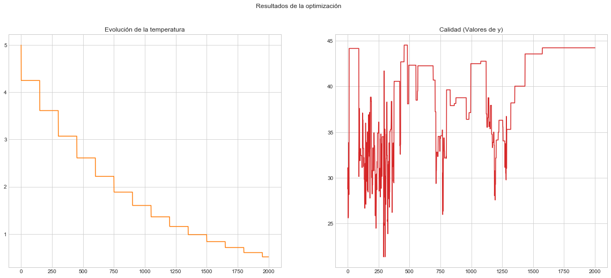

#### Análisis de la solución obtenida

```python
p_bets_sa = [0.10,0.15,0.11,0.10,0.15,0.14,0.25]
```

```python
LEAVE_WITH_MIN = 0 # Mínimo número de fichas con las que el jugador se retira
LEAVE_WITH_MAX = 150 # Máximo número de fichas con las que el jugador se retira
NUM_GAMES = 50 # Número máximo de partidas que puede jugar un jugador
INITIAL_CHIPS = 30 # Número de fichas iniciales con las que comienza a jugar
DAYS = 30 # Número de días que el jugador va a ir a jugara a la ruleta
```

```python
matrix = tm.create_transition_matrix(LEAVE_WITH_MIN,LEAVE_WITH_MAX, bets, p_bets_sa)
```

Vamos a visualizar la matriz creada por medio de la libreria pandas y añadiendo un vector de filas y columnas que representan los estados del problema, es decir, las fichas que tiene el jugador en cada momento.

```python
df = pd.DataFrame(matrix)
df.head()
```

<div>
<style scoped>
    .dataframe tbody tr th:only-of-type {
        vertical-align: middle;
    }

    .dataframe tbody tr th {
        vertical-align: top;
    }

    .dataframe thead th {
        text-align: right;
    }

</style>
<table border="1" class="dataframe">
  <thead>
    <tr style="text-align: right;">
      <th></th>
      <th>0</th>
      <th>1</th>
      <th>2</th>
      <th>3</th>
      <th>4</th>
      <th>5</th>
      <th>6</th>
      <th>7</th>
      <th>8</th>
      <th>9</th>
      <th>10</th>
      <th>11</th>
      <th>12</th>
      <th>13</th>
      <th>14</th>
      <th>15</th>
      <th>16</th>
      <th>17</th>
      <th>18</th>
      <th>19</th>
      <th>20</th>
      <th>21</th>
      <th>22</th>
      <th>23</th>
      <th>24</th>
      <th>25</th>
      <th>26</th>
      <th>27</th>
      <th>28</th>
      <th>29</th>
      <th>30</th>
      <th>31</th>
      <th>32</th>
      <th>33</th>
      <th>34</th>
      <th>35</th>
      <th>36</th>
      <th>37</th>
      <th>38</th>
      <th>39</th>
      <th>40</th>
      <th>41</th>
      <th>42</th>
      <th>43</th>
      <th>44</th>
      <th>45</th>
      <th>46</th>
      <th>47</th>
      <th>48</th>
      <th>49</th>
      <th>50</th>
      <th>51</th>
      <th>52</th>
      <th>53</th>
      <th>54</th>
      <th>55</th>
      <th>56</th>
      <th>57</th>
      <th>58</th>
      <th>59</th>
      <th>60</th>
      <th>61</th>
      <th>62</th>
      <th>63</th>
      <th>64</th>
      <th>65</th>
      <th>66</th>
      <th>67</th>
      <th>68</th>
      <th>69</th>
      <th>70</th>
      <th>71</th>
      <th>72</th>
      <th>73</th>
      <th>74</th>
      <th>75</th>
      <th>76</th>
      <th>77</th>
      <th>78</th>
      <th>79</th>
      <th>80</th>
      <th>81</th>
      <th>82</th>
      <th>83</th>
      <th>84</th>
      <th>85</th>
      <th>86</th>
      <th>87</th>
      <th>88</th>
      <th>89</th>
      <th>90</th>
      <th>91</th>
      <th>92</th>
      <th>93</th>
      <th>94</th>
      <th>95</th>
      <th>96</th>
      <th>97</th>
      <th>98</th>
      <th>99</th>
      <th>100</th>
      <th>101</th>
      <th>102</th>
      <th>103</th>
      <th>104</th>
      <th>105</th>
      <th>106</th>
      <th>107</th>
      <th>108</th>
      <th>109</th>
      <th>110</th>
      <th>111</th>
      <th>112</th>
      <th>113</th>
      <th>114</th>
      <th>115</th>
      <th>116</th>
      <th>117</th>
      <th>118</th>
      <th>119</th>
      <th>120</th>
      <th>121</th>
      <th>122</th>
      <th>123</th>
      <th>124</th>
      <th>125</th>
      <th>126</th>
      <th>127</th>
      <th>128</th>
      <th>129</th>
      <th>130</th>
      <th>131</th>
      <th>132</th>
      <th>133</th>
      <th>134</th>
      <th>135</th>
      <th>136</th>
      <th>137</th>
      <th>138</th>
      <th>139</th>
      <th>140</th>
      <th>141</th>
      <th>142</th>
      <th>143</th>
      <th>144</th>
      <th>145</th>
      <th>146</th>
      <th>147</th>
      <th>148</th>
      <th>149</th>
      <th>150</th>
      <th>151</th>
      <th>152</th>
      <th>153</th>
      <th>154</th>
      <th>155</th>
      <th>156</th>
      <th>157</th>
      <th>158</th>
      <th>159</th>
      <th>160</th>
      <th>161</th>
      <th>162</th>
      <th>163</th>
      <th>164</th>
      <th>165</th>
      <th>166</th>
      <th>167</th>
      <th>168</th>
      <th>169</th>
      <th>170</th>
      <th>171</th>
      <th>172</th>
      <th>173</th>
      <th>174</th>
      <th>175</th>
      <th>176</th>
      <th>177</th>
      <th>178</th>
      <th>179</th>
      <th>180</th>
      <th>181</th>
      <th>182</th>
      <th>183</th>
      <th>184</th>
    </tr>
  </thead>
  <tbody>
    <tr>
      <th>0</th>
      <td>1.000000</td>
      <td>0.000000</td>
      <td>0.000000</td>
      <td>0.000000</td>
      <td>0.000000</td>
      <td>0.000000</td>
      <td>0.000000</td>
      <td>0.000000</td>
      <td>0.000000</td>
      <td>0.000000</td>
      <td>0.000000</td>
      <td>0.000000</td>
      <td>0.000000</td>
      <td>0.000000</td>
      <td>0.000000</td>
      <td>0.000000</td>
      <td>0.0</td>
      <td>0.0</td>
      <td>0.000000</td>
      <td>0.000000</td>
      <td>0.000000</td>
      <td>0.000000</td>
      <td>0.0</td>
      <td>0.0</td>
      <td>0.0</td>
      <td>0.0</td>
      <td>0.0</td>
      <td>0.0</td>
      <td>0.0</td>
      <td>0.0</td>
      <td>0.0</td>
      <td>0.0</td>
      <td>0.0</td>
      <td>0.0</td>
      <td>0.0</td>
      <td>0.0</td>
      <td>0.000000</td>
      <td>0.000000</td>
      <td>0.000000</td>
      <td>0.000000</td>
      <td>0.0</td>
      <td>0.0</td>
      <td>0.0</td>
      <td>0.0</td>
      <td>0.0</td>
      <td>0.0</td>
      <td>0.0</td>
      <td>0.0</td>
      <td>0.0</td>
      <td>0.0</td>
      <td>0.0</td>
      <td>0.0</td>
      <td>0.0</td>
      <td>0.0</td>
      <td>0.0</td>
      <td>0.0</td>
      <td>0.0</td>
      <td>0.0</td>
      <td>0.0</td>
      <td>0.0</td>
      <td>0.0</td>
      <td>0.0</td>
      <td>0.0</td>
      <td>0.0</td>
      <td>0.0</td>
      <td>0.0</td>
      <td>0.0</td>
      <td>0.0</td>
      <td>0.0</td>
      <td>0.0</td>
      <td>0.0</td>
      <td>0.0</td>
      <td>0.0</td>
      <td>0.0</td>
      <td>0.0</td>
      <td>0.0</td>
      <td>0.0</td>
      <td>0.0</td>
      <td>0.0</td>
      <td>0.0</td>
      <td>0.0</td>
      <td>0.0</td>
      <td>0.0</td>
      <td>0.0</td>
      <td>0.0</td>
      <td>0.0</td>
      <td>0.0</td>
      <td>0.0</td>
      <td>0.0</td>
      <td>0.0</td>
      <td>0.0</td>
      <td>0.0</td>
      <td>0.0</td>
      <td>0.0</td>
      <td>0.0</td>
      <td>0.0</td>
      <td>0.0</td>
      <td>0.0</td>
      <td>0.0</td>
      <td>0.0</td>
      <td>0.0</td>
      <td>0.0</td>
      <td>0.0</td>
      <td>0.0</td>
      <td>0.0</td>
      <td>0.0</td>
      <td>0.0</td>
      <td>0.0</td>
      <td>0.0</td>
      <td>0.0</td>
      <td>0.0</td>
      <td>0.0</td>
      <td>0.0</td>
      <td>0.0</td>
      <td>0.0</td>
      <td>0.0</td>
      <td>0.0</td>
      <td>0.0</td>
      <td>0.0</td>
      <td>0.0</td>
      <td>0.0</td>
      <td>0.0</td>
      <td>0.0</td>
      <td>0.0</td>
      <td>0.0</td>
      <td>0.0</td>
      <td>0.0</td>
      <td>0.0</td>
      <td>0.0</td>
      <td>0.0</td>
      <td>0.0</td>
      <td>0.0</td>
      <td>0.0</td>
      <td>0.0</td>
      <td>0.0</td>
      <td>0.0</td>
      <td>0.0</td>
      <td>0.0</td>
      <td>0.0</td>
      <td>0.0</td>
      <td>0.0</td>
      <td>0.0</td>
      <td>0.0</td>
      <td>0.0</td>
      <td>0.0</td>
      <td>0.0</td>
      <td>0.0</td>
      <td>0.0</td>
      <td>0.0</td>
      <td>0.0</td>
      <td>0.0</td>
      <td>0.0</td>
      <td>0.0</td>
      <td>0.0</td>
      <td>0.0</td>
      <td>0.0</td>
      <td>0.0</td>
      <td>0.0</td>
      <td>0.0</td>
      <td>0.0</td>
      <td>0.0</td>
      <td>0.0</td>
      <td>0.0</td>
      <td>0.0</td>
      <td>0.0</td>
      <td>0.0</td>
      <td>0.0</td>
      <td>0.0</td>
      <td>0.0</td>
      <td>0.0</td>
      <td>0.0</td>
      <td>0.0</td>
      <td>0.0</td>
      <td>0.0</td>
      <td>0.0</td>
      <td>0.0</td>
      <td>0.0</td>
      <td>0.0</td>
      <td>0.0</td>
      <td>0.0</td>
      <td>0.0</td>
      <td>0.0</td>
      <td>0.0</td>
      <td>0.0</td>
      <td>0.0</td>
    </tr>
    <tr>
      <th>1</th>
      <td>0.847568</td>
      <td>0.000000</td>
      <td>0.048649</td>
      <td>0.048649</td>
      <td>0.000000</td>
      <td>0.000000</td>
      <td>0.017838</td>
      <td>0.000000</td>
      <td>0.000000</td>
      <td>0.010811</td>
      <td>0.000000</td>
      <td>0.000000</td>
      <td>0.012162</td>
      <td>0.000000</td>
      <td>0.000000</td>
      <td>0.000000</td>
      <td>0.0</td>
      <td>0.0</td>
      <td>0.007568</td>
      <td>0.000000</td>
      <td>0.000000</td>
      <td>0.000000</td>
      <td>0.0</td>
      <td>0.0</td>
      <td>0.0</td>
      <td>0.0</td>
      <td>0.0</td>
      <td>0.0</td>
      <td>0.0</td>
      <td>0.0</td>
      <td>0.0</td>
      <td>0.0</td>
      <td>0.0</td>
      <td>0.0</td>
      <td>0.0</td>
      <td>0.0</td>
      <td>0.006757</td>
      <td>0.000000</td>
      <td>0.000000</td>
      <td>0.000000</td>
      <td>0.0</td>
      <td>0.0</td>
      <td>0.0</td>
      <td>0.0</td>
      <td>0.0</td>
      <td>0.0</td>
      <td>0.0</td>
      <td>0.0</td>
      <td>0.0</td>
      <td>0.0</td>
      <td>0.0</td>
      <td>0.0</td>
      <td>0.0</td>
      <td>0.0</td>
      <td>0.0</td>
      <td>0.0</td>
      <td>0.0</td>
      <td>0.0</td>
      <td>0.0</td>
      <td>0.0</td>
      <td>0.0</td>
      <td>0.0</td>
      <td>0.0</td>
      <td>0.0</td>
      <td>0.0</td>
      <td>0.0</td>
      <td>0.0</td>
      <td>0.0</td>
      <td>0.0</td>
      <td>0.0</td>
      <td>0.0</td>
      <td>0.0</td>
      <td>0.0</td>
      <td>0.0</td>
      <td>0.0</td>
      <td>0.0</td>
      <td>0.0</td>
      <td>0.0</td>
      <td>0.0</td>
      <td>0.0</td>
      <td>0.0</td>
      <td>0.0</td>
      <td>0.0</td>
      <td>0.0</td>
      <td>0.0</td>
      <td>0.0</td>
      <td>0.0</td>
      <td>0.0</td>
      <td>0.0</td>
      <td>0.0</td>
      <td>0.0</td>
      <td>0.0</td>
      <td>0.0</td>
      <td>0.0</td>
      <td>0.0</td>
      <td>0.0</td>
      <td>0.0</td>
      <td>0.0</td>
      <td>0.0</td>
      <td>0.0</td>
      <td>0.0</td>
      <td>0.0</td>
      <td>0.0</td>
      <td>0.0</td>
      <td>0.0</td>
      <td>0.0</td>
      <td>0.0</td>
      <td>0.0</td>
      <td>0.0</td>
      <td>0.0</td>
      <td>0.0</td>
      <td>0.0</td>
      <td>0.0</td>
      <td>0.0</td>
      <td>0.0</td>
      <td>0.0</td>
      <td>0.0</td>
      <td>0.0</td>
      <td>0.0</td>
      <td>0.0</td>
      <td>0.0</td>
      <td>0.0</td>
      <td>0.0</td>
      <td>0.0</td>
      <td>0.0</td>
      <td>0.0</td>
      <td>0.0</td>
      <td>0.0</td>
      <td>0.0</td>
      <td>0.0</td>
      <td>0.0</td>
      <td>0.0</td>
      <td>0.0</td>
      <td>0.0</td>
      <td>0.0</td>
      <td>0.0</td>
      <td>0.0</td>
      <td>0.0</td>
      <td>0.0</td>
      <td>0.0</td>
      <td>0.0</td>
      <td>0.0</td>
      <td>0.0</td>
      <td>0.0</td>
      <td>0.0</td>
      <td>0.0</td>
      <td>0.0</td>
      <td>0.0</td>
      <td>0.0</td>
      <td>0.0</td>
      <td>0.0</td>
      <td>0.0</td>
      <td>0.0</td>
      <td>0.0</td>
      <td>0.0</td>
      <td>0.0</td>
      <td>0.0</td>
      <td>0.0</td>
      <td>0.0</td>
      <td>0.0</td>
      <td>0.0</td>
      <td>0.0</td>
      <td>0.0</td>
      <td>0.0</td>
      <td>0.0</td>
      <td>0.0</td>
      <td>0.0</td>
      <td>0.0</td>
      <td>0.0</td>
      <td>0.0</td>
      <td>0.0</td>
      <td>0.0</td>
      <td>0.0</td>
      <td>0.0</td>
      <td>0.0</td>
      <td>0.0</td>
      <td>0.0</td>
      <td>0.0</td>
      <td>0.0</td>
      <td>0.0</td>
      <td>0.0</td>
      <td>0.0</td>
      <td>0.0</td>
      <td>0.0</td>
      <td>0.0</td>
    </tr>
    <tr>
      <th>2</th>
      <td>0.000000</td>
      <td>0.847568</td>
      <td>0.000000</td>
      <td>0.048649</td>
      <td>0.048649</td>
      <td>0.000000</td>
      <td>0.000000</td>
      <td>0.017838</td>
      <td>0.000000</td>
      <td>0.000000</td>
      <td>0.010811</td>
      <td>0.000000</td>
      <td>0.000000</td>
      <td>0.012162</td>
      <td>0.000000</td>
      <td>0.000000</td>
      <td>0.0</td>
      <td>0.0</td>
      <td>0.000000</td>
      <td>0.007568</td>
      <td>0.000000</td>
      <td>0.000000</td>
      <td>0.0</td>
      <td>0.0</td>
      <td>0.0</td>
      <td>0.0</td>
      <td>0.0</td>
      <td>0.0</td>
      <td>0.0</td>
      <td>0.0</td>
      <td>0.0</td>
      <td>0.0</td>
      <td>0.0</td>
      <td>0.0</td>
      <td>0.0</td>
      <td>0.0</td>
      <td>0.000000</td>
      <td>0.006757</td>
      <td>0.000000</td>
      <td>0.000000</td>
      <td>0.0</td>
      <td>0.0</td>
      <td>0.0</td>
      <td>0.0</td>
      <td>0.0</td>
      <td>0.0</td>
      <td>0.0</td>
      <td>0.0</td>
      <td>0.0</td>
      <td>0.0</td>
      <td>0.0</td>
      <td>0.0</td>
      <td>0.0</td>
      <td>0.0</td>
      <td>0.0</td>
      <td>0.0</td>
      <td>0.0</td>
      <td>0.0</td>
      <td>0.0</td>
      <td>0.0</td>
      <td>0.0</td>
      <td>0.0</td>
      <td>0.0</td>
      <td>0.0</td>
      <td>0.0</td>
      <td>0.0</td>
      <td>0.0</td>
      <td>0.0</td>
      <td>0.0</td>
      <td>0.0</td>
      <td>0.0</td>
      <td>0.0</td>
      <td>0.0</td>
      <td>0.0</td>
      <td>0.0</td>
      <td>0.0</td>
      <td>0.0</td>
      <td>0.0</td>
      <td>0.0</td>
      <td>0.0</td>
      <td>0.0</td>
      <td>0.0</td>
      <td>0.0</td>
      <td>0.0</td>
      <td>0.0</td>
      <td>0.0</td>
      <td>0.0</td>
      <td>0.0</td>
      <td>0.0</td>
      <td>0.0</td>
      <td>0.0</td>
      <td>0.0</td>
      <td>0.0</td>
      <td>0.0</td>
      <td>0.0</td>
      <td>0.0</td>
      <td>0.0</td>
      <td>0.0</td>
      <td>0.0</td>
      <td>0.0</td>
      <td>0.0</td>
      <td>0.0</td>
      <td>0.0</td>
      <td>0.0</td>
      <td>0.0</td>
      <td>0.0</td>
      <td>0.0</td>
      <td>0.0</td>
      <td>0.0</td>
      <td>0.0</td>
      <td>0.0</td>
      <td>0.0</td>
      <td>0.0</td>
      <td>0.0</td>
      <td>0.0</td>
      <td>0.0</td>
      <td>0.0</td>
      <td>0.0</td>
      <td>0.0</td>
      <td>0.0</td>
      <td>0.0</td>
      <td>0.0</td>
      <td>0.0</td>
      <td>0.0</td>
      <td>0.0</td>
      <td>0.0</td>
      <td>0.0</td>
      <td>0.0</td>
      <td>0.0</td>
      <td>0.0</td>
      <td>0.0</td>
      <td>0.0</td>
      <td>0.0</td>
      <td>0.0</td>
      <td>0.0</td>
      <td>0.0</td>
      <td>0.0</td>
      <td>0.0</td>
      <td>0.0</td>
      <td>0.0</td>
      <td>0.0</td>
      <td>0.0</td>
      <td>0.0</td>
      <td>0.0</td>
      <td>0.0</td>
      <td>0.0</td>
      <td>0.0</td>
      <td>0.0</td>
      <td>0.0</td>
      <td>0.0</td>
      <td>0.0</td>
      <td>0.0</td>
      <td>0.0</td>
      <td>0.0</td>
      <td>0.0</td>
      <td>0.0</td>
      <td>0.0</td>
      <td>0.0</td>
      <td>0.0</td>
      <td>0.0</td>
      <td>0.0</td>
      <td>0.0</td>
      <td>0.0</td>
      <td>0.0</td>
      <td>0.0</td>
      <td>0.0</td>
      <td>0.0</td>
      <td>0.0</td>
      <td>0.0</td>
      <td>0.0</td>
      <td>0.0</td>
      <td>0.0</td>
      <td>0.0</td>
      <td>0.0</td>
      <td>0.0</td>
      <td>0.0</td>
      <td>0.0</td>
      <td>0.0</td>
      <td>0.0</td>
      <td>0.0</td>
      <td>0.0</td>
      <td>0.0</td>
      <td>0.0</td>
      <td>0.0</td>
      <td>0.0</td>
    </tr>
    <tr>
      <th>3</th>
      <td>0.000000</td>
      <td>0.000000</td>
      <td>0.847568</td>
      <td>0.000000</td>
      <td>0.048649</td>
      <td>0.048649</td>
      <td>0.000000</td>
      <td>0.000000</td>
      <td>0.017838</td>
      <td>0.000000</td>
      <td>0.000000</td>
      <td>0.010811</td>
      <td>0.000000</td>
      <td>0.000000</td>
      <td>0.012162</td>
      <td>0.000000</td>
      <td>0.0</td>
      <td>0.0</td>
      <td>0.000000</td>
      <td>0.000000</td>
      <td>0.007568</td>
      <td>0.000000</td>
      <td>0.0</td>
      <td>0.0</td>
      <td>0.0</td>
      <td>0.0</td>
      <td>0.0</td>
      <td>0.0</td>
      <td>0.0</td>
      <td>0.0</td>
      <td>0.0</td>
      <td>0.0</td>
      <td>0.0</td>
      <td>0.0</td>
      <td>0.0</td>
      <td>0.0</td>
      <td>0.000000</td>
      <td>0.000000</td>
      <td>0.006757</td>
      <td>0.000000</td>
      <td>0.0</td>
      <td>0.0</td>
      <td>0.0</td>
      <td>0.0</td>
      <td>0.0</td>
      <td>0.0</td>
      <td>0.0</td>
      <td>0.0</td>
      <td>0.0</td>
      <td>0.0</td>
      <td>0.0</td>
      <td>0.0</td>
      <td>0.0</td>
      <td>0.0</td>
      <td>0.0</td>
      <td>0.0</td>
      <td>0.0</td>
      <td>0.0</td>
      <td>0.0</td>
      <td>0.0</td>
      <td>0.0</td>
      <td>0.0</td>
      <td>0.0</td>
      <td>0.0</td>
      <td>0.0</td>
      <td>0.0</td>
      <td>0.0</td>
      <td>0.0</td>
      <td>0.0</td>
      <td>0.0</td>
      <td>0.0</td>
      <td>0.0</td>
      <td>0.0</td>
      <td>0.0</td>
      <td>0.0</td>
      <td>0.0</td>
      <td>0.0</td>
      <td>0.0</td>
      <td>0.0</td>
      <td>0.0</td>
      <td>0.0</td>
      <td>0.0</td>
      <td>0.0</td>
      <td>0.0</td>
      <td>0.0</td>
      <td>0.0</td>
      <td>0.0</td>
      <td>0.0</td>
      <td>0.0</td>
      <td>0.0</td>
      <td>0.0</td>
      <td>0.0</td>
      <td>0.0</td>
      <td>0.0</td>
      <td>0.0</td>
      <td>0.0</td>
      <td>0.0</td>
      <td>0.0</td>
      <td>0.0</td>
      <td>0.0</td>
      <td>0.0</td>
      <td>0.0</td>
      <td>0.0</td>
      <td>0.0</td>
      <td>0.0</td>
      <td>0.0</td>
      <td>0.0</td>
      <td>0.0</td>
      <td>0.0</td>
      <td>0.0</td>
      <td>0.0</td>
      <td>0.0</td>
      <td>0.0</td>
      <td>0.0</td>
      <td>0.0</td>
      <td>0.0</td>
      <td>0.0</td>
      <td>0.0</td>
      <td>0.0</td>
      <td>0.0</td>
      <td>0.0</td>
      <td>0.0</td>
      <td>0.0</td>
      <td>0.0</td>
      <td>0.0</td>
      <td>0.0</td>
      <td>0.0</td>
      <td>0.0</td>
      <td>0.0</td>
      <td>0.0</td>
      <td>0.0</td>
      <td>0.0</td>
      <td>0.0</td>
      <td>0.0</td>
      <td>0.0</td>
      <td>0.0</td>
      <td>0.0</td>
      <td>0.0</td>
      <td>0.0</td>
      <td>0.0</td>
      <td>0.0</td>
      <td>0.0</td>
      <td>0.0</td>
      <td>0.0</td>
      <td>0.0</td>
      <td>0.0</td>
      <td>0.0</td>
      <td>0.0</td>
      <td>0.0</td>
      <td>0.0</td>
      <td>0.0</td>
      <td>0.0</td>
      <td>0.0</td>
      <td>0.0</td>
      <td>0.0</td>
      <td>0.0</td>
      <td>0.0</td>
      <td>0.0</td>
      <td>0.0</td>
      <td>0.0</td>
      <td>0.0</td>
      <td>0.0</td>
      <td>0.0</td>
      <td>0.0</td>
      <td>0.0</td>
      <td>0.0</td>
      <td>0.0</td>
      <td>0.0</td>
      <td>0.0</td>
      <td>0.0</td>
      <td>0.0</td>
      <td>0.0</td>
      <td>0.0</td>
      <td>0.0</td>
      <td>0.0</td>
      <td>0.0</td>
      <td>0.0</td>
      <td>0.0</td>
      <td>0.0</td>
      <td>0.0</td>
      <td>0.0</td>
      <td>0.0</td>
      <td>0.0</td>
      <td>0.0</td>
      <td>0.0</td>
    </tr>
    <tr>
      <th>4</th>
      <td>0.000000</td>
      <td>0.000000</td>
      <td>0.000000</td>
      <td>0.847568</td>
      <td>0.000000</td>
      <td>0.048649</td>
      <td>0.048649</td>
      <td>0.000000</td>
      <td>0.000000</td>
      <td>0.017838</td>
      <td>0.000000</td>
      <td>0.000000</td>
      <td>0.010811</td>
      <td>0.000000</td>
      <td>0.000000</td>
      <td>0.012162</td>
      <td>0.0</td>
      <td>0.0</td>
      <td>0.000000</td>
      <td>0.000000</td>
      <td>0.000000</td>
      <td>0.007568</td>
      <td>0.0</td>
      <td>0.0</td>
      <td>0.0</td>
      <td>0.0</td>
      <td>0.0</td>
      <td>0.0</td>
      <td>0.0</td>
      <td>0.0</td>
      <td>0.0</td>
      <td>0.0</td>
      <td>0.0</td>
      <td>0.0</td>
      <td>0.0</td>
      <td>0.0</td>
      <td>0.000000</td>
      <td>0.000000</td>
      <td>0.000000</td>
      <td>0.006757</td>
      <td>0.0</td>
      <td>0.0</td>
      <td>0.0</td>
      <td>0.0</td>
      <td>0.0</td>
      <td>0.0</td>
      <td>0.0</td>
      <td>0.0</td>
      <td>0.0</td>
      <td>0.0</td>
      <td>0.0</td>
      <td>0.0</td>
      <td>0.0</td>
      <td>0.0</td>
      <td>0.0</td>
      <td>0.0</td>
      <td>0.0</td>
      <td>0.0</td>
      <td>0.0</td>
      <td>0.0</td>
      <td>0.0</td>
      <td>0.0</td>
      <td>0.0</td>
      <td>0.0</td>
      <td>0.0</td>
      <td>0.0</td>
      <td>0.0</td>
      <td>0.0</td>
      <td>0.0</td>
      <td>0.0</td>
      <td>0.0</td>
      <td>0.0</td>
      <td>0.0</td>
      <td>0.0</td>
      <td>0.0</td>
      <td>0.0</td>
      <td>0.0</td>
      <td>0.0</td>
      <td>0.0</td>
      <td>0.0</td>
      <td>0.0</td>
      <td>0.0</td>
      <td>0.0</td>
      <td>0.0</td>
      <td>0.0</td>
      <td>0.0</td>
      <td>0.0</td>
      <td>0.0</td>
      <td>0.0</td>
      <td>0.0</td>
      <td>0.0</td>
      <td>0.0</td>
      <td>0.0</td>
      <td>0.0</td>
      <td>0.0</td>
      <td>0.0</td>
      <td>0.0</td>
      <td>0.0</td>
      <td>0.0</td>
      <td>0.0</td>
      <td>0.0</td>
      <td>0.0</td>
      <td>0.0</td>
      <td>0.0</td>
      <td>0.0</td>
      <td>0.0</td>
      <td>0.0</td>
      <td>0.0</td>
      <td>0.0</td>
      <td>0.0</td>
      <td>0.0</td>
      <td>0.0</td>
      <td>0.0</td>
      <td>0.0</td>
      <td>0.0</td>
      <td>0.0</td>
      <td>0.0</td>
      <td>0.0</td>
      <td>0.0</td>
      <td>0.0</td>
      <td>0.0</td>
      <td>0.0</td>
      <td>0.0</td>
      <td>0.0</td>
      <td>0.0</td>
      <td>0.0</td>
      <td>0.0</td>
      <td>0.0</td>
      <td>0.0</td>
      <td>0.0</td>
      <td>0.0</td>
      <td>0.0</td>
      <td>0.0</td>
      <td>0.0</td>
      <td>0.0</td>
      <td>0.0</td>
      <td>0.0</td>
      <td>0.0</td>
      <td>0.0</td>
      <td>0.0</td>
      <td>0.0</td>
      <td>0.0</td>
      <td>0.0</td>
      <td>0.0</td>
      <td>0.0</td>
      <td>0.0</td>
      <td>0.0</td>
      <td>0.0</td>
      <td>0.0</td>
      <td>0.0</td>
      <td>0.0</td>
      <td>0.0</td>
      <td>0.0</td>
      <td>0.0</td>
      <td>0.0</td>
      <td>0.0</td>
      <td>0.0</td>
      <td>0.0</td>
      <td>0.0</td>
      <td>0.0</td>
      <td>0.0</td>
      <td>0.0</td>
      <td>0.0</td>
      <td>0.0</td>
      <td>0.0</td>
      <td>0.0</td>
      <td>0.0</td>
      <td>0.0</td>
      <td>0.0</td>
      <td>0.0</td>
      <td>0.0</td>
      <td>0.0</td>
      <td>0.0</td>
      <td>0.0</td>
      <td>0.0</td>
      <td>0.0</td>
      <td>0.0</td>
      <td>0.0</td>
      <td>0.0</td>
      <td>0.0</td>
      <td>0.0</td>
      <td>0.0</td>
      <td>0.0</td>
      <td>0.0</td>
      <td>0.0</td>
    </tr>
  </tbody>
</table>
</div>

```python
simulation, chips, games = simulate(matrix, gambling_random,NUM_GAMES, INITIAL_CHIPS, DAYS)
df = create_df(chips, games)
```

```python
plot_bar_graph(df, INITIAL_CHIPS)
```

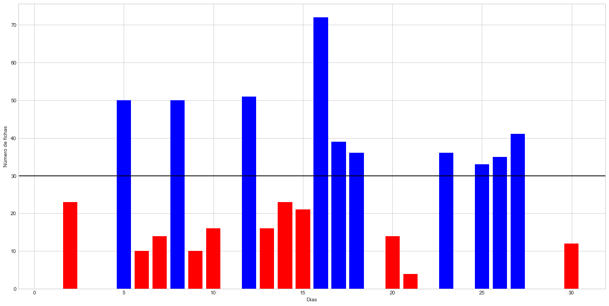

```python
show_results(df, INITIAL_CHIPS, LEAVE_WITH_MAX)
```

    Número de noches que el jugador perdió todas las fichas: 9
    Porcentaje de noches que el jugador perdió todas las fichas: 30.0%
    Número de noches que el jugador perdió fichas: 20
    Porcentaje de noches que el jugador perdió fichas: 66.67%
    Número de noches que el jugador salió igual del casino: 0
    Porcentaje de noches que el jugador salió igual del casino: 0.0%
    Número de noches que el jugador ganó fichas: 10
    Porcentaje de noches que el jugador ganó fichas: 33.33%
    Número de noches que el jugador se retiró alcanzando el máximo de fichas: 0
    Porcentaje de noches que el jugador se retiró alcanzando el máximo de fichas: 0.0%

```python
plot_chips_evolution(chips[:15])
```

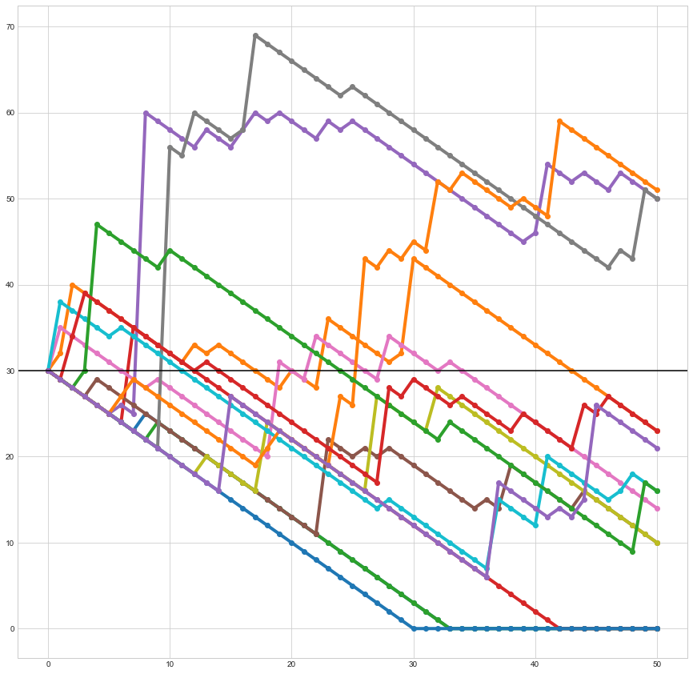

Por último, vamos a mostra rle histograma de frecuencia de la cantidad de fichas con las que le jugador es capaz de salir del casino a lo largo de un mes.

```python
sns.distplot(df['Chips']);plt.xlim(0,None)
```

    (0, 108.20342422101784)

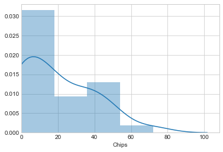

```python
ruined = df[df['Chips'] == 0]
ruined
```

<div>
<style scoped>
    .dataframe tbody tr th:only-of-type {
        vertical-align: middle;
    }

    .dataframe tbody tr th {
        vertical-align: top;
    }

    .dataframe thead th {
        text-align: right;
    }

</style>
<table border="1" class="dataframe">
  <thead>
    <tr style="text-align: right;">
      <th></th>
      <th>Day</th>
      <th>Chips</th>
      <th>Games</th>
      <th>Benefit</th>
      <th>Improvement</th>
    </tr>
  </thead>
  <tbody>
    <tr>
      <th>0</th>
      <td>1</td>
      <td>0</td>
      <td>33</td>
      <td>-30</td>
      <td>-1.0</td>
    </tr>
    <tr>
      <th>2</th>
      <td>3</td>
      <td>0</td>
      <td>33</td>
      <td>-30</td>
      <td>-1.0</td>
    </tr>
    <tr>
      <th>3</th>
      <td>4</td>
      <td>0</td>
      <td>42</td>
      <td>-30</td>
      <td>-1.0</td>
    </tr>
    <tr>
      <th>10</th>
      <td>11</td>
      <td>0</td>
      <td>30</td>
      <td>-30</td>
      <td>-1.0</td>
    </tr>
    <tr>
      <th>18</th>
      <td>19</td>
      <td>0</td>
      <td>32</td>
      <td>-30</td>
      <td>-1.0</td>
    </tr>
    <tr>
      <th>21</th>
      <td>22</td>
      <td>0</td>
      <td>37</td>
      <td>-30</td>
      <td>-1.0</td>
    </tr>
    <tr>
      <th>23</th>
      <td>24</td>
      <td>0</td>
      <td>39</td>
      <td>-30</td>
      <td>-1.0</td>
    </tr>
    <tr>
      <th>27</th>
      <td>28</td>
      <td>0</td>
      <td>39</td>
      <td>-30</td>
      <td>-1.0</td>
    </tr>
    <tr>
      <th>28</th>
      <td>29</td>
      <td>0</td>
      <td>35</td>
      <td>-30</td>
      <td>-1.0</td>
    </tr>
  </tbody>
</table>
</div>
